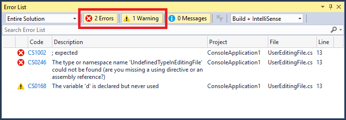

# Como: habilitar e desabilitar análise de solução completa para código gerenciado

*Total de análise de solução* é um recurso do Visual Studio que permite que você veja somente em arquivos abertos de Visual c# ou Visual Basic em sua solução de problemas de análise do código ou também em código de arquivos que estão fechados. Por padrão, a análise de solução completa é *habilitado* do Visual Basic e *desabilitado* para Visual c#.

Ele pode ser útil ver todos os problemas em todos os arquivos, mas também pode ser causa uma distração. Ele diminui o Visual Studio se sua solução for muito grande ou tem vários arquivos. Para limitar o número de saídas mostrado e melhorar o desempenho do Visual Studio, você pode desabilitar análise de solução completa. Você pode facilmente habilitar este recurso novamente se necessário.

## Para alternar a análise de solução completa

1. Para abrir o **opções** escolha a caixa de diálogo, na barra de menu do Visual Studio **ferramentas** > **opções**.

1. No **opções** caixa de diálogo caixa, escolha **Editor de texto** > **c#** ou **básica**  >   **Advanced**.

1. Selecione o **habilitar análise de solução completa** caixa de seleção para habilitar a análise de solução completa, ou desmarque a caixa para desativá-lo. Escolha **Okey** quando terminar.

    

## Resultados de habilitar e desabilitar análise de solução completa

Na captura de tela a seguir, você pode ver os resultados quando a análise de solução completa está habilitada. Todos os erros e problemas de análise de código em *todos os* dos arquivos na solução aparecem, independentemente se os arquivos estiverem abertos ou não.

Captura de tela a seguir mostra os resultados da mesma solução depois de desabilitar análise de solução completa. Somente erros e problemas de análise de código em arquivos de solução aberta aparecem no **lista de erros**.

## Desabilitar automaticamente a análise de solução completa

Se o Visual Studio detectar que 200 MB ou menos de memória do sistema está disponível para ele, ele automaticamente desabilita a análise de solução completa (e outros recursos) se ele está habilitado. Se isso ocorrer, um alerta será exibida informando que o Visual Studio desabilitou a alguns recursos. Um botão permite habilitar novamente a análise de solução completa se quiser.

