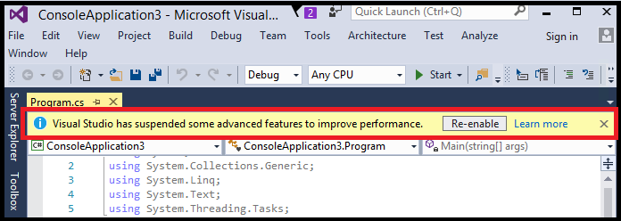

# Como: habilitar e desabilitar análise de solução completa para código gerenciado
> [!NOTE]
>  Este tópico se aplica somente ao Visual Studio 2015 atualização 3 RC e versões posteriores.  
  
 *Total de análise de solução* é um recurso do Visual Studio que permite que você escolha se houver problemas de análise de código apenas em abrir arquivos Visual c# ou Visual Basic em sua solução, ou em arquivos de Visual c# ou Visual Basic abertos e fechados em sua solução.  
  
 Embora seja útil visualizar todos os problemas em todos os arquivos, pode ser distrativas e até mesmo desacelerar o Visual Studio se sua solução for muito grande ou tem muitos arquivos.  Para limitar o número de saídas mostrado e melhorar o desempenho do Visual Studio, você pode desabilitar análise de solução completa. Você pode facilmente habilitar este recurso novamente se desejar.  
  
#### Para alternar a análise de solução completa  
  
1.  No menu principal do Visual Studio, escolha **ferramentas** &#124; **Opções** para exibir o **opções** caixa de diálogo.  
  
2.  No **opções** caixa de diálogo caixa, escolha **Editor de texto** &#124; **C#** ou **básica** &#124; **Advanced**.  
  
3.  Selecione o **habilitar análise de solução completa** caixa de seleção para habilitar a análise de solução completa, ou desmarque a caixa para desativá-lo. Escolha o **Okey** botão quando terminar.  
  
     ![Habilite a caixa de seleção de análise de solução completa. ] (../code-quality/media/fsa_toolsoptions.png "FSA_ToolsOptions")  
  
## Resultados de habilitar e desabilitar análise de solução completa  
 Na captura de tela a seguir, você pode ver os resultados quando a análise de solução completa está habilitada. Todos os erros e problemas de análise de código em *todos os* dos arquivos na solução aparecem, independentemente se os arquivos estiverem abertos ou não.  
  
 ![Análise de solução completa habilitado. ] (../code-quality/media/fsa_enabled.png "FSA_Enabled")  
  
 Captura de tela a seguir mostra os resultados da mesma solução depois de desabilitar análise de solução completa. Somente os erros e problemas de análise de código em abrem solução arquivos aparecem na lista de erros.  
  
 ![Análise de solução completa desabilitado. ] (../code-quality/media/fsa_disabled.png "FSA_Disabled")  
  
## Desabilitar automaticamente a análise de solução completa  
 Se o Visual Studio detectar que 200MB ou menos memória do sistema está disponível para ele, ele automaticamente desabilita a análise de solução completa (bem como alguns outros recursos) se ele está habilitado. Se isso ocorrer, um alerta será exibida informando sobre isso. Um botão permite habilitar novamente a análise de solução completa para fazer isso.  
  
   
  
## Detalhes adicionais  
 Por padrão, a análise de solução completa é habilitado para o Visual Basic e desabilitado para o Visual c#.  
  
 Visual Studio Update 3 RC inclui um mecanismo de diagnóstico v2 de analisador de código avançado que significativamente reduz o uso de memória e reduz o tempo de CPU para ocioso, mesmo se a análise de solução completa está habilitada.