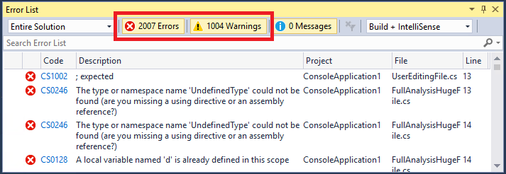

# Como: habilitar e desabilitar an&#225;lise de solu&#231;&#227;o completa para c&#243;digo gerenciado
[!INCLUDE[vs2017banner](../code-quality/includes/vs2017banner.md)]

> [!NOTE]
>  Este tópico se aplica somente a atualização 3 RC do Visual Studio 2015 e posterior.  
  
 *Completo de análise de solução* é um recurso do Visual Studio que permite que você escolha se você encontrar problemas de análise de código apenas em abrir arquivos Visual c\# ou Visual Basic em sua solução ou em arquivos abertos e fechados, do Visual c\# ou Visual Basic em sua solução.  
  
 Embora seja útil poder ver todos os problemas em todos os arquivos, pode ser distração e até mesmo desacelerar o Visual Studio se a sua solução for muito grande ou muitos arquivos.  Para limitar o número de problemas mostrado e melhorar o desempenho do Visual Studio, você pode desativar a análise de solução completa. Você pode facilmente habilitar este recurso novamente se desejar.  
  
#### Para alternar a análise da solução completa  
  
1.  No menu principal do Visual Studio, escolha **ferramentas** &#124; **Opções** para exibir o **opções** caixa de diálogo.  
  
2.  No **opções** caixa de diálogo, escolha **Editor de texto** &#124; **C\#** or **Basic** &#124; **Avançado**.  
  
3.  Selecione o **permitem uma análise completa solução** caixa de seleção para habilitar a análise de solução completa, ou desmarque a caixa para desativá\-lo. Escolha o **OK** botão quando terminar.  
  
       
  
## Resultados de habilitar e desabilitar análise de solução completa  
 Na seguinte captura de tela, você pode ver os resultados quando a análise da solução completa está habilitada. Todos os erros e problemas de análise de código em *todas as* dos arquivos na solução aparecem, independentemente se os arquivos estiverem abertos ou não.  
  
   
  
 Captura de tela a seguir mostra os resultados da solução mesmo depois de desabilitar análise de solução completa. Somente erros e problemas de análise de código em abrem solução arquivos aparecem na lista de erros.  
  
   
  
## Desabilitar automaticamente a análise da solução completa  
 Se o Visual Studio detecta que 200MB ou menor de memória do sistema está disponível, ele automaticamente desabilita a análise da solução completa \(bem como alguns outros recursos\) se ele estiver habilitado. Se isso ocorrer, será exibido um alerta informando isso. Um botão permite habilitar novamente a análise da solução completa para fazê\-lo.  
  
   
  
## Detalhes adicionais  
 Por padrão, análise da solução completa está habilitada para o Visual Basic e desabilitado para o Visual c\#.  
  
 RC do Visual Studio atualização 3 inclui um mecanismo de diagnóstico v2 analyzer código aprimorados significativamente reduz o uso de memória e diminui o tempo de CPU para ociosa, mesmo que a análise da solução completa está habilitada.