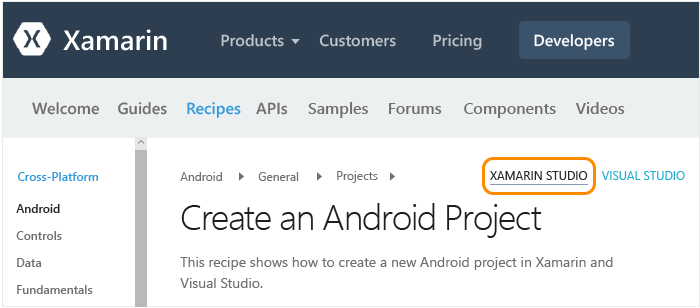
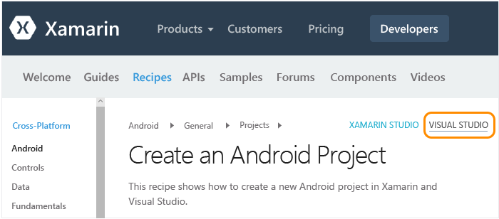

# Configuração, instalação e verificações para usuários do Mac
Este tópico destina-se a desenvolvedores que trabalham principalmente em um Mac e que usarão opcionalmente o Visual Studio dentro de uma máquina virtual do Windows no Mac. Se você for um desenvolvedor que trabalhe principalmente em um computador Windows e precisará configurar um Mac secundário para o direcionamento do iOS, consulte o tópico principal [Instalação e Configuração](../cross-platform/setup-and-install.md).

 Para trabalhar com o Xamarin em um Mac, você precisará do seguinte:

-   Um Mac com macOS Sierra 10.12 ou posterior, com Xcode e Xamarin instalados.

-   Uma das seguintes configurações:

    -   **Para executar o Xamarin Studio diretamente no Mac:** o Xamarin Studio é o ambiente de desenvolvimento do Xamarin que dá suporte à criação de aplicativos Android, iOS e Windows usando C#.  Para obter uma visão geral rápida do Xamarin Studio, consulte a [Visão geral do Xamarin Studio](https://xamarin.com/studio) (xamarin.com).

    -   **Se você já tiver o Parallels ou VMWare configurado em seu Mac:** execute o Windows com o Visual Studio 2017 e o Xamarin no Parallels ou VMWare.  Com essa configuração, o Xamarin é uma extensão que é instalada com o Visual Studio e que oferece a capacidade de usar o Visual Studio como ambiente de desenvolvimento para a criação de aplicativos Android, iOS e Windows usando C#.  Observe que você pode obter uma assinatura de 3 meses gratuita do Parallels como parte do programa Visual Studio Developer Essentials. Consulte [Microsoft Visual Studio Dev Essentials Incluirá Parallels Desktop Pro e Parallels Access](http://blog.parallels.com/blog/2015/11/18/visual-studio-dev-essentials/) (blog Parallels).

 Este tópico fornece instruções para esses requisitos.  Enquanto o processo de instalação está em execução, você pode examinar o tópico [Saiba mais sobre desenvolvimento móvel com Xamarin](../cross-platform/learn-about-mobile-development-with-xamarin.md) para ler e inspecionar o material básico necessário.

##   Configuração do Mac (Apple ID, Xcode e Xamarin)

1.  Crie uma ID Apple gratuita em [Minha ID Apple](https://appleid.apple.com/) caso ainda não tenha uma. Isso é necessário para instalar e entrar no Xcode.

2.  Baixe e instale o Xcode de [https://developer.apple.com/xcode/](https://developer.apple.com/xcode/).

3.  Baixe e instale o Xamarin, seguindo as instruções em [Instalando e configurando o Xamarin.iOS](http://developer.xamarin.com/guides/ios/getting_started/installation/mac/) (xamarin.com).

4.  Depois de concluir a instalação do Xamarin em computadores Windows e Mac, siga as instruções em [Conectando-se ao Mac usando XMA](http://developer.xamarin.com/guides/ios/getting_started/installation/windows/#Connecting_to_the_Mac_Using_XMA) (xamarin.com) para que você possa trabalhar com o iOS e o Mac usando o Visual Studio no computador Windows.

##   Instalação do Windows no Parallels (Visual Studio e Xamarin)

1.  Usando a área de trabalho do Windows que você configurou no Parallels/VMWare, [baixar e inicie o instalador para qualquer edição do Visual Studio 2017](https://www.visualstudio.com/downloads/) (Community, Professional ou Enterprise). O Visual Studio 2017 Community é a versão gratuita; as edições Professional e Enterprise poderão ser usadas em uma base de avaliação por 30 dias.

2.  No instalador, clique no botão **Opções adicionais** (ícone de três barras) _ao lado de_ **Inicialização** e, então, escolha **Modificar**.  
  
       
  
3.  Verifique as seguintes caixas:

    1.  **Celular e Jogos > Desenvolvimento Móvel com o .NET**. Isso também selecionará automaticamente várias ferramentas Android em Ferramentas Comuns e Kits de desenvolvimento de Software. Essa opção também deve atualizar uma instalação existente do Xamarin.  
  
           
  
    2. (Opcional) **Windows > desenvolvimento da Plataforma Universal do Windows**. Isso inclui opções de instalação de imagens de emulador que levarão mais tempo para baixar; você sempre pode retornar ao instalador do Visual Studio para adicioná-las mais tarde.  

4.  Clique no botão **Modificar** e permita que o processo seja executado. Novamente, isso levará algum tempo para ser concluído; durante esse período, você pode continuar com as instruções de configuração do Mac e percorrer [Saiba mais sobre desenvolvimento móvel com Xamarin](../cross-platform/learn-about-mobile-development-with-xamarin.md).

5.  Depois que a instalação for concluída, inicie o Visual Studio e entre com sua conta da Microsoft se solicitado (é a mesma conta que você usa com o Windows).

6.  Depois de concluir a instalação do Xamarin nos computadores Windows e Mac, siga as instruções em [Conectando-se ao Mac usando XMA](http://developer.xamarin.com/guides/ios/getting_started/installation/windows/#Connecting_to_the_Mac_Using_XMA) (xamarin.com) para que você possa trabalhar com o iOS usando o Visual Studio.

##   Verifique o seu ambiente
 Depois de ter concluído os instaladores, reserve alguns minutos para verificar se tudo está pronto para experimentar o desenvolvimento do Xamarin.

### Xamarin Studio
 Primeiro, certifique-se de que quando você navegar para links fornecidos a opção **Xamarin Studio** estará selecionada no canto superior direito para que você veja a versão correta da documentação do Xamarin:

 

**Android**

1.  Valide a criação de um projeto Android, seguindo as instruções em [Criar um projeto Android](http://developer.xamarin.com/recipes/android/general/projects/create_an_android_project/) (xamarin.com).

2.  Valide a depuração no emulador do Android em [Android Player > Integração com a Documentação do Xamarin Studio](https://developer.xamarin.com/guides/android/getting_started/installation/android-player/#Integration_with_Xamarin_Studio) (xamarin.com).

**iOS**

1.  Validar a criação de um projeto iOS, seguindo as instruções em [Criar um iOS](http://developer.xamarin.com/recipes/ios/general/projects/create_an_ios_project/) (xamarin.com).

2.  Valide a depuração no simulador iOS por meio de [Depuração na documentação do simulador](https://developer.xamarin.com/guides/ios/deployment,_testing,_and_metrics/debugging_in_xamarin_ios/#Debugging_on_the_Simulator) (xamarin.com).

### Visual Studio
 Primeiro, certifique-se de que quando você navegar para links fornecidos a opção **Visual Studio** estará selecionada no canto superior direito para que você veja a versão correta da documentação do Xamarin:

 

**Android**

1.  Valide a criação de um projeto Android, seguindo as instruções em [Criar um projeto Android](http://developer.xamarin.com/recipes/android/general/projects/create_an_android_project/) (xamarin.com).

2.  Valide o designer Android: no projeto do Android no Gerenciador de Soluções, abra **Recursos > Layout > arquivo Main.axml**.

    -   Se você receber um erro informando que "O SDK do Android instalado é muito antigo", clique em **Abrir SDK do Android** na mensagem e selecione a versão do SDK mais recente disponível. Observe que você deve estar executando o Visual Studio como administrador para atualizar o SDK.

3.  Valide que você pode se conectar do Visual Studio ao emulador que está instalado no seu Mac.  O resultado disso é que você verá o Xamarin Player na lista de emuladores que você pode selecionar no Visual Studio para depuração.  Para fazer isso, siga as instruções em [Conectando o Visual Studio ao Xamarin Android Player](http://developer.xamarin.com/guides/android/deployment,_testing,_and_metrics/android-player-with-visual-studio-in-vm/) (xamarin.com).

**iOS**

1.  Verifique se seu Mac está disponível na rede e emparelhado com o Visual Studio, conforme descrito em [Conectando-se ao Mac](https://developer.xamarin.com/guides/ios/getting_started/installation/windows/#Connecting_to_the_Mac) (xamarin.com).

2.  Validar a criação de um projeto iOS, seguindo as instruções em [Criar um iOS](http://developer.xamarin.com/recipes/ios/general/projects/create_an_ios_project/) (xamarin.com).

3.  Valide o designer do storyboard: no projeto do iOS no Gerenciador de Soluções, abra o arquivo **MainStoryboard.storyboard**. Aqui, o Visual Studio hospeda o designer que está sendo executado remotamente no Mac.

4.  Validar compilação e depuração:

    1.  Clique com o botão direito do mouse no projeto do iOS no Gerenciador de Soluções e selecione **Definir como projeto de inicialização**.

    2.  Selecione o destino **iPhoneSimulator** na lista suspensa do build do Visual Studio, conforme mostrado abaixo. Se nenhum simulador estiver listado, inicie o Xcode no Mac, selecione **Xcode->Preferências** e clique em **Baixar**. Em **Componentes** você deve ver as versões de simulador que estão disponíveis para download. Instruções adicionais para depuração podem ser encontradas na página [Depuração](https://developer.xamarin.com/guides/ios/deployment,_testing,_and_metrics/debugging_in_xamarin_ios/#Debugging_on_the_Simulator) do Xamarin (xamarin.com).

         

    3.  Selecione um destino iPhone na lista suspensa de depuração do Visual Studio, conforme mostrado abaixo e inicie o depurador pressionando F5. Isso inicia o simulador no Mac no qual você poderá interagir com o aplicativo enquanto a depuração ocorrer no Visual Studio.

         
