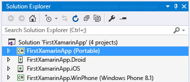
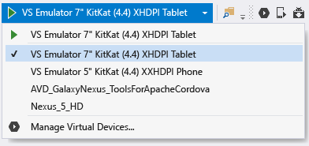
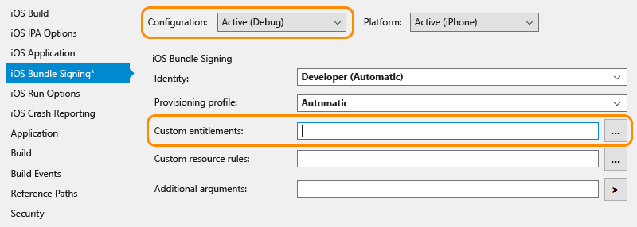

# Verificar o ambiente do Xamarin

Depois de ter concluído os instaladores (consulte [Configurar e instalar](../cross-platform/setup-and-install.md)), reserve alguns minutos para verificar se tudo está pronto para experimentar o desenvolvimento do Xamarin.  
  
 Depois concluir a verificação da instalação, tente uma das instruções passo a passo a seguir ou ambas:  
  
-   [Aprenda noções básicas de criação de aplicativo com o Xamarin.Forms no Visual Studio](../cross-platform/learn-app-building-basics-with-xamarin-forms-in-visual-studio.md) para criar um aplicativo do Xamarin.Forms.
  
-   [Crie aplicativos com a interface do usuário nativa usando o Xamarin no Visual Studio](../cross-platform/build-apps-with-native-ui-using-xamarin-in-visual-studio.md) para usar as interfaces do usuário nativas em cada plataforma, mas compartilham alguns códigos em uma biblioteca do .NET Standard.
  
## Todas as Plataformas 
 
No Visual Studio, primeiro selecione **Ferramentas > Extensões e Atualizações** e verifique se algum dos componentes do Xamarin requerem atualizações.  
  
Em seguida, crie uma nova solução do Xamarin.Forms no Visual Studio usando **Arquivo > Novo Projeto**. Na caixa de diálogo, expanda **Visual C# > Multiplataforma**, selecione **Aplicativo Móvel (Xamarin.Forms)** e clique em OK. Na caixa de diálogo seguinte, selecione **Aplicativo em Branco**. Em **Estratégia de Compartilhamento de Código**, selecione **.NET Standard**. Clique em OK.

Essas ações criam uma solução com quatro projetos: um projeto de biblioteca do .NET Standard 2.0 compartilhado e projetos de aplicativo para Android, iOS e UWP (Plataforma Universal do Windows):  
  
  
   
## Android  
  
1. Verifique se as ferramentas mais recentes do SDK do Android estão instaladas acessando **Ferramentas > Android > Gerenciador do SDK do Android**. Instale as versões mais recentes do Android SDK Tools, do Android SDK Platform Tools e do Android SDK Build Tools. Não é necessário sempre instalar o nível da API do Android mais recente. O nível da API necessário depende do nível da plataforma que você deseja como destino. Em geral, a instalação da plataforma Xamarin já instalará o nível da plataforma Android necessário.  
  
2.  Valide o build e a depuração em um dispositivo ou emulador:  
  
    -   Clique com o botão direito do mouse no projeto do Android no Gerenciador de Soluções e selecione **Definir como projeto de inicialização**.  
  
    -   Na barra de ferramentas, deverá ser exibida uma lista suspensa contendo uma lista de dispositivos e emuladores Android disponíveis. 
    
    Os dispositivos Android precisam ser habilitados para depuração de USB nas Opções do Desenvolvedor da página de Configurações do dispositivo. Em seguida, o dispositivo será anexado ao computador por um cabo USB. 
    
    Também estão listados os emuladores. Selecione um dos dispositivos ou emuladores do Visual Studio:

    
  
  Para obter mais informações, confira [Introducing Visual Studio's Emulator for Android](http://blogs.msdn.com/b/visualstudioalm/archive/2014/11/12/introducing-visual-studio-s-emulator-for-android.aspx) (Apresentando o Emulador do Visual Studio para Android) (blog do ALM do Visual Studio). Se você encontrar problemas ao obter o emulador, consulte [Solução de problemas de Emulador do Visual Studio para Android](../cross-platform/troubleshooting-the-visual-studio-emulator-for-android.md). Você também pode criar novos perfis de dispositivo para o emulador selecionando **Ferramentas > Android > Gerenciador do Android Emulator**.  
  
3. Pressione F5 para compilar e implantar o programa no emulador ou dispositivo Android.
  
## Windows 
  
1.  Clique com o botão direito do mouse no projeto universal do Windows no Gerenciador de Soluções e selecione **Definir como projeto de inicialização**.  

2.  Na lista suspensa **Plataformas da Solução**, selecione **x86** ou **x64**. Selecione **Computador Local**.

3.  Pressione F5 para implantar o programa na área de trabalho.
  
## iOS  
  
1.  Verifique se o Mac está disponível na rede e emparelhado com o Visual Studio, conforme descrito em [Conectar-se ao Mac](/xamarin/ios/get-started/installation/windows/connecting-to-mac/).  
  
2.  Clique com o botão direito do mouse no projeto do iOS no Gerenciador de Soluções e selecione **Definir como projeto de inicialização**.  
  
3.  Selecione o destino **iPhoneSimulator** na lista suspensa de build do Visual Studio, conforme é mostrado abaixo, ou o destino **iPhone** se você tiver um dispositivo vinculado ao Mac.   
  
  

 Se não houver nenhum simulador listado, inicie o Xcode no Mac, selecione **Xcode > Preferências** e clique em **Baixar**. No título **Componentes**, são exibidas as versões do simulador que estão disponíveis para download. Instruções adicionais para depuração podem ser encontradas na página [Depuração do iOS](/xamarin/ios/deploy-test/debugging-in-xamarin-ios/?tabs=vsmac#Debugging_on_the_Simulator).
  
4.  Selecione um destino de dispositivo do emulador na lista suspensa do Visual Studio:

 

5. Inicie o depurador pressionando F5. O simulador é aberto no Mac para que você interaja com o aplicativo, enquanto a depuração ocorre no Visual Studio. Se você tiver um iPhone ou iPad físico conectado ao Mac, ele será exibido na lista e você poderá selecioná-lo. Se não aparecer nenhum dispositivo nem simulador, verifique a conexão com o Mac. Examine o artigo vinculado na etapa 1 acima, ou acesse **Ferramentas > iOS > Parear com o Mac**  
  
6.  Se houver problemas para se conectar com o Mac, leia [Solução de problemas de conexão](/xamarin/ios/get-started/installation/windows/connecting-to-mac/troubleshooting/).  
  
7.  Se aparecer um erro informando "Nenhum perfil de provisionamento instalado corresponde às chaves de assinatura do iOS instaladas", tente as seguintes sugestões:  
  
  - Verifique se sua conta da Apple ID está adicionada no Xcode no Mac, conforme descrito em [Adicionar sua Conta ao Xcode](https://developer.apple.com/library/content/documentation/IDEs/Conceptual/AppStoreDistributionTutorial/AddingYourAccounttoXcode/AddingYourAccounttoXcode.html#//apple_ref/doc/uid/TP40013839-CH40-SW1) (apple.com).  Depois de adicionar sua conta, certifique-se de reiniciar o Visual Studio e o Xcode.  
    
  - Verifique se nas propriedades do projeto do iOS na guia de assinatura de pacote de iOS, se o campo de autorização personalizada está vazio para a configuração de depuração ativa.  Observação: você só deverá tentar remover essa configuração se encontrar a mensagem de erro acima.  
  
    
