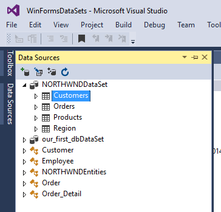

# Associar controles a dados no Visual Studio
Você pode exibir dados para usuários do seu aplicativo pela vinculação de dados a controles. Você pode criar esses controles associados a dados arrastando itens do **fontes de dados** janela em uma superfície de design ou controles em uma superfície no Visual Studio.  
  
 Este tópico descreve as fontes de dados que você pode usar para criar controles ligados a dados. Ele também descreve algumas das tarefas gerais envolvidas na associação de dados. Para obter detalhes mais específicos sobre como criar controles ligados a dados, consulte [Associar controles dos Windows Forms a dados no Visual Studio](../data-tools/bind-windows-forms-controls-to-data-in-visual-studio.md) e [Associar controles WPF a dados no Visual Studio](../data-tools/bind-wpf-controls-to-data-in-visual-studio1.md).  
  
## Fontes de dados  
 No contexto de associação de dados, uma fonte de dados representa os dados na memória que podem ser associado à interface do usuário. Em termos práticos, uma fonte de dados pode ser uma classe do Entity Framework, um conjunto de dados, um ponto de extremidade de serviço que é encapsulado em um objeto de proxy .NET, uma classe LINQ to SQL, ou qualquer objeto .NET ou coleção. Algumas fontes de dados permitem criar controles vinculados a dados arrastando itens do **fontes de dados** janela, enquanto outras fontes de dados não. A tabela a seguir mostra quais fontes de dados têm suporte.  
  
|Fonte de dados|Suporte a arrastar e soltar no **o Windows Forms Designer**|Suporte a arrastar e soltar no **o WPF Designer**|Suporte a arrastar e soltar no **o Designer do Silverlight**|  
|--------------------|-----------------------------------------------------------------|-------------------------------------------------------|------------------------------------------------------------------|  
|Conjunto de dados|Sim|Sim|Não|  
|Modelo de Dados de Entidade|Yes1|Sim|Sim|  
|Classes LINQ to SQL|No2|No2|No2|  
|Serviços \(incluindo [!INCLUDE[ssAstoria](../data-tools/includes/ssastoria_md.md)], WCF services e serviços da Web\)|Sim|Sim|Sim|  
|Objeto|Sim|Sim|Sim|  
|SharePoint|Sim|Sim|Sim|  
  
 1. Gerar o modelo usando o Assistente de modelo de dados de entidade, em seguida, arraste os objetos para o designer.  
  
 2. Classes LINQ to SQL não aparecem no **fontes de dados** janela. No entanto, você pode adicionar uma nova fonte de dados de objeto baseado em LINQ para classes SQL e, em seguida, arrastar esses objetos para o designer para criar controles ligados a dados. Para obter mais informações, consulte [Walkthrough: Creating LINQ to SQL Classes \(O\/R Designer\)](../Topic/Walkthrough:%20Creating%20LINQ%20to%20SQL%20Classes%20\(O-R%20Designer\).md).  
  
## Janela Fontes de Dados  
 Fontes de dados estão disponíveis para o projeto como itens na **fontes de dados** janela. Esta janela está visível ou então é acessível a partir de **exibição** menu quando uma superfície de design do formulário é a janela ativa em seu projeto. Você pode arrastar itens dessa janela para criar controles associados aos dados subjacentes, e você também pode configurar as fontes de dados clicando.  
  
   
  
 Para cada tipo de dados que aparece no **fontes de dados** janela, um controle padrão é criado quando você arrasta o item para o designer. Antes de arrastar um item do **fontes de dados** janela, você pode alterar o controle que será criado. Para obter mais informações, consulte [Como definir o controle a ser criado quando arrastado da janela Fontes de Dados](../data-tools/set-the-control-to-be-created-when-dragging-from-the-data-sources-window.md).  
  
## Tarefas envolvidas na associação de controles a dados  
 A tabela a seguir lista algumas das tarefas mais comuns que você seguir para associar controles a dados.  
  
|Tarefa|Mais informações|  
|------------|----------------------|  
|Abra o **fontes de dados** janela|Abra uma superfície de design no editor e escolha **Exibir &#124; Fontes de dados**.|  
|Adicionar uma fonte de dados ao seu projeto|[Adicionar novas fontes de dados](../data-tools/add-new-data-sources.md)|  
|Definir o controle que é criado quando você arrasta um item do **fontes de dados** janela no Designer.|[Como definir o controle a ser criado quando arrastado da janela Fontes de Dados](../data-tools/set-the-control-to-be-created-when-dragging-from-the-data-sources-window.md)|  
|Modificar a lista de controles associados a itens do **fontes de dados** janela.|[Adicionar controles personalizados à janela fontes de dados](../data-tools/add-custom-controls-to-the-data-sources-window.md)|  
|Crie controles ligados a dados.|[Associar controles dos Windows Forms a dados no Visual Studio](../data-tools/bind-windows-forms-controls-to-data-in-visual-studio.md)   [Associar controles WPF a dados no Visual Studio](../data-tools/bind-wpf-controls-to-data-in-visual-studio1.md)|  
|Vincule a um objeto ou coleção.|[Associar objetos no Visual Studio](../data-tools/bind-objects-in-visual-studio.md)|  
|Filtre dados que aparece na interface do usuário.|[Filtrar e classificar dados em um aplicativo Windows Forms](../data-tools/filter-and-sort-data-in-a-windows-forms-application.md)|  
|Personalizar as legendas para controles|[Como personalizar como o Visual Studio cria legendas para controles associados a dados](../data-tools/customize-how-visual-studio-creates-captions-for-data-bound-controls.md)|  
  
## Consulte também  
 [Ferramentas de dados do Visual Studio para .NET](../data-tools/visual-studio-data-tools-for-dotnet.md)   
 [Associação de dados do Windows Forms](../Topic/Windows%20Forms%20Data%20Binding.md)