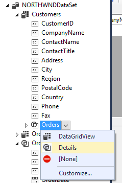

# Associar controles dos Windows Forms a dados no Visual Studio
Você pode exibir dados para usuários do seu aplicativo pela associação de dados para formulários do Windows. Para criar esses controles associados a dados, você pode arrastar itens a partir de **fontes de dados** janela no Designer de formulários do Windows no Visual Studio.
  

Antes de arrastar itens, você pode definir o tipo de controle que você deseja associar. Valores diferentes são exibidos dependendo se você escolher a tabela em si, ou uma coluna individual.  Você também pode definir valores personalizados. Para uma tabela, "Detalhes" significa que cada coluna é associada a um controle separado.  

  
  
## Controles de BindingNavigator e BindingSource
O <xref:System.Windows.Forms.BindingSource> componente tem duas finalidades. Primeiro, ele fornece uma camada de abstração ao associar os controles a dados. Para os controles no formulário são limitados a <xref:System.Windows.Forms.BindingSource> componente, em vez de diretamente a uma fonte de dados. Em segundo lugar, ele pode gerenciar uma coleção de objetos. Adicionar um tipo para o <xref:System.Windows.Forms.BindingSource> cria uma lista desse tipo.  
  
Para obter mais informações sobre o <xref:System.Windows.Forms.BindingSource> componente, consulte:  
  
-   [Componente BindingSource](/dotnet/framework/winforms/controls/bindingsource-component)  
  
-   [Visão geral do componente BindingSource](/dotnet/framework/winforms/controls/bindingsource-component-overview)  
  
-   [Arquitetura do componente BindingSource](/dotnet/framework/winforms/controls/bindingsource-component-architecture)  
  
O [controle BindingNavigator](/dotnet/framework/winforms/controls/bindingnavigator-control-windows-forms) fornece uma interface de usuário para navegar pelos dados exibidos por um aplicativo do Windows.

## Associar dados em um controle DataGridView  
Para uma [controle DataGridView](/dotnet/framework/winforms/controls/datagridview-control-overview-windows-forms), a tabela inteira está associada ao controle único. Quando você arrasta uma DataGridView do formulário, uma ferramenta da faixa para navegar pelos registros (<xref:System.Windows.Forms.BindingNavigator>) também será exibida. Um [DataSet](../data-tools/dataset-tools-in-visual-studio.md), [TableAdapter](../data-tools/create-and-configure-tableadapters.md), <xref:System.Windows.Forms.BindingSource>, e <xref:System.Windows.Forms.BindingNavigator> aparecem na bandeja do componente. A ilustração a seguir, um TableAdapterManager também é adicionado porque a tabela clientes tem uma relação à tabela Orders. Essas variáveis todos são declaradas no código gerado automaticamente como membros particulares na classe de formulário. O código gerado automaticamente para preencher o DataGridView está localizado no manipulador de eventos form_load. O código para salvar os dados para atualizar o banco de dados está localizado no manipulador de eventos Salvar para BindingNavigator. Você pode mover ou modificar este código conforme necessário.  
  
  
  
Você pode personalizar o comportamento de DataGridView e BindingNavigator clicando na marca inteligente no canto superior direito de cada um:  
  
  
  
Se os controles de seu aplicativo precisa não estiverem disponível no **fontes de dados** janela, você pode adicionar controles. Para obter mais informações, consulte [adicionar controles personalizados à janela fontes de dados](../data-tools/add-custom-controls-to-the-data-sources-window.md).  
  
Você também pode arrastar itens do **fontes de dados** window para controles já em um formulário para associar o controle aos dados. Um controle que já está associado a dados tiver seus dados associações redefinidas para o item mais recentemente arrastado para ele. Para destinos válidos para arrastar, controles devem ser capazes de exibir o tipo de dados subjacentes do item arrastado para ele do **fontes de dados** janela. Por exemplo, não é válido arrastar um item que tem um tipo de dados <xref:System.DateTime> para um <xref:System.Windows.Forms.CheckBox>, porque o <xref:System.Windows.Forms.CheckBox> não é capaz de exibir uma data.  
  
## Associar a dados em controles individuais  
Quando você associa uma fonte de dados para "Detalhes", cada coluna no conjunto de dados é associada a um controle separado.  
  
  
  
> [!IMPORTANT]
> Observe que, na ilustração anterior, você arrasta da propriedade pedidos da tabela Customers, não da tabela Orders. Associando a propriedade Orders, feitos no DataGridView de comandos de navegação são refletidos imediatamente em controles de detalhes. Se você arrastou da tabela Orders, os controles ainda poderá estar associados ao conjunto de dados, mas não eles não poderiam ser sincronizados com o DataGridView.  
  
A ilustração a seguir mostra o padrão controles associados a dados que são adicionados para o formulário depois que a propriedade de pedidos na tabela Customers é associada a "Detalhes" no **fontes de dados** janela.  
  
  
  
Observe também que cada controle tem uma marca inteligente. Essa marca permite que personalizações que se aplicam a esse controle.
  
## Consulte também
[Associando controles a dados no Visual Studio](../data-tools/bind-controls-to-data-in-visual-studio.md)  
[Associação de dados em formulários do Windows (.NET Framework)](/dotnet/framework/winforms/windows-forms-data-binding)