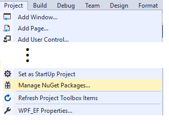
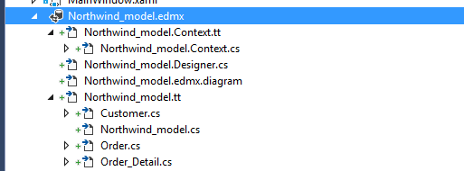
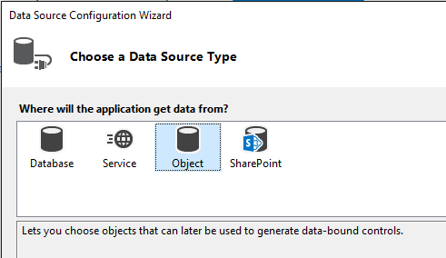
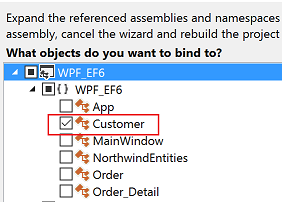
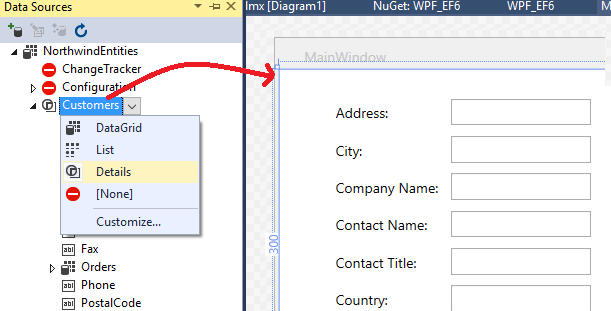
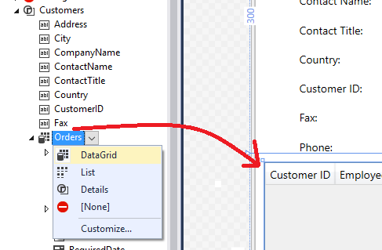

# <a name="create-a-simple-data-application-with-wpf-and-entity-framework-6"></a>Criar um aplicativo de dados simples com WPF e do Entity Framework 6

Este passo a passo mostra como criar um aplicativo "formas básicas sobre dados" no Visual Studio. O aplicativo usa o LocalDB do SQL Server, o banco de dados Northwind, Entity Framework 6 e Windows Presentation Foundation. Ele mostra como fazer a associação de dados básico com um modo de exibição de detalhes mestre, e ele também tem um personalizado "associação Navigator" com os botões para "MoveNext", "Mover anterior," "Mover para o início," "mover até o fim," "Atualizar" e "Excluir".

Este artigo enfoca usando ferramentas de dados no Visual Studio e não tenta explicar as tecnologias subjacentes em qualquer profundidade. Ele pressupõe que você tenha uma familiaridade básica com XAML, Entity Framework e SQL. Este exemplo também demonstra arquitetura de modo de exibição de modelo modelo MVVM (), que é o padrão para aplicativos do WPF. No entanto, você pode copiar este código em seu próprio aplicativo MVVM com poucas modificações.

## <a name="install-and-connect-to-northwind"></a>Instalar e conectar-se para a Northwind

Este exemplo usa o SQL Server Express LocalDB e o banco de dados de exemplo Northwind. Se o provedor de dados ADO.NET para o produto dá suporte ao Entity Framework, ele deve funcionar muito bem com outros produtos de banco de dados SQL.

1.  Se você não tiver o SQL Server Express LocalDB, instale-o do [página de download do SQL Server Express](https://www.microsoft.com/sql-server/sql-server-editions-express), ou por meio de **instalador do Visual Studio**. No instalador do Visual Studio, o SQL Server Express LocalDB pode ser instalado como parte do **desenvolvimento de área de trabalho do .NET** carga de trabalho, ou como um componente individual.

2.  Instale o banco de dados de exemplo Northwind seguindo estas etapas:

    1. No Visual Studio, abra o **Pesquisador de objetos do SQL Server** janela. (Pesquisador de objetos do SQL Server é instalado como parte do **armazenamento de dados e processamento** carga de trabalho em que o instalador do Visual Studio.) Expanda o **do SQL Server** nó. Clique com botão direito em sua instância de LocalDB e selecione **nova consulta...** .

       Abre uma janela do editor de consultas.

    2. Copie o [script Transact-SQL Northwind](https://github.com/MicrosoftDocs/visualstudio-docs/blob/master/docs/data-tools/samples/northwind.sql?raw=true) para sua área de transferência. Este script T-SQL cria o banco de dados Northwind desde o início e a preenche com dados.

    3. Cole o script T-SQL no editor de consultas e, em seguida, escolha o **Execute** botão.

       Após um curto período de tempo, a consulta termina de ser executado e o banco de dados Northwind é criado.

3.  [Adicionar novas conexões](../data-tools/add-new-connections.md) da Northwind.

## <a name="configure-the-project"></a>Configurar o projeto

1.  No Visual Studio, escolha **arquivo**, **novo**, **projeto...**  e, em seguida, crie um novo aplicativo WPF c#.

2.  Em seguida, adicionar o pacote NuGet para Entity Framework 6. No Solution Explorer, selecione o nó do projeto. No menu principal, escolha **projeto**, **gerenciar pacotes NuGet...**

     

3.  No Gerenciador de pacote NuGet, clique no **procurar** link. Entity Framework é provavelmente o pacote superior na lista. Clique em **instalar** no painel direito e siga os prompts. A janela de saída informa quando a instalação for concluída.

     

4.  Agora podemos usar o Visual Studio para criar um modelo com base no banco de dados Northwind.

## <a name="create-the-model"></a>Criar o modelo

1.  Clique com o botão direito no nó do projeto no Gerenciador de soluções e escolha **adicionar**, **Novo Item...** . No painel esquerdo, sob o nó C#, escolha **dados** e no painel central, escolha **modelo de dados de entidade ADO.NET**.

     

  2.  Chame o modelo `Northwind_model` e escolha Okey. O **Assistente de modelo de dados de entidade** é aberto. Escolha **EF Designer do banco de dados** e, em seguida, clique em **próximo**.

     

3.  Na próxima tela, escolha o LocalDB Northwind conexão e clique em **próximo**.

4.  Na próxima página do assistente, podemos escolher quais tabelas, procedimentos armazenados e outros objetos de banco de dados para incluir no modelo do Entity Framework. Expanda o nó dbo na exibição de árvore e escolha os clientes, pedidos e detalhes do pedido. Deixe o padrão é marcada e clique em **concluir**.

     

5.  O assistente gera as classes do c# que representam o modelo do Entity Framework. As classes são antigos classes c# simples e são que podemos databind à interface de usuário do WPF. O arquivo. edmx descreve as relações e outros metadados que associa as classes de objetos no banco de dados. Os arquivos. TT são modelos T4 geram o código que opera no modelo e salvar as alterações no banco de dados. Você pode ver todos esses arquivos no Gerenciador de soluções sob o nó Northwind_model:

       

     A superfície do designer para o arquivo. edmx permite modificar algumas propriedades e relações no modelo. Não vamos usar o designer neste passo a passo.

6.  Os arquivos. TT são genéricos e precisamos ajustar um para trabalhar com associação de dados do WPF, que exige ObservableCollections. No Gerenciador de soluções, expanda o nó de Northwind_model até encontrar Northwind_model.tt. (Verifique se você está *não* no *. Contexto. TT arquivo, que está diretamente abaixo o arquivo. edmx.)

    -   Substitua as duas ocorrências de <xref:System.Collections.ICollection> com <xref:System.Collections.ObjectModel.ObservableCollection%601>.

    -   Substitua a primeira ocorrência de <xref:System.Collections.Generic.HashSet%601> com <xref:System.Collections.ObjectModel.ObservableCollection%601> em torno da linha 51. Não substituirá a segunda ocorrência da HashSet

    -   Substitua a ocorrência única de <xref:System.Collections.Generic> (em torno da linha 431) com <xref:System.Collections.ObjectModel>.

7.  Pressione **Ctrl + Shift + B** para compilar o projeto. Quando a compilação for concluída, as classes de modelo são visíveis para o Assistente de fontes de dados.

Agora você está pronto para conectar esse modelo para a página XAML de forma que podemos exibir, navegar e modificar os dados.

## <a name="databind-the-model-to-the-xaml-page"></a>Associação de dados de modelo para a página do XAML

É possível escrever seu próprio código de associação de dados, mas é mais fácil permitir que o Visual Studio faça isso para você.

1.  No menu principal, escolha **projeto > Adicionar nova fonte de dados** para ativar o **Assistente de configuração de fonte de dados**. Escolha **objeto** porque estamos associando para as classes de modelo, não para o banco de dados:

     

2.  Selecione o cliente. (Fontes para pedidos são gerados automaticamente da propriedade de navegação pedidos do cliente).

     

3.  Clique em **concluir**

4.  Navegue até MainWindow. XAML no modo de exibição de código. Vamos manter o XAML simples para os fins deste exemplo. Alterar o título de MainWindow para algo mais descritivo e aumentar sua altura e largura para 800 x 600 por enquanto. Você pode sempre alterá-lo mais tarde. Agora adicione estas definições de três linhas de grade principal, uma linha para os botões de navegação, uma para os detalhes do cliente, uma para a grade mostra as ordens:

    ```xaml
    <Grid.RowDefinitions>
            <RowDefinition Height="auto"/>
            <RowDefinition Height="auto"/>
            <RowDefinition Height="*"/>
        </Grid.RowDefinitions>
    ```

5.  Agora, abra MainWindow. XAML para que você está exibindo-lo no designer. Isso faz com que a janela fontes de dados sejam exibidos como uma opção na margem da janela do Visual Studio ao lado da caixa de ferramentas. Clique na guia para abrir a janela ou pressione else **Shift**+**Alt**+**D** ou escolha **exibição**  >  **Outras janelas** > **fontes de dados**. Vamos para exibir cada propriedade na classe de clientes em sua própria caixa de texto individuais. Primeiro, clique na seta na caixa de combinação de clientes e escolha **detalhes**. Arraste o nó para a parte central da superfície de design para que o designer sabe que você deseja na linha do meio. Se você substitua a ele, você pode especificar a linha manualmente mais tarde no XAML. Por padrão, os controles são colocados verticalmente em um elemento de grade, mas agora você pode organizá-los como no formulário. Por exemplo, pode fazer sentido colocar a caixa de texto nome na parte superior, acima do endereço. O aplicativo de exemplo para este artigo reorganiza os campos e reorganiza-los em duas colunas.

     

     Na exibição de código, agora você pode ver uma nova `Grid` elemento na linha 1 (a linha intermediária) do pai de grade. O pai grade tem uma `DataContext` atributo que se refere a um CollectionViewSource que foi adicionado ao `Windows.Resources` elemento. Considerando esse contexto de dados, quando a primeira caixa de texto associa a "Address", esse nome é mapeado para o `Address` propriedade atual `Customer` objeto no CollectionViewSource.

    ```xaml
    <Grid DataContext="{StaticResource customerViewSource}">
    ```

6.  Quando um cliente estiver visível na metade superior da janela, você deseja ver seus pedidos na parte inferior metade. Vamos mostrar os pedidos em um controle de exibição de grade simples. Para associação de dados de detalhes mestre funcione como esperado, é importante que podemos associar à propriedade pedidos na classe de clientes, não para o nó de pedidos separado. Arraste a propriedade de pedidos da classe de clientes na metade inferior do formulário, para que o designer coloca na linha 2:

     

7.  O Visual Studio gerou todo o código de associação que conecta os controles de interface do usuário a eventos no modelo. Tudo que precisamos fazer para ver alguns dados, é escrever um código para preencher o modelo. Primeiro vamos navegue até MainWindow.xaml.cs e adicionar um membro de dados para a classe MainWindow para o contexto de dados. Esse objeto, que foi gerado para que possamos, age algo parecido com um controle que rastreia alterações e eventos no modelo. Nós adicionaremos a lógica de inicialização do construtor. A parte superior da nossa classe deve ter esta aparência:

     [!code-csharp[MainWindow#1](../data-tools/codesnippet/CSharp/CreateWPFDataApp/MainWindow.xaml.cs#1)]

     Adicionar um `using` diretiva para System.Data.Entity colocar o método de extensão de carga no escopo:

     ```csharp
     using System.Data.Entity;
     ```

     Agora, role para baixo e localize o manipulador de eventos Window_Loaded. Observe que o Visual Studio adicionou um objeto CollectionViewSource para nós. Isso representa o objeto de NorthwindEntities que selecionamos quando criamos o modelo. Vamos adicionar código para Window_Loaded para que todo o método agora esta aparência:

     [!code-csharp[Window_Loaded#2](../data-tools/codesnippet/CSharp/CreateWPFDataApp/MainWindow.xaml.cs#2)]

8.  Pressione **F5**. Você deve ver os detalhes para o primeiro cliente que foi recuperado no CollectionViewSource. Você também verá seus pedidos na grade de dados. Não é grande, por isso vamos corrigir que a formatação. Também vamos criar uma maneira de exibir os outros registros e realizar operações CRUD básicas.

## <a name="adjust-the-page-design-and-add-grids-for-new-customers-and-orders"></a>Ajustar o design da página e adicionar grades para novos clientes e pedidos

A organização padrão produzida pelo Visual Studio não é ideal para nosso aplicativo, portanto faremos algumas alterações manualmente em XAML. Também precisamos alguns "formulários" (que são realmente grades) para permitir que o usuário adicionar um novo cliente ou pedido. Para poder adicionar um novo cliente e a classificação, precisamos de um conjunto separado de caixas de texto que não são associados a dados para o `CollectionViewSource`. Podemos vai controlar quais o usuário vê a qualquer momento determinado, definindo a propriedade Visible nos métodos de manipulador de grade. Por fim, adicionamos um botão de exclusão para cada linha da grade de pedidos para permitir que o usuário excluir um pedido individual.

Primeiro, adicione estes estilos para o elemento Windows.Resources MainWindow. XAML:

```xaml
<Style x:Key="Label" TargetType="{x:Type Label}" BasedOn="{x:Null}">
    <Setter Property="HorizontalAlignment" Value="Left"/>
    <Setter Property="VerticalAlignment" Value="Center"/>
    <Setter Property="Margin" Value="3"/>
    <Setter Property="Height" Value="23"/>
</Style>
<Style x:Key="CustTextBox" TargetType="{x:Type TextBox}" BasedOn="{x:Null}">
    <Setter Property="HorizontalAlignment" Value="Right"/>
    <Setter Property="VerticalAlignment" Value="Center"/>
    <Setter Property="Margin" Value="3"/>
    <Setter Property="Height" Value="26"/>
    <Setter Property="Width" Value="120"/>
</Style>
```

Em seguida, substitua toda a grade externa com essa marcação:

```xaml
<Grid>
     <Grid.RowDefinitions>
         <RowDefinition Height="auto"/>
         <RowDefinition Height="auto"/>
         <RowDefinition Height="*"/>
     </Grid.RowDefinitions>
     <Grid x:Name="existingCustomerGrid" Grid.Row="1" HorizontalAlignment="Left" Margin="5" Visibility="Visible" VerticalAlignment="Top" Background="AntiqueWhite" DataContext="{StaticResource customerViewSource}">
         <Grid.ColumnDefinitions>
             <ColumnDefinition Width="Auto" MinWidth="233"/>
             <ColumnDefinition Width="Auto" MinWidth="397"/>
         </Grid.ColumnDefinitions>
         <Grid.RowDefinitions>
             <RowDefinition Height="Auto"/>
             <RowDefinition Height="Auto"/>
             <RowDefinition Height="Auto"/>
             <RowDefinition Height="Auto"/>
             <RowDefinition Height="Auto"/>
             <RowDefinition Height="Auto"/>
         </Grid.RowDefinitions>
         <Label Content="Customer ID:" Grid.Row="0" Style="{StaticResource Label}"/>
         <TextBox x:Name="customerIDTextBox" Grid.Row="0" Style="{StaticResource CustTextBox}"
                  Text="{Binding CustomerID, Mode=TwoWay, NotifyOnValidationError=true, ValidatesOnExceptions=true}"/>
         <Label Content="Company Name:" Grid.Row="1" Style="{StaticResource Label}"/>
         <TextBox x:Name="companyNameTextBox" Grid.Row="1" Style="{StaticResource CustTextBox}"
                  Text="{Binding CompanyName, Mode=TwoWay, NotifyOnValidationError=true, ValidatesOnExceptions=true}"/>
         <Label Content="Contact Name:" Grid.Row="2" Style="{StaticResource Label}"/>
         <TextBox x:Name="contactNameTextBox" Grid.Row="2" Style="{StaticResource CustTextBox}"
                  Text="{Binding ContactName, Mode=TwoWay, NotifyOnValidationError=true, ValidatesOnExceptions=true}"/>
         <Label Content="Contact Title:" Grid.Row="3" Style="{StaticResource Label}"/>
         <TextBox x:Name="contactTitleTextBox" Grid.Row="3" Style="{StaticResource CustTextBox}"
                  Text="{Binding ContactTitle, Mode=TwoWay, NotifyOnValidationError=true, ValidatesOnExceptions=true}"/>
         <Label Content="Address:" Grid.Row="4" Style="{StaticResource Label}"/>
         <TextBox x:Name="addressTextBox" Grid.Row="4" Style="{StaticResource CustTextBox}"
                  Text="{Binding Address, Mode=TwoWay, NotifyOnValidationError=true, ValidatesOnExceptions=true}"/>
         <Label Content="City:" Grid.Column="1" Grid.Row="0" Style="{StaticResource Label}"/>
         <TextBox x:Name="cityTextBox" Grid.Column="1" Grid.Row="0" Style="{StaticResource CustTextBox}"
                  Text="{Binding City, Mode=TwoWay, NotifyOnValidationError=true, ValidatesOnExceptions=true}"/>
         <Label Content="Country:" Grid.Column="1" Grid.Row="1" Style="{StaticResource Label}"/>
         <TextBox x:Name="countryTextBox" Grid.Column="1" Grid.Row="1" Style="{StaticResource CustTextBox}"
                  Text="{Binding Country, Mode=TwoWay, NotifyOnValidationError=true, ValidatesOnExceptions=true}"/>
         <Label Content="Fax:" Grid.Column="1" Grid.Row="2" Style="{StaticResource Label}"/>
         <TextBox x:Name="faxTextBox" Grid.Column="1" Grid.Row="2" Style="{StaticResource CustTextBox}"
                  Text="{Binding Fax, Mode=TwoWay, NotifyOnValidationError=true, ValidatesOnExceptions=true}"/>
         <Label Content="Phone:" Grid.Column="1" Grid.Row="3" Style="{StaticResource Label}"/>
         <TextBox x:Name="phoneTextBox" Grid.Column="1" Grid.Row="3" Style="{StaticResource CustTextBox}"
                  Text="{Binding Phone, Mode=TwoWay, NotifyOnValidationError=true, ValidatesOnExceptions=true}"/>
         <Label Content="Postal Code:" Grid.Column="1" Grid.Row="4" VerticalAlignment="Center" Style="{StaticResource Label}"/>
         <TextBox x:Name="postalCodeTextBox" Grid.Column="1" Grid.Row="4" Style="{StaticResource CustTextBox}"
                  Text="{Binding PostalCode, Mode=TwoWay, NotifyOnValidationError=true, ValidatesOnExceptions=true}"/>
         <Label Content="Region:" Grid.Column="1" Grid.Row="5" Style="{StaticResource Label}"/>
         <TextBox x:Name="regionTextBox" Grid.Column="1" Grid.Row="5" Style="{StaticResource CustTextBox}"
                  Text="{Binding Region, Mode=TwoWay, NotifyOnValidationError=true, ValidatesOnExceptions=true}"/>
     </Grid>
     <Grid x:Name="newCustomerGrid" Grid.Row="1" HorizontalAlignment="Left" VerticalAlignment="Top" Margin="5" DataContext="{Binding RelativeSource={RelativeSource FindAncestor, AncestorType={x:Type Window}}, Path=newCustomer, UpdateSourceTrigger=Explicit}" Visibility="Collapsed" Background="CornflowerBlue">
         <Grid.ColumnDefinitions>
             <ColumnDefinition Width="Auto" MinWidth="233"/>
             <ColumnDefinition Width="Auto" MinWidth="397"/>
         </Grid.ColumnDefinitions>
         <Grid.RowDefinitions>
             <RowDefinition Height="Auto"/>
             <RowDefinition Height="Auto"/>
             <RowDefinition Height="Auto"/>
             <RowDefinition Height="Auto"/>
             <RowDefinition Height="Auto"/>
             <RowDefinition Height="Auto"/>
         </Grid.RowDefinitions>
         <Label Content="Customer ID:" Grid.Row="0" Style="{StaticResource Label}"/>
         <TextBox x:Name="add_customerIDTextBox" Grid.Row="0" Style="{StaticResource CustTextBox}"
                  Text="{Binding CustomerID, Mode=TwoWay, NotifyOnValidationError=true, ValidatesOnExceptions=true}"/>
         <Label Content="Company Name:" Grid.Row="1" Style="{StaticResource Label}"/>
         <TextBox x:Name="add_companyNameTextBox" Grid.Row="1" Style="{StaticResource CustTextBox}"
                  Text="{Binding CompanyName, Mode=TwoWay, NotifyOnValidationError=true, ValidatesOnExceptions=true }"/>
         <Label Content="Contact Name:" Grid.Row="2" Style="{StaticResource Label}"/>
         <TextBox x:Name="add_contactNameTextBox" Grid.Row="2" Style="{StaticResource CustTextBox}"
                  Text="{Binding ContactName, Mode=TwoWay, NotifyOnValidationError=true, ValidatesOnExceptions=true}"/>
         <Label Content="Contact Title:" Grid.Row="3" Style="{StaticResource Label}"/>
         <TextBox x:Name="add_contactTitleTextBox" Grid.Row="3" Style="{StaticResource CustTextBox}"
                  Text="{Binding ContactTitle, Mode=TwoWay, NotifyOnValidationError=true, ValidatesOnExceptions=true}"/>
         <Label Content="Address:" Grid.Row="4" Style="{StaticResource Label}"/>
         <TextBox x:Name="add_addressTextBox" Grid.Row="4" Style="{StaticResource CustTextBox}"
                  Text="{Binding Address, Mode=TwoWay, NotifyOnValidationError=true, ValidatesOnExceptions=true}"/>
         <Label Content="City:" Grid.Column="1" Grid.Row="0" Style="{StaticResource Label}"/>
         <TextBox x:Name="add_cityTextBox" Grid.Column="1" Grid.Row="0" Style="{StaticResource CustTextBox}"
                  Text="{Binding City, Mode=TwoWay, NotifyOnValidationError=true, ValidatesOnExceptions=true}"/>
         <Label Content="Country:" Grid.Column="1" Grid.Row="1" Style="{StaticResource Label}"/>
         <TextBox x:Name="add_countryTextBox" Grid.Column="1" Grid.Row="1" Style="{StaticResource CustTextBox}"
                  Text="{Binding Country, Mode=TwoWay, NotifyOnValidationError=true, ValidatesOnExceptions=true}"/>
         <Label Content="Fax:" Grid.Column="1" Grid.Row="2" Style="{StaticResource Label}"/>
         <TextBox x:Name="add_faxTextBox" Grid.Column="1" Grid.Row="2" Style="{StaticResource CustTextBox}"
                  Text="{Binding Fax, Mode=TwoWay, NotifyOnValidationError=true, ValidatesOnExceptions=true}"/>
         <Label Content="Phone:" Grid.Column="1" Grid.Row="3" Style="{StaticResource Label}"/>
         <TextBox x:Name="add_phoneTextBox" Grid.Column="1" Grid.Row="3" Style="{StaticResource CustTextBox}"
                  Text="{Binding Phone, Mode=TwoWay, NotifyOnValidationError=true, ValidatesOnExceptions=true}"/>
         <Label Content="Postal Code:" Grid.Column="1" Grid.Row="4" VerticalAlignment="Center" Style="{StaticResource Label}"/>
         <TextBox x:Name="add_postalCodeTextBox" Grid.Column="1" Grid.Row="4" Style="{StaticResource CustTextBox}"
                  Text="{Binding PostalCode, Mode=TwoWay, NotifyOnValidationError=true, ValidatesOnExceptions=true}"/>
         <Label Content="Region:" Grid.Column="1" Grid.Row="5" Style="{StaticResource Label}"/>
         <TextBox x:Name="add_regionTextBox" Grid.Column="1" Grid.Row="5" Style="{StaticResource CustTextBox}"
                  Text="{Binding Region, Mode=TwoWay, NotifyOnValidationError=true, ValidatesOnExceptions=true}"/>
     </Grid>
     <Grid x:Name="newOrderGrid" Grid.Row="1" HorizontalAlignment="Left" VerticalAlignment="Top" Margin="5" DataContext="{Binding Path=newOrder, Mode=TwoWay}" Visibility="Collapsed" Background="LightGreen">
         <Grid.ColumnDefinitions>
             <ColumnDefinition Width="Auto" MinWidth="233"/>
             <ColumnDefinition Width="Auto" MinWidth="397"/>
         </Grid.ColumnDefinitions>
         <Grid.RowDefinitions>
             <RowDefinition Height="Auto"/>
             <RowDefinition Height="Auto"/>
             <RowDefinition Height="Auto"/>
             <RowDefinition Height="Auto"/>
             <RowDefinition Height="Auto"/>
             <RowDefinition Height="Auto"/>
             <RowDefinition Height="Auto"/>
         </Grid.RowDefinitions>
         <Label Content="New Order Form" FontWeight="Bold"/>
         <Label Content="Employee ID:"  Grid.Row="1" Style="{StaticResource Label}"/>
         <TextBox x:Name="add_employeeIDTextBox" Grid.Row="1" Style="{StaticResource CustTextBox}"
                  Text="{Binding EmployeeID, Mode=TwoWay, NotifyOnValidationError=true, ValidatesOnExceptions=true}"/>
         <Label Content="Order Date:"  Grid.Row="2" Style="{StaticResource Label}"/>
         <DatePicker x:Name="add_orderDatePicker" Grid.Row="2"  HorizontalAlignment="Right" Width="120"
                 SelectedDate="{Binding OrderDate, Mode=TwoWay, NotifyOnValidationError=true, ValidatesOnExceptions=true, UpdateSourceTrigger=PropertyChanged}"/>
         <Label Content="Required Date:" Grid.Row="3" Style="{StaticResource Label}"/>
         <DatePicker x:Name="add_requiredDatePicker" Grid.Row="3" HorizontalAlignment="Right" Width="120"
                  SelectedDate="{Binding RequiredDate, Mode=TwoWay, NotifyOnValidationError=true, ValidatesOnExceptions=true, UpdateSourceTrigger=PropertyChanged}"/>
         <Label Content="Shipped Date:"  Grid.Row="4"  Style="{StaticResource Label}"/>
         <DatePicker x:Name="add_shippedDatePicker"  Grid.Row="4"  HorizontalAlignment="Right" Width="120"
                 SelectedDate="{Binding ShippedDate, Mode=TwoWay, NotifyOnValidationError=true, ValidatesOnExceptions=true, UpdateSourceTrigger=PropertyChanged}"/>
         <Label Content="Ship Via:"  Grid.Row="5" Style="{StaticResource Label}"/>
         <TextBox x:Name="add_ShipViaTextBox"  Grid.Row="5" Style="{StaticResource CustTextBox}"
                  Text="{Binding ShipVia, Mode=TwoWay, NotifyOnValidationError=true, ValidatesOnExceptions=true}"/>
         <Label Content="Freight"  Grid.Row="6" Style="{StaticResource Label}"/>
         <TextBox x:Name="add_freightTextBox" Grid.Row="6" Style="{StaticResource CustTextBox}"
                  Text="{Binding Freight, Mode=TwoWay, NotifyOnValidationError=true, ValidatesOnExceptions=true}"/>
     </Grid>
     <DataGrid x:Name="ordersDataGrid" SelectionUnit="Cell" SelectionMode="Single" AutoGenerateColumns="False" CanUserAddRows="false" IsEnabled="True" EnableRowVirtualization="True" Width="auto" ItemsSource="{Binding Source={StaticResource customerOrdersViewSource}}" Margin="10,10,10,10" Grid.Row="2" RowDetailsVisibilityMode="VisibleWhenSelected">
         <DataGrid.Columns>
             <DataGridTemplateColumn>
                 <DataGridTemplateColumn.CellTemplate>
                     <DataTemplate>
                         <Button Content="Delete" Command="{StaticResource DeleteOrderCommand}" CommandParameter="{Binding}"/>
                     </DataTemplate>
                 </DataGridTemplateColumn.CellTemplate>
             </DataGridTemplateColumn>
             <DataGridTextColumn x:Name="customerIDColumn" Binding="{Binding CustomerID}" Header="Customer ID" Width="SizeToHeader"/>
             <DataGridTextColumn x:Name="employeeIDColumn" Binding="{Binding EmployeeID}" Header="Employee ID" Width="SizeToHeader"/>
             <DataGridTextColumn x:Name="freightColumn" Binding="{Binding Freight}" Header="Freight" Width="SizeToHeader"/>
             <DataGridTemplateColumn x:Name="orderDateColumn" Header="Order Date" Width="SizeToHeader">
                 <DataGridTemplateColumn.CellTemplate>
                     <DataTemplate>
                         <DatePicker SelectedDate="{Binding OrderDate, Mode=TwoWay, NotifyOnValidationError=true, ValidatesOnExceptions=true, UpdateSourceTrigger=PropertyChanged}"/>
                     </DataTemplate>
                 </DataGridTemplateColumn.CellTemplate>
             </DataGridTemplateColumn>
             <DataGridTextColumn x:Name="orderIDColumn" Binding="{Binding OrderID}" Header="Order ID" Width="SizeToHeader"/>
             <DataGridTemplateColumn x:Name="requiredDateColumn" Header="Required Date" Width="SizeToHeader">
                 <DataGridTemplateColumn.CellTemplate>
                     <DataTemplate>
                         <DatePicker SelectedDate="{Binding RequiredDate, Mode=TwoWay, NotifyOnValidationError=true, ValidatesOnExceptions=true, UpdateSourceTrigger=PropertyChanged}"/>
                     </DataTemplate>
                 </DataGridTemplateColumn.CellTemplate>
             </DataGridTemplateColumn>
             <DataGridTextColumn x:Name="shipAddressColumn" Binding="{Binding ShipAddress}" Header="Ship Address" Width="SizeToHeader"/>
             <DataGridTextColumn x:Name="shipCityColumn" Binding="{Binding ShipCity}" Header="Ship City" Width="SizeToHeader"/>
             <DataGridTextColumn x:Name="shipCountryColumn" Binding="{Binding ShipCountry}" Header="Ship Country" Width="SizeToHeader"/>
             <DataGridTextColumn x:Name="shipNameColumn" Binding="{Binding ShipName}" Header="Ship Name" Width="SizeToHeader"/>
             <DataGridTemplateColumn x:Name="shippedDateColumn" Header="Shipped Date" Width="SizeToHeader">
                 <DataGridTemplateColumn.CellTemplate>
                     <DataTemplate>
                         <DatePicker SelectedDate="{Binding ShippedDate, Mode=TwoWay, NotifyOnValidationError=true, ValidatesOnExceptions=true, UpdateSourceTrigger=PropertyChanged}"/>
                     </DataTemplate>
                 </DataGridTemplateColumn.CellTemplate>
             </DataGridTemplateColumn>
             <DataGridTextColumn x:Name="shipPostalCodeColumn" Binding="{Binding ShipPostalCode}" Header="Ship Postal Code" Width="SizeToHeader"/>
             <DataGridTextColumn x:Name="shipRegionColumn" Binding="{Binding ShipRegion}" Header="Ship Region" Width="SizeToHeader"/>
             <DataGridTextColumn x:Name="shipViaColumn" Binding="{Binding ShipVia}" Header="Ship Via" Width="SizeToHeader"/>
         </DataGrid.Columns>
     </DataGrid>
 </Grid>
```

## <a name="add-buttons-to-navigate-add-update-and-delete"></a>Adicionar botões para navegar, adicionar, atualizar e excluir

Em aplicativos de formulários do Windows, você pode obter um objeto de BindingNavigator com botões para navegar pelas linhas em um banco de dados e realizar operações CRUD básicas. WPF não fornece um BindingNavigator, mas é muito fácil criar um. Podemos fazer isso com botões dentro de um StackPanel horizontal e estamos associará os botões de comandos que são associados a métodos no code-behind.

Há quatro partes para a lógica de comando: (1) os comandos, (2) as associações, (3) os botões e (4) o manipulador de comandos no code-behind.

### <a name="add-commands-bindings-and-buttons-in-xaml"></a>Adicionar comandos, associações e botões em XAML

1.  Primeiro, vamos adicionar os comandos em nosso arquivo MainWindow dentro do elemento Windows.Resources:

    ```xaml
    <RoutedUICommand x:Key="FirstCommand" Text="First"/>
    <RoutedUICommand x:Key="LastCommand" Text="Last"/>
    <RoutedUICommand x:Key="NextCommand" Text="Next"/>
    <RoutedUICommand x:Key="PreviousCommand" Text="Previous"/>
    <RoutedUICommand x:Key="DeleteCustomerCommand" Text="Delete Customer"/>
    <RoutedUICommand x:Key="DeleteOrderCommand" Text="Delete Order"/>
    <RoutedUICommand x:Key="UpdateCommand" Text="Update"/>
    <RoutedUICommand x:Key="AddCommand" Text="Add"/>
    <RoutedUICommand x:Key="CancelCommand" Text="Cancel"/>
    ```

2.  Um CommandBinding mapeia um evento RoutedUICommand para um método no code-behind. Adicione esse elemento CommandBindings após a marca de fechamento de Windows.Resources:

    ```xaml
    <Window.CommandBindings>
        <CommandBinding Command="{StaticResource FirstCommand}" Executed="FirstCommandHandler"/>
        <CommandBinding Command="{StaticResource LastCommand}" Executed="LastCommandHandler"/>
        <CommandBinding Command="{StaticResource NextCommand}" Executed="NextCommandHandler"/>
        <CommandBinding Command="{StaticResource PreviousCommand}" Executed="PreviousCommandHandler"/>
        <CommandBinding Command="{StaticResource DeleteCustomerCommand}" Executed="DeleteCustomerCommandHandler"/>
        <CommandBinding Command="{StaticResource DeleteOrderCommand}" Executed="DeleteOrderCommandHandler"/>
        <CommandBinding Command="{StaticResource UpdateCommand}" Executed="UpdateCommandHandler"/>
        <CommandBinding Command="{StaticResource AddCommand}" Executed="AddCommandHandler"/>
        <CommandBinding Command="{StaticResource CancelCommand}" Executed="CancelCommandHandler"/>
    </Window.CommandBindings>
    ```

3.  Agora vamos adicionar StackPanel com o painel de navegação, adicionar, excluir e atualizar botões. Primeiro, adicione esse estilo ao Windows.Resources:

    ```xaml
    <Style x:Key="NavButton" TargetType="{x:Type Button}" BasedOn="{x:Null}">
        <Setter Property="FontSize" Value="24"/>
        <Setter Property="FontFamily" Value="Segoe UI Symbol"/>
        <Setter Property="Margin" Value="2,2,2,0"/>
        <Setter Property="Width" Value="40"/>
        <Setter Property="Height" Value="auto"/>
    </Style>
    ```

     Em seguida, cole este código logo após o RowDefinitions para o elemento externo de grade, na parte superior da página XAML:

    ```xaml
    <StackPanel Orientation="Horizontal" Margin="2,2,2,0" Height="36" VerticalAlignment="Top" Background="Gainsboro" DataContext="{StaticResource customerViewSource}" d:LayoutOverrides="LeftMargin, RightMargin, TopMargin, BottomMargin">
        <Button Name="btnFirst" Content="|◄" Command="{StaticResource FirstCommand}" Style="{StaticResource NavButton}"/>
        <Button Name="btnPrev" Content="◄" Command="{StaticResource PreviousCommand}" Style="{StaticResource NavButton}"/>
        <Button Name="btnNext" Content="►" Command="{StaticResource NextCommand}" Style="{StaticResource NavButton}"/>
        <Button Name="btnLast" Content="►|" Command="{StaticResource LastCommand}" Style="{StaticResource NavButton}"/>
        <Button Name="btnDelete" Content="Delete Customer" Command="{StaticResource DeleteCustomerCommand}" FontSize="11" Width="120" Style="{StaticResource NavButton}"/>
        <Button Name="btnAdd" Content="New Customer" Command="{StaticResource AddCommand}" FontSize="11" Width="80" Style="{StaticResource NavButton}"/>
        <Button Content="New Order" Name="btnNewOrder" FontSize="11" Width="80" Style="{StaticResource NavButton}" Click="NewOrder_click"/>
        <Button Name="btnUpdate" Content="Commit" Command="{StaticResource UpdateCommand}" FontSize="11" Width="80" Style="{StaticResource NavButton}"/>
        <Button Content="Cancel" Name="btnCancel" Command="{StaticResource CancelCommand}" FontSize="11" Width="80" Style="{StaticResource NavButton}"/>
    </StackPanel>
    ```

### <a name="add-command-handlers-to-the-mainwindow-class"></a>Adicionar manipuladores de comandos para a classe MainWindow

Code-behind é mínimo, exceto os métodos adicionar e excluir. Navegação é executada chamando métodos na propriedade de exibição de CollectionViewSource. O DeleteOrderCommandHandler mostra como executar uma exclusão em cascata em uma ordem. É necessário primeiro excluir o Order_Details que estão associados ele. O UpdateCommandHandler adiciona um novo cliente ou pedido à coleção, caso contrário, atualiza apenas um cliente existente ou ordem com as alterações que o usuário fez nas caixas de texto.

Adicione esses métodos de manipulador para a classe MainWindow MainWindow.xaml.cs. Se seu CollectionViewSource para a tabela clientes tem um nome diferente, você precisa ajustar o nome em cada um dos seguintes métodos:

[!code-csharp[CommandHandlers#3](../data-tools/codesnippet/CSharp/CreateWPFDataApp/MainWindow.xaml.cs#3)]

## <a name="run-the-application"></a>Executar o aplicativo

Para iniciar a depuração, pressione **F5**. Você deve ver o cliente e preenchidos na grade de dados de pedidos e os botões de navegação devem funcionar conforme o esperado. Clique em "Confirmação" para adicionar um novo cliente ou a ordem para o modelo depois de inserir os dados. Clique em "Cancelar" para fazer fora de um novo cliente ou um novo formulário sem salvar os dados. Você pode fazer edições em clientes e pedidos diretamente nas caixas de texto, e essas alterações são gravadas automaticamente para o modelo.

## <a name="see-also"></a>Consulte também

- [Ferramentas de dados do Visual Studio para .NET](../data-tools/visual-studio-data-tools-for-dotnet.md)
- [Documentação do Entity Framework](/ef/)