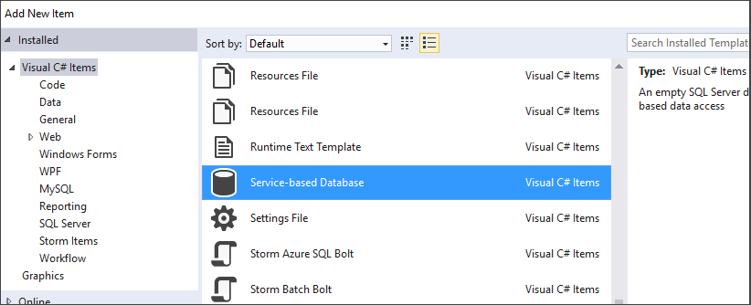
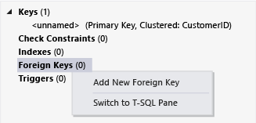

# Criar um banco de dados SQL usando um designer
Você pode explorar tarefas básicas, como adição de tabelas e definir colunas, usando o Visual Studio para criar e atualizar um arquivo de banco de dados local no SQL Server Express LocalDB. Depois de concluir este passo a passo, você pode descobrir recursos mais avançados usando o banco de dados local como um ponto de partida para outra explicações passo a passo que a exigem.  
  
 Você também pode criar um banco de dados usando o SQL Server Management Studio \(um download separado\) ou instruções Transact\-SQL na janela da ferramenta de Pesquisador de objetos do SQL Server no Visual Studio.  
  
 Durante essa explicação passo a passo, você irá explorar as seguintes tarefas:  
  
-   [Criando um projeto e um arquivo de banco de dados local](../data-tools/create-a-sql-database-by-using-a-designer.md#BKMK_CreateNewSQLDB).  
  
-   [Criando tabelas, colunas, chaves primárias e chaves estrangeiras](../data-tools/create-a-sql-database-by-using-a-designer.md#BKMK_CreateNewTbls).  
  
-   [Preencher as tabelas com dados](../data-tools/create-a-sql-database-by-using-a-designer.md#BKMK_Populating).  
  
## Pré-requisitos  
 Para concluir este passo a passo, certifique\-se de que você tenha as ferramentas de dados do SQL Server instalado. No menu Exibir, você deve ver o Pesquisador de objetos do SQL Server. Se não estiver, vá para adicionar ou remover programas, clique em Visual Studio 2015, escolha alterar e marque a caixa ao lado do SQL Server Data Tools.  
  
##  <a name="BKMK_CreateNewSQLDB"></a> Criando um projeto e um arquivo de banco de dados local  
  
#### Para criar um projeto e um arquivo de banco de dados  
  
1.  Criar um projeto Windows Forms chamado `SampleDatabaseWalkthrough`.  
  
2.  Na barra de menus, escolha **projeto &#124; Adicionar Novo Item**.  
  
3.  Na lista de modelos de item, role para baixo e escolha **banco de dados baseado em serviço**.  
  
       
  
4.  Nome do banco de dados **SampleDatabase**, e, em seguida, escolha o **Add** botão.  
  
5.  Se a janela fontes de dados não estiver aberta, abra\-a escolhendo as teclas Shift\-Alt\-D ou, na barra de menus, escolhendo **Exibir &#124; Outras janelas &#124; Fontes de dados**.  
  
6.  Na janela fontes de dados, escolha o **Add New Data Source** link.  
  
7.  No **Data Source Configuration Wizard**, escolha o **próximo** botão quatro vezes para aceitar as configurações padrão e, em seguida, escolha o **Concluir** botão.  
  
 Abrindo a janela Propriedades de banco de dados, você pode exibir sua cadeia de conexão e o local do arquivo. mdf primário. Você verá que o arquivo de banco de dados está na pasta do projeto.  
  
-   No Visual Studio, escolha **Exibir &#124; Pesquisador de objetos do SQL Server** se essa janela não estiver aberta. Abra a janela Propriedades expandindo o **conexões de dados** nó, abrindo o menu de atalho de SampleDatabase. mdf e em seguida, escolhendo **propriedades**.  
  
-   Como alternativa, você pode escolher **Exibir &#124; Gerenciador de servidores**, se essa janela não estiver aberta. Abra a janela Propriedades expandindo o **conexões de dados** nó. Abra o menu de atalho de SampleDatabase. mdf e escolha **propriedades**.  
  
##  <a name="BKMK_CreateNewTbls"></a> Criando tabelas, colunas, chaves primárias e chaves estrangeiras  
 Nesta seção, você criará duas tabelas, uma chave primária em cada tabela e algumas linhas de dados de exemplo. A próximo passo a passo, você terá uma idéia de como essas informações podem aparecer em um aplicativo. Você também criará uma chave estrangeira para especificar como os registros de uma tabela podem corresponder aos registros na outra tabela.  
  
#### Para criar a tabela de clientes  
  
1.  Em **Server Explorer** ou **Pesquisador de objetos do SQL Server**, expanda o **conexões de dados** nó e, em seguida, expanda o **SampleDatabase** nó.  
  
2.  Abra o menu de atalho para **tabelas**, e, em seguida, escolha **Adicionar nova tabela**.  
  
     O **Designer de tabela** é aberto e mostra uma grade com uma linha padrão, que representa uma única coluna na tabela que você está criando. Adicionando linhas na grade, você adicionará colunas na tabela.  
  
3.  Na grade, adicione uma linha para cada uma das seguintes entradas:  
  
    |Nome da coluna|Tipo de dados|Permitir nulos|  
    |--------------------|-------------------|--------------------|  
    |`CustomerID`|`nchar(5)`|FALSO \(desmarcado\)|  
    |`CompanyName`|`nvarchar(50)`|FALSO \(desmarcado\)|  
    |`ContactName`|`nvarchar (50)`|True \(selecionado\)|  
    |`Phone`|`nvarchar (24)`|True \(selecionado\)|  
  
4.  Abra o menu de atalho para o `CustomerID` linha e, em seguida, escolha **Set Primary Key**.  
  
5.  Abra o menu de atalho para a linha padrão e, em seguida, escolha **Excluir**.  
  
6.  Nomeie a tabela clientes atualizando a primeira linha no painel de script para coincidir com o exemplo a seguir:  
  
    ```  
    CREATE TABLE [dbo].[Customers]  
    ```  
  
     Você deve ver algo assim:  
  
       
  
7.  No canto superior esquerdo do Designer de tabela, escolha o **atualização** botão.  
  
8.  No **Visualizar atualizações de banco de dados** caixa de diálogo, escolha o **Atualizar banco de dados** botão.  
  
     As alterações são salvas no arquivo de banco de dados local.  
  
#### Para criar a tabela de pedidos  
  
1.  Adicione outra tabela e, em seguida, adicione uma linha para cada entrada na tabela a seguir:  
  
    |Nome da coluna|Tipo de dados|Permitir nulos|  
    |--------------------|-------------------|--------------------|  
    |`OrderID`|`int`|FALSO \(desmarcado\)|  
    |`CustomerID`|`nchar(5)`|FALSO \(desmarcado\)|  
    |`OrderDate`|`datetime`|True \(selecionado\)|  
    |`OrderQuantity`|`int`|True \(selecionado\)|  
  
2.  Definir o **OrderID** como a chave primária e, em seguida, exclui a linha padrão.  
  
3.  Nomeie a tabela Orders atualizando a primeira linha no painel de script para coincidir com o exemplo a seguir:  
  
    ```  
    CREATE TABLE [dbo].[Orders]  
    ```  
  
4.  No canto superior esquerdo do Designer de tabela, escolha o **atualização** botão.  
  
5.  No **Visualizar atualizações de banco de dados** caixa de diálogo, escolha o **Atualizar banco de dados** botão.  
  
     As alterações são salvas no arquivo de banco de dados local.  
  
#### Para criar uma chave estrangeira  
  
1.  No painel de contexto no lado direito da grade, abra o menu de atalho **chaves estrangeiras**, e, em seguida, escolha **Adicionar nova chave estrangeira**, como mostra a ilustração a seguir.  
  
       
  
2.  Na caixa de texto que aparece, substitua **ToTable** com `Customers`.  
  
3.  No painel de T\-SQL, atualize a última linha do exemplo a seguir:  
  
    ```  
    CONSTRAINT [FK_Orders_Customers] FOREIGN KEY ([CustomerID]) REFERENCES [Customers]([CustomerID])  
    ```  
  
4.  No canto superior esquerdo do Designer de tabela, escolha o **atualização** botão.  
  
5.  No **Visualizar atualizações de banco de dados** caixa de diálogo, escolha o **Atualizar banco de dados** botão.  
  
     As alterações são salvas no arquivo de banco de dados local.  
  
##  <a name="BKMK_Populating"></a> Preencher as tabelas com dados  
  
#### Para preencher as tabelas com dados  
  
1.  Em **Server Explorer** ou **SQL Server Object Explorer**, expanda o nó para o banco de dados de exemplo.  
  
2.  Abra o menu de atalho para o nó Tables, escolha **atualizar**, e, em seguida, expanda o nó Tables.  
  
3.  Abra o menu de atalho para a tabela Customers e escolha **Mostrar dados da tabela**.  
  
4.  Adicione os dados desejados pelo menos três clientes.  
  
     Você pode especificar qualquer cinco caracteres que você deseja como IDs de cliente, mas escolha pelo menos um que você possa se lembrar para uso neste procedimento.  
  
5.  Abra o menu de atalho da tabela Orders e, em seguida, escolha **Mostrar dados da tabela**.  
  
6.  Adicione dados para pelo menos três pedidos.  
  
    > [!IMPORTANT]
    >  Certifique\-se de que todos os IDs de pedido e quantidades do pedido são inteiros e que cada ID do cliente corresponde a um valor que você especificou na coluna CustomerID da tabela Customers.  
  
7.  Na barra de menus, escolha **arquivo**, **Salvar tudo**.  
  
8.  Na barra de menus, escolha **arquivo**, **Fechar solução**.  
  
    > [!NOTE]
    >  Como prática recomendada, você pode fazer backup do arquivo de banco de dados que você acabou de criar, copiar e colar a cópia em outro local ou dando à cópia um nome diferente.  
  
## Próximas etapas  
 Agora que você tem um arquivo de banco de dados local com alguns dados de exemplo, você pode concluir qualquer uma das explicações passo a passo que demonstram tarefas de banco de dados.