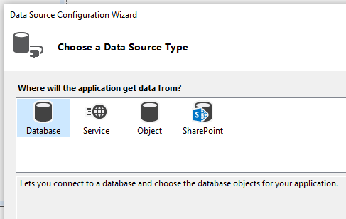

# Criar e configurar conjuntos de dados no Visual Studio
Um conjunto de dados é um conjunto de objetos que armazenam dados de um banco de dados na memória e oferecer suporte a controle de alterações para permitir operações CRUD em dados sem a necessidade de estar sempre conectado ao banco de dados. Conjuntos de dados foram projetados para serem simples *formulários sobre dados* aplicativos de negócios. Novos aplicativos devem considerar o uso do Entity Framework para armazenar e modelar dados na memória. Para trabalhar com conjuntos de dados, você deve ter um conhecimento básico dos conceitos de banco de dados.  
  
 Criar um tipo <xref:System.Data.DataSet> no Visual Studio em tempo de design usando o **Data Source Configuration Wizard**. Para obter informações sobre como criar conjuntos de dados programaticamente, consulte [Criando um DataSet](../Topic/Creating%20a%20DataSet.md).  
  
## Criar um novo Dataset com o Data Source Configuration Wizard  
  
1.  Sobre o **projeto** menu, clique em **Add New Data Source** para iniciar o **Data Source Configuration Wizard**.  
  
2.  Escolha o tipo de fonte de dados que você irá se conectar.  
  
       
  
3.  Para bancos de dados, escolha o banco de dados ou bancos de dados que serão a fonte de dados para o conjunto de dados.  
  
       
  
4.  Escolha as tabelas \(ou colunas individuais\), procedimentos armazenados, funções e exibições do banco de dados que você deseja ser representado no conjunto de dados.  
  
       
  
5.  Clique em **Concluir**.  
  
6.  O conjunto de dados aparece como um nó no Gerenciador de soluções:  
  
       
  
     Clique no nó e o conjunto de dados aparece no Designer de conjunto de dados. Observe que cada tabela no conjunto de dados tem um TableAdapter associado que é representado na parte inferior. O adaptador de tabela é usado para preencher o conjunto de dados e, opcionalmente, para enviar comandos para o banco de dados.  
  
       
  
7.  As linhas de relação que conectam as tabelas representam relações de tabela, conforme definido no banco de dados. Por padrão, as restrições de chave estrangeira em um banco de dados são representadas como uma relação somente, com a atualização e excluir regras definidas como none. Normalmente, que é o que você deseja. No entanto, você pode clicar nas linhas para abrir a caixa de diálogo relação, que permite que você altere o comportamento de atualizações hierárquicas. Para obter mais informações, consulte [Relacionamentos em conjuntos de dados](../data-tools/relationships-in-datasets.md) e [Atualização hierárquica](../data-tools/hierarchical-update.md)  
  
       
  
8.  Clique em uma tabela, o adaptador de tabela ou o nome da coluna em uma tabela para ver suas propriedades na janela Propriedades. Você pode modificar alguns valores aqui. Lembre\-se que você estiver modificando o conjunto de dados, não o banco de dados de origem.  
  
       
  
9. Você pode adicionar novas tabelas ou adaptadores de tabela para o conjunto de dados, ou adicione novas consultas para adaptadores de tabela existentes ou especificar novas relações entre tabelas, arrastando os itens na guia caixa de ferramentas do conjunto de dados, que aparece quando o Designer de conjunto de dados estiver em foco.  
  
       
  
10. Em seguida, você provavelmente deseja especificar como preencher o conjunto de dados. Para fazer isso, você deve usar o Assistente de configuração do TableAdapter. Para obter mais informações, consulte [Preencher datasets usando TableAdapters](../data-tools/fill-datasets-by-using-tableadapters.md).  
  
## Adicionar uma tabela de banco de dados ou outro objeto para um conjunto de dados existente  
 Este procedimento mostra como adicionar uma tabela de banco de dados mesmo que você usou para criar primeiro o conjunto de dados.  
  
1.  Clique no nó do conjunto de dados no **Solution Explorer** para trazer o dataset designer em foco.  
  
2.  Clique no **fontes de dados** guia na margem esquerda do Visual Studio, ou insira `Data Sources` no **QuickLaunch**.  
  
3.  Clique com botão direito no nó do conjunto de dados e escolha **"Configurar a fonte de dados com o assistente...".**  
  
       
  
4.  Use o Assistente para especificar quais tabelas adicionais, ou procedimentos armazenados ou outro objeto de banco de dados para adicionar ao conjunto de dados.  
  
## Adicionar uma tabela de dados autônoma para um conjunto de dados  
  
1.  Abra o dataset no **Dataset Designer**.  
  
2.  Arraste um <xref:System.Data.DataTable> do **DataSet** guia do **Toolbox** para o **Dataset Designer**.  
  
3.  Adicione colunas para definir sua tabela de dados. Para obter mais informações, consulte [Como adicionar colunas a um DataTable](../Topic/How%20to:%20Add%20Columns%20to%20a%20DataTable.md).  
  
4.  Tabelas autônomas precisam ter `Fill` lógica implementada para ser preenchida com dados. Para obter informações sobre preenchimento de tabelas de dados autônoma, consulte [Populando um DataSet a partir de um DataAdapter](../Topic/Populating%20a%20DataSet%20from%20a%20DataAdapter.md).