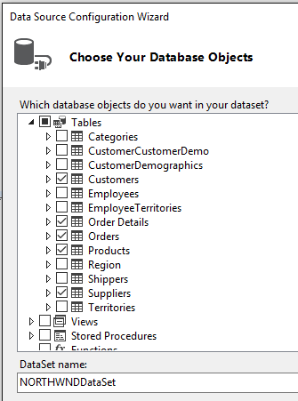
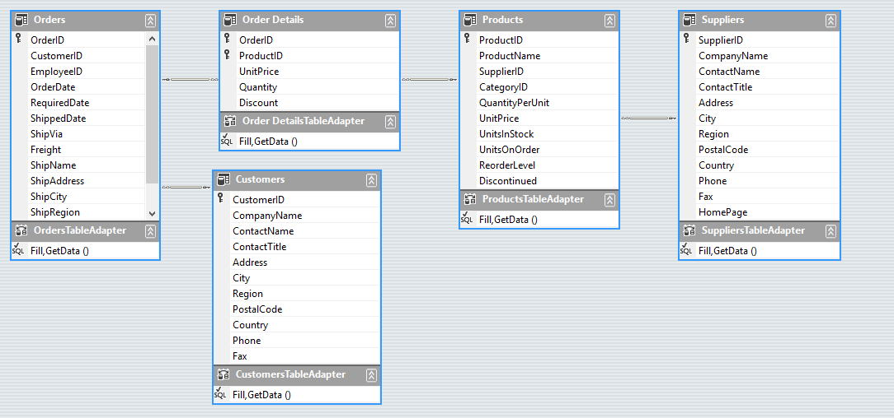
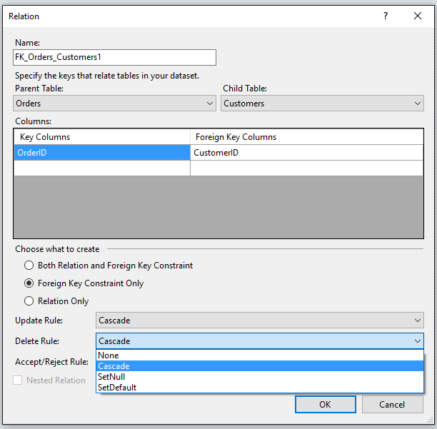
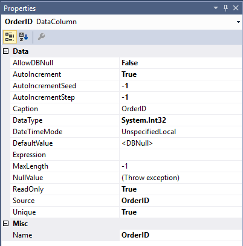
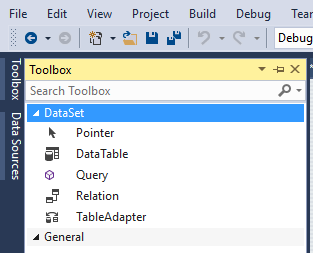

# Criar e configurar conjuntos de dados no Visual Studio

Um conjunto de dados é um conjunto de objetos que armazenam dados de um banco de dados na memória e dar suporte a controle de alterações para permitir criar, ler, atualizar e excluir operações (CRUD) nos dados sem a necessidade de estar sempre conectado ao banco de dados. Conjuntos de dados foram projetados para simple *formulários sobre dados* aplicativos de negócios. Para novos aplicativos, considere o uso do Entity Framework para armazenar e modelar dados na memória. Para trabalhar com conjuntos de dados, você deve ter um conhecimento básico dos conceitos de banco de dados.

Você cria um tipado <xref:System.Data.DataSet> classe no Visual Studio em tempo de design usando o **Data Source Configuration Wizard**. Para obter informações sobre como criar conjuntos de dados programaticamente, consulte [criando um conjunto de dados (ADO.NET)](/dotnet/framework/data/adonet/dataset-datatable-dataview/creating-a-dataset).

## Criar um novo conjunto de dados usando o Assistente de configuração de fonte de dados

1.  Sobre o **projeto** menu, clique em **Add New Data Source** para iniciar o **Data Source Configuration Wizard**.

2.  Escolha o tipo de fonte de dados ao qual você irá se conectar.

     

3.  Escolha o banco de dados ou bancos de dados que serão a fonte de dados para seu conjunto de dados.

     

4.  Escolha as tabelas (ou colunas individuais), procedimentos armazenados, funções e exibições do banco de dados que você deseja ser representado no conjunto de dados.

     

5.  Clique em **Finalizar**.

6.  O conjunto de dados aparece como um nó no **Gerenciador de soluções**.

     

     Clicar nesse nó e o conjunto de dados aparece na **DataSet Designer**. Observe que cada tabela no conjunto de dados tem um associado `TableAdapter` objeto, que é representado na parte inferior. O adaptador de tabela é usado para preencher o conjunto de dados e, opcionalmente, para enviar comandos ao banco de dados.

     

7.  As linhas de relação que conectam as tabelas representam relações de tabela, conforme definido no banco de dados. Por padrão, as restrições de chave estrangeira em um banco de dados são representadas como uma relação somente, com a atualização e excluir regras definidas como none. Normalmente, esse é o que você deseja. No entanto, você pode clicar para exibir as linhas as **relação** caixa de diálogo, onde é possível alterar o comportamento das atualizações hierárquicas. Para obter mais informações, consulte [relacionamentos em conjuntos de dados](../data-tools/relationships-in-datasets.md) e [atualização hierárquica](../data-tools/hierarchical-update.md).

     

8.  Clique em uma tabela, o adaptador de tabela ou o nome da coluna em uma tabela para ver suas propriedades na **propriedades** janela. Você pode modificar alguns valores aqui. Lembre-se de que você está modificando o conjunto de dados, não o banco de dados de origem.

     

9. Você pode adicionar novas tabelas ou adaptadores de tabela para o conjunto de dados, ou adicionar novas consultas para adaptadores de tabela existente ou especificar novas relações entre tabelas, arrastando esses itens a partir de **caixa de ferramentas** guia. Essa guia é exibida quando o **DataSet Designer** está no foco.

     

10. Em seguida, você provavelmente desejará especificar como preencher o conjunto de dados. Para fazer isso, você deve usar o **Assistente de configuração TableAdapter**. Para obter mais informações, consulte [preencher conjuntos de dados usando TableAdapters](../data-tools/fill-datasets-by-using-tableadapters.md).

## Adicionar uma tabela de banco de dados ou outro objeto para um conjunto de dados existente

Este procedimento mostra como adicionar uma tabela do mesmo banco de dados que você usou para primeiro criar o conjunto de dados.

1.  Clique no nó do conjunto de dados do **Gerenciador de soluções** para trazer o designer de conjunto de dados para o foco.

2.  Clique o **fontes de dados** guia na margem esquerda do Visual Studio ou o tipo **fontes de dados** no **início rápido** caixa.

3.  Clique com botão direito no nó do conjunto de dados e selecione **configurar a fonte de dados com o assistente**.

     

4.  Use o Assistente para especificar quais tabelas adicionais, ou procedimentos armazenados ou outro objeto de banco de dados, para adicionar ao conjunto de dados.

## Adicionar uma tabela de dados autônoma para um conjunto de dados

1.  Abra o dataset na **Dataset Designer**.

2.  Arraste uma <xref:System.Data.DataTable> de classe do **conjunto de dados** guia do **caixa de ferramentas** até a **Dataset Designer**.

3.  Adicione colunas para definir sua tabela de dados. Clique com botão direito na tabela e escolha **Add** > **coluna**. Use o **propriedades** janela para definir o tipo de dados da coluna e uma chave, se necessário.

4.  Tabelas autônomas precisam implementar `Fill` lógica nas tabelas autônomas para que você pode preenchê-los com dados. Para obter informações sobre o preenchimento de tabelas de dados autônoma, consulte [populando um DataSet a partir de um DataAdapter](/dotnet/framework/data/adonet/populating-a-dataset-from-a-dataadapter).

## Consulte também

- [Ferramentas de conjunto de dados no Visual Studio](../data-tools/dataset-tools-in-visual-studio.md)