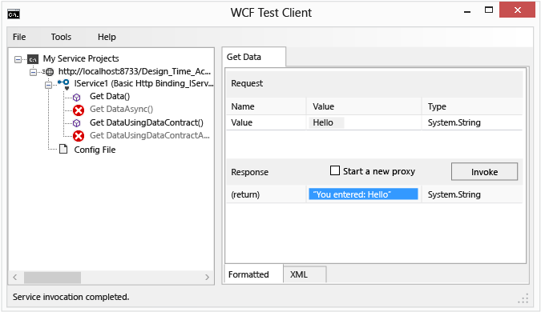
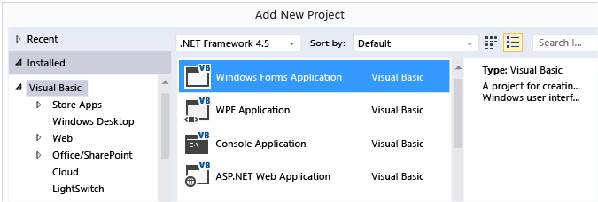
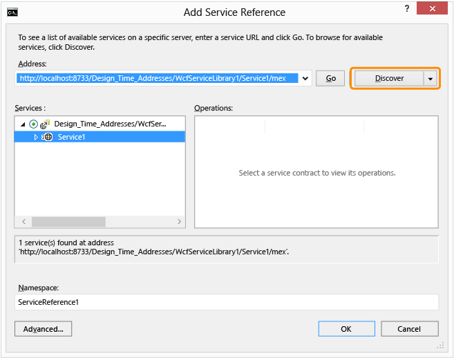
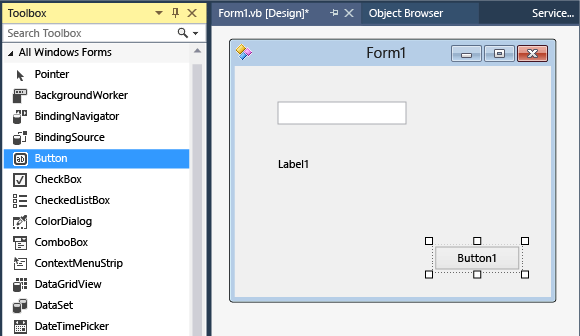

# Passo a passo: Criando um serviço WCF simples no Windows Forms
Este passo a passo demonstra como criar um simples [!INCLUDE[vsindigo](../data-tools/includes/vsindigo_md.md)] de serviço, testá-lo e, em seguida, acessá-lo de um aplicativo Windows Forms.

[!INCLUDE[note_settings_general](../data-tools/includes/note_settings_general_md.md)]

## Criando o serviço

#### Para criar um serviço WCF

1.  No menu **Arquivo**, aponte para **Novo** e clique em **Projeto**.

2.  No **novo projeto** caixa de diálogo caixa, expanda o **Visual Basic** ou **Visual C#** nó e clique em **WCF**, seguido por **WCF Biblioteca de serviço**. Clique em **Okey** para abrir o projeto.

     

    > [!NOTE]
    >  Isso cria um serviço de trabalho que pode ser testado e acessado. As duas etapas a seguir demonstram como você pode modificar o método padrão para usar um tipo de dados diferente. Em um aplicativo real, você também deve adicionar suas próprias funções para o serviço.

3.  

     Em **Solution Explorer**, clique duas vezes em IService1.vb ou Iservice1 e localize a seguinte linha:

     [!code-csharp[WCFWalkthrough#4](../data-tools/codesnippet/CSharp/walkthrough-creating-a-simple-wcf-service-in-windows-forms_1.cs)]
     [!code-vb[WCFWalkthrough#4](../data-tools/codesnippet/VisualBasic/walkthrough-creating-a-simple-wcf-service-in-windows-forms_1.vb)]

     Alterar o tipo para o `value` parâmetro de cadeia de caracteres:

     [!code-csharp[WCFWalkthrough#1](../data-tools/codesnippet/CSharp/walkthrough-creating-a-simple-wcf-service-in-windows-forms_2.cs)]
     [!code-vb[WCFWalkthrough#1](../data-tools/codesnippet/VisualBasic/walkthrough-creating-a-simple-wcf-service-in-windows-forms_2.vb)]

     No código acima, observe o `<OperationContract()>` ou `[OperationContract]` atributos. Esses atributos são necessários para qualquer método exposto pelo serviço.

4.  

     Em **Solution Explorer**, clique duas vezes em Service1 ou Service1 e localize a seguinte linha:

     [!code-vb[WCFWalkthrough#5](../data-tools/codesnippet/VisualBasic/walkthrough-creating-a-simple-wcf-service-in-windows-forms_3.vb)]
     [!code-csharp[WCFWalkthrough#5](../data-tools/codesnippet/CSharp/walkthrough-creating-a-simple-wcf-service-in-windows-forms_3.cs)]

     Altere o tipo para o parâmetro de valor de cadeia de caracteres:

     [!code-csharp[WCFWalkthrough#2](../data-tools/codesnippet/CSharp/walkthrough-creating-a-simple-wcf-service-in-windows-forms_4.cs)]
     [!code-vb[WCFWalkthrough#2](../data-tools/codesnippet/VisualBasic/walkthrough-creating-a-simple-wcf-service-in-windows-forms_4.vb)]

## Testando o serviço

#### Para testar um serviço WCF

1.  Pressione **F5** para executar o serviço. Um **cliente de teste do WCF** formulário será exibido e ele carregará o serviço.

2.  No **cliente de teste do WCF** de formulário, clique duas vezes o **GetData** método em **IService1**. O **GetData** guia será exibida.

     

3.  No **solicitação** caixa, selecione a **valor** campo e digite `Hello`.

     

4.  Clique o **Invoke** botão. Se um **aviso de segurança** caixa de diálogo for exibida, clique em **Okey**. O resultado será exibido no **resposta** caixa.

     

5.  Sobre o **arquivo** menu, clique em **saída** para fechar o formulário de teste.

## Acessando o serviço

#### Para fazer referência a um serviço WCF

1.  Sobre o **arquivo** , aponte para **adicionar** e, em seguida, clique em **novo projeto**.

2.  No **novo projeto** caixa de diálogo caixa, expanda o **Visual Basic** ou **Visual C#** nó e selecione **Windows**e, em seguida, selecione **Aplicativo dos Windows Forms**. Clique em **Okey** para abrir o projeto.

     

3.  Clique com botão direito **WindowsApplication1** e clique em **adicionar referência de serviço**. O **adicionar referência de serviço** caixa de diálogo será exibida.

4.  No **adicionar referência de serviço** caixa de diálogo, clique em **Discover**.

     

     **Service1** será exibido no **serviços** painel.

5.  Clique em **Okey** para adicionar a referência de serviço.

#### Para criar um aplicativo cliente

1.  Em **Solution Explorer**, clique duas vezes em **Form1. vb** ou **Form1.cs** para abrir o Designer de formulários do Windows, se ainda não estiver aberto.

2.  Do **caixa de ferramentas**, arraste um `TextBox` controle, uma `Label` controle e um `Button` controle para o formulário.

     

3.  Clique duas vezes o `Button`e adicione o seguinte código no `Click` manipulador de eventos:

     [!code-csharp[WCFWalkthrough#3](../data-tools/codesnippet/CSharp/walkthrough-creating-a-simple-wcf-service-in-windows-forms_5.cs)]
     [!code-vb[WCFWalkthrough#3](../data-tools/codesnippet/VisualBasic/walkthrough-creating-a-simple-wcf-service-in-windows-forms_5.vb)]

4.  Em **Solution Explorer**, clique com botão direito **WindowsApplication1** e clique em **definir como projeto de inicialização**.

5.  Pressione **F5** para executar o projeto. Digite algum texto e clique no botão. Exibirá o rótulo "você digitou:" e o texto que você inseriu.

     

## Consulte também

- [Serviços do Windows Communication Foundation e WCF Data Services no Visual Studio](../data-tools/windows-communication-foundation-services-and-wcf-data-services-in-visual-studio.md)