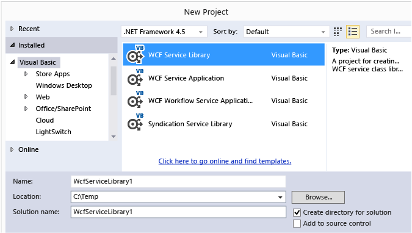
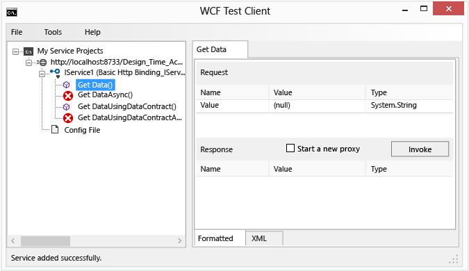

# Passo a passo: Criando um servi&#231;o WCF simples no Windows Forms
Este passo a passo demonstra como criar um simples [!INCLUDE[vsindigo](../data-tools/includes/vsindigo_md.md)] de serviço, testá\-lo e, em seguida, acessá\-lo de um aplicativo Windows Forms.  
  
 [!INCLUDE[note_settings_general](../data-tools/includes/note_settings_general_md.md)]  
  
## Criando o serviço  
  
#### Para criar um serviço WCF  
  
1.  Sobre o **arquivo** aponte para **novo** e, em seguida, clique em **projeto**.  
  
2.  No **novo projeto** caixa de diálogo caixa, expanda o **Visual Basic** ou **Visual C\#** nó e clique em **WCF**, seguido por **WCF Service Library**. Clique em **OK** para abrir o projeto.  
  
       
  
    > [!NOTE]
    >  Isso cria um serviço de trabalho que pode ser testado e acessado. As duas etapas a seguir demonstram como você pode modificar o método padrão para usar um tipo de dados diferente. Em um aplicativo real, você também poderia adicionar suas próprias funções para o serviço.  
  
3.    
  
     Em **Solution Explorer**, clique duas vezes em Iservice1 ou IService1. cs e localize a seguinte linha:  
  
     [!code-cs[WCFWalkthrough#4](../data-tools/codesnippet/CSharp/walkthrough-creating-a-simple-wcf-service-in-windows-forms_1.cs)]
     [!code-vb[WCFWalkthrough#4](../data-tools/codesnippet/VisualBasic/walkthrough-creating-a-simple-wcf-service-in-windows-forms_1.vb)]  
  
     Alterar o tipo para o `value` parâmetro para `String`:  
  
     [!code-cs[WCFWalkthrough#1](../data-tools/codesnippet/CSharp/walkthrough-creating-a-simple-wcf-service-in-windows-forms_2.cs)]
     [!code-vb[WCFWalkthrough#1](../data-tools/codesnippet/VisualBasic/walkthrough-creating-a-simple-wcf-service-in-windows-forms_2.vb)]  
  
     No código acima, observe o `<OperationContract()>` ou `[OperationContract]` atributos. Esses atributos são obrigatórios para qualquer método exposto pelo serviço.  
  
4.    
  
     Em **Solution Explorer**, clique duas vezes em Service1. vb ou Service1. cs e localize a seguinte linha:  
  
     [!code-vb[WCFWalkthrough#5](../data-tools/codesnippet/VisualBasic/walkthrough-creating-a-simple-wcf-service-in-windows-forms_3.vb)]
     [!code-cs[WCFWalkthrough#5](../data-tools/codesnippet/CSharp/walkthrough-creating-a-simple-wcf-service-in-windows-forms_3.cs)]  
  
     Alterar o tipo para o parâmetro de valor para `String`:  
  
     [!code-cs[WCFWalkthrough#2](../data-tools/codesnippet/CSharp/walkthrough-creating-a-simple-wcf-service-in-windows-forms_4.cs)]
     [!code-vb[WCFWalkthrough#2](../data-tools/codesnippet/VisualBasic/walkthrough-creating-a-simple-wcf-service-in-windows-forms_4.vb)]  
  
## O serviço de teste  
  
#### Para testar um serviço WCF  
  
1.  Pressione **F5** para executar o serviço. Um **cliente de teste do WCF** formulário será exibido e ele carregará o serviço.  
  
2.  No **cliente de teste do WCF** de formulário, clique duas vezes o **GetData** método sob **IService1**. O **GetData** guia será exibida.  
  
       
  
3.  No **solicitação** caixa, selecione a **valor** campo e digite `Hello`.  
  
       
  
4.  Clique o **Invoke** botão. Se um **Aviso de segurança** caixa de diálogo for exibida, clique em **OK**. O resultado será exibido no **resposta** caixa.  
  
       
  
5.  Sobre o **arquivo** menu, clique em **Exit** para fechar o formulário de teste.  
  
## Acessando o serviço  
  
#### Para fazer referência a um serviço WCF  
  
1.  Sobre o **arquivo** aponte para **Add** e, em seguida, clique em **novo projeto**.  
  
2.  No **novo projeto** caixa de diálogo caixa, expanda o **Visual Basic** ou **Visual C\#** nó e selecione **Windows**, e, em seguida, selecione **Windows Forms Application**. Clique em **OK** para abrir o projeto.  
  
       
  
3.  Clique com botão direito **WindowsApplication1** e clique em **Add Service Reference**. O **Add Service Reference** caixa de diálogo será exibida.  
  
4.  No **Add Service Reference** caixa de diálogo, clique em **Discover**.  
  
       
  
     **Service1** será exibido no **serviços** painel.  
  
5.  Clique em **OK** para adicionar a referência de serviço.  
  
#### Para criar um aplicativo cliente  
  
1.  Em **Solution Explorer**, clique duas vezes em **Form1. vb** ou **Form1. CS** para abrir o Designer de formulários do Windows, se ele não ainda estiver aberto.  
  
2.  Do **Toolbox**, arraste um `TextBox` controle, um `Label` controle e um `Button` controle para o formulário.  
  
       
  
3.  Clique duas vezes o `Button`, e adicione o seguinte código no `Click` manipulador de eventos:  
  
     [!code-cs[WCFWalkthrough#3](../data-tools/codesnippet/CSharp/walkthrough-creating-a-simple-wcf-service-in-windows-forms_5.cs)]
     [!code-vb[WCFWalkthrough#3](../data-tools/codesnippet/VisualBasic/walkthrough-creating-a-simple-wcf-service-in-windows-forms_5.vb)]  
  
4.  Em **Solution Explorer**, clique com botão direito **WindowsApplication1** e clique em **Set as StartUp Project**.  
  
5.  Pressione **F5** para executar o projeto. Digite algum texto e clique no botão. Exibirá o rótulo "você digitou:" e o texto que você inseriu.  
  
       
  
## Consulte também  
 [Serviços do Windows Communication Foundation e WCF Data Services no Visual Studio](../data-tools/windows-communication-foundation-services-and-wcf-data-services-in-visual-studio.md)