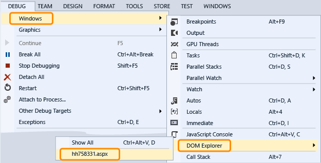

# Depurar um controle WebView em um aplicativo de UWP
  
  
 Para inspecionar e depurar os controles do `WebView` em um aplicativo do Tempo de Execução do Windows, você pode configurar o Visual Studio para anexar o Depurador de Scripts quando iniciar seu aplicativo. No Visual Studio 2013 Update 2, você tem duas formas de interagir com os controles do `WebView` usando o depurador:  
  
-   Abra o [Explorador do DOM](../debugger/quickstart-debug-html-and-css.md) para um `WebView` de instância e inspecione os elementos de DOM, investigue os problemas de estilo CSS e teste dinamicamente as mudanças renderizadas nos estilos.  
  
-   Selecione a página da Web ou `iFrame` exibido no `WebView` instância como um destino no [Console do JavaScript](../debugger/javascript-console-commands.md) janela e, em seguida, interaja com a página da Web usando comandos do console. O console dá acesso ao contexto de execução do script atual.  
  
### Anexar o depurador (C#, Visual Basic, C++)  
  
1.  No Visual Studio, adicione um controle `WebView` ao seu aplicativo de Tempo de Execução do Windows.  
  
2.  No Solution Explorer, abra as propriedades do projeto, escolhendo **propriedades** no menu de atalho para o projeto.  
  
3.  Escolha **depurar**. No **processo do aplicativo** , escolha **Script**.  
  
       
  
4.  (Opcional) Para versões não expressas do Visual Studio, desabilite a depuração just-in-time (JIT) escolhendo **Ferramentas > Opções > Depuração > Just-In-Time**, e, em seguida, desabilite a depuração JIT para Script.  
  
    > [!NOTE]
    >  Desabilitando a depuração JIT, você pode ocultar caixas de diálogo para exceções não tratadas que ocorrem em algumas páginas da Web. No Visual Studio Express, a depuração JIT sempre fica desabilitada.  
  
5.  Pressione F5 para iniciar a depuração.  
  
### Use o Explorador do DOM para inspecionar e depurar um controle WebView  
  
1.  (C#, Visual Basic, C++) Anexe o depurador do script ao seu aplicativo. Veja a primeira seção para obter instruções.  
  
2.  Se ainda não o fez, adicione um controle `WebView` ao seu aplicativo e pressione F5 para iniciar a depuração.  
  
3.  Navegue até a página que contém os controles `Webview`.  
  
4.  Abra a janela Explorador do DOM para o `WebView` controle escolhendo **depurar**, **Windows**, **Explorador do DOM**e, em seguida, escolha a URL do `WebView` que você deseja inspecionar.  
  
       
  
     O Explorador do DOM associado ao `WebView` aparece como uma nova guia no Visual Studio.  
  
5.  Exibir e modificar elementos de DOM ativos e estilos CSS, conforme descrito em [estilos de CSS depurar usando o Explorador do DOM](../debugger/debug-css-styles-using-dom-explorer.md).  
  
### Usar a janela Console do JavaScript para inspecionar e depurar um controle WebView  
  
1.  (C#, Visual Basic, C++) Anexe o depurador do script ao seu aplicativo. Veja a primeira seção para obter instruções.  
  
2.  Se ainda não o fez, adicione um controle `WebView` ao seu aplicativo e pressione F5 para iniciar a depuração.  
  
3.  Abra a janela do Console do JavaScript para o `WebView` controle escolhendo **depurar**, **Windows**, **Console do JavaScript**.  
  
     A janela Console do JavaScript aparece.  
  
4.  Navegue até a página que contém os controles `Webview`.  
  
5.  Na janela do Console, selecione a página da Web ou um `iFrame` exibido pelo `WebView` controlar o **destino** lista.  
  
       
  
    > [!NOTE]
    >  Usando o console, você pode interagir com um único `WebView`, `iFrame`, compartilhar o contrato ou web worker por vez. Cada elemento requer uma instância separada do host da plataforma web (WWAHost.exe). Você pode interagir com um host por vez.  
  
6.  Visualize e modifique variáveis em seu aplicativo ou usar comandos do console, conforme descrito em [início rápido: depurar JavaScript](../debugger/quickstart-debug-javascript-using-the-console.md) e [comandos do JavaScript Console](../debugger/javascript-console-commands.md).  
  
## Consulte também  
 [Guia de início rápido: depurar HTML e CSS](../debugger/quickstart-debug-html-and-css.md)