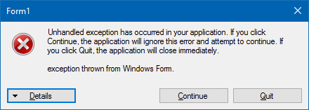
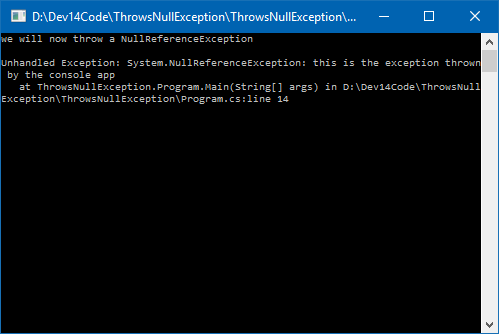
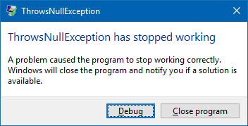

# <a name="debug-using-the-just-in-time-debugger-in-visual-studio"></a>Depurar usando o depurador Just-in-no Visual Studio
Depuração Just-In-Time inicia o Visual Studio automaticamente quando uma exceção ou a falha ocorre em um aplicativo que está em execução fora do Visual Studio. Isso permite que você teste seu aplicativo quando o Visual Studio não está em execução e iniciar a depuração com o Visual Studio quando ocorre um problema.

Depuração Just-In-Time funciona para aplicativos de área de trabalho do Windows. Ele não funciona para aplicativos universais do Windows e não funciona para código gerenciado que é hospedado em um aplicativo nativo, como visualizadores.

> [!TIP] 
> Se você desejar saber como responder a Just-in-Time caixa de diálogo do depurador, consulte [neste tópico](../debugger/just-in-time-debugging-in-visual-studio.md).

##  <a name="BKMK_Enabling"></a>Habilitar ou desabilitar Just-In-Time de depuração  
Você pode habilitar ou Desabilitar depuração no Visual Studio Just-In-Time **Ferramentas > Opções** caixa de diálogo.
  
#### <a name="to-enable-or-disable-just-in-time-debugging"></a>Para habilitar ou desabilitar a depuração Just-In-Time  
  
1.  Abra o Visual Studio com privilégios de administrador (com o botão direito e escolha **executar como administrador**).

    Habilitar ou desabilitar Just-In-Time depuração define uma chave do registro e podem ser necessários privilégios de administrador para alterar essa chave.
    
2. No menu **Ferramentas**, clique em **Opções**.
  
2.  No **opções** caixa de diálogo caixa, expanda o **depuração** nó.  
  
3.  No **depuração** nó, selecione **Just-In-Time**.

     
  
4.  No **depuração Just-in-habilitar esses tipos de código** caixa, marque ou desmarque os tipos de programa relevantes: **gerenciado**, **nativo**, ou **Script**.    
  
5.  Clique em **OK**.  
  
A depuração Just-In-Time ainda poderá ser habilitada, mesmo que o Visual Studio não esteja mais instalado no seu computador. Quando o Visual Studio não estiver instalado, não é possível desabilitar depuração no Visual Studio Just-In-Time **opções** caixa de diálogo. Nesse caso, você poderá desabilitar a depuração Just-In-Time editando o Registro do Windows.  
  
#### <a name="to-disable-just-in-time-debugging-by-editing-the-registry"></a>Para desabilitar a depuração Just-In-Time editando o Registro  
  
1.  Sobre o **iniciar** menu, pesquisar e executar`regedit.exe`  
  
2.  No **Editor do registro** janela, localize e exclua as entradas do registro a seguir:  
  
    -   HKEY_LOCAL_MACHINE\SOFTWARE\Microsoft\Windows NT\CurrentVersion\AeDebug\Debugger  
  
    -   HKEY_LOCAL_MACHINE\Software\Microsoft\.NETFramework\DbgManagedDebugger  

     
  
3.  Se o computador estiver executando um sistema operacional de 64 bits, exclua as seguintes entradas de registro também:  
  
    -   HKEY_LOCAL_MACHINE\SOFTWARE\Wow6432Node\Microsoft\Windows NT\CurrentVersion\AeDebug\Debugger  
  
    -   HKEY_LOCAL_MACHINE\SOFTWARE\Wow6432Node\Microsoft\\. NETFramework\DbgManagedDebugger  
  
4.  Tenha cuidado para não excluir ou não alterar acidentalmente quaisquer outras chaves do Registro.  
  
5.  Fechar o **Editor do registro** janela.   
  
#### <a name="to-enable-just-in-time-debugging-of-a-windows-form"></a>Para habilitar a depuração Just-In-Time de um formulário do Windows  
  
1.  Por padrão, os aplicativos do Windows Forms têm um manipulador de exceção de nível superior que permite que o programa continue a executar se puder recuperar. Por exemplo, se seu aplicativo do Windows Forms lança uma exceção sem tratamento, você verá uma caixa de diálogo semelhante ao seguinte:  
  
       
  
     Para habilitar Just-In-Time depuração de um aplicativo de formulários do Windows, você deve executar as seguintes etapas adicionais:  
  
2.  Definir o `jitDebugging` valor `true` no `system.windows.form` seção de Machine. config ou  *\<nome do aplicativo >*. exe:  
  
    ```  
    <configuration>  
        <system.windows.forms jitDebugging="true" />  
    </configuration>  
    ```  
  
3.  No aplicativo C++ do Windows Form, você também deve definir `DebuggableAttribute` em um arquivo .config ou no seu código. Se você compilar com [/Zi](/cpp/build/reference/z7-zi-zi-debug-information-format) e sem [/Og](/cpp/build/reference/og-global-optimizations), o compilador define esse atributo para você. Se você desejar depurar uma compilação de liberação não otimizada, no entanto, deverá definir isso por conta própria. Você pode fazer isso adicionando a seguinte linha ao arquivo de AssemblyInfo.cpp do seu aplicativo:  
  
    ```  
    [assembly:System::Diagnostics::DebuggableAttribute(true, true)];   
    ```  
  
     Para obter mais informações, consulte <xref:System.Diagnostics.DebuggableAttribute>.  
  
## <a name="a-namebkmkusingjituse-just-in-time-debugging"></a><a name="BKMK_Using_JIT">Use a depuração Just-In-Time  
 Esta seção mostra o que acontece quando um executável lança uma exceção.  
  
 Você deve ter o Visual Studio instalado para executar essas etapas. Se você não tiver o Visual Studio, você pode baixar a versão gratuita [Visual Studio Community Edition](https://www.visualstudio.com/thank-you-downloading-visual-studio/?sku=Community&rel=15).  
  
 Certifique-se de que Just-In-Time de depuração é [habilitado](#BKMK_Enabling).
  
 Para os fins desta seção, faremos um aplicativo de console c# no Visual Studio gera um [NullReferenceException](http://msdn.microsoft.com/Library/658af786-d893-4114-a3c5-31c7d586056a).  
  
 No Visual Studio, crie um aplicativo de console c# (**arquivo > Novo > projeto > Visual C# > aplicativo de Console**) denominado **ThrowsNullException**. Para obter mais informações sobre como criar projetos no Visual Studio, consulte [passo a passo: criar um aplicativo simples](../ide/walkthrough-create-a-simple-application-with-visual-csharp-or-visual-basic.md).  
  
 Quando o projeto é aberto no Visual Studio, abra o arquivo Program.cs. Substitua o método Main () com o código a seguir, que imprime uma linha para o console e, em seguida, gera uma NullReferenceException:  
  
```csharp  
static void Main(string[] args)  
{  
    Console.WriteLine("we will now throw a NullReferenceException");  
    throw new NullReferenceException("this is the exception thrown by the console app");  
}  
```  
  
> [!IMPORTANT]
>  Para que este procedimento para trabalhar um [configuração release](../debugger/how-to-set-debug-and-release-configurations.md), você precisará desativar [apenas meu código](../debugger/just-my-code.md). No Visual Studio, clique em **Ferramentas > Opções**. No **opções** caixa de diálogo, selecione **depuração**. Remover a verificação de **habilitar apenas meu código**.  
  
 Compile a solução (no Visual Studio, escolha **Build > recompilar solução**). Você pode escolher a depuração ou a configuração de versão (escolha **depurar** para a experiência de depuração completa). Para obter mais informações sobre configurações de build, consulte [Noções básicas sobre configurações de build](../ide/understanding-build-configurations.md).  
  
 O processo de compilação cria um executável ThrowsNullException.exe. Você pode encontrar na pasta em que você criou o projeto c#: **...\ThrowsNullException\ThrowsNullException\bin\Debug** ou **...\ThrowsNullException\ThrowsNullException\bin\Release**.  
  
 Clique duas vezes o ThrowsNullException.exe. Você verá uma janela de comando como este:  
  
   
  
 Depois de alguns segundos, aparece uma janela de erro:  
  
   
  
 Não clique **Cancelar**! Depois de alguns segundos, você deverá ver dois botões, **depurar** e **fechar programa**. Clique em **depurar**.  
  
> [!CAUTION]
>  Se seu aplicativo contiver código não confiável, será exibida uma caixa de diálogo com um aviso de segurança. Essa caixa de diálogo permite que você decida se deseja continuar com a depuração. Antes de prosseguir com a depuração, decida se você confia no código. Você mesmo escreveu o código? Você confia no programador? Se o aplicativo está sendo executado em um computador remoto, você reconhece o nome do processo? Mesmo que o aplicativo seja executado localmente, isso não significa necessariamente que ele é confiável. Considere a possibilidade de um código mal-intencionado em execução no seu computador. Se você decidir que o código que você está prestes a depuração é confiável, clique em **depurar**. Caso contrário, clique em **não depurar**.  
  
 O **depurador do Visual Studio Just-in-** janela é exibida:  
  
   
  
 Em **possíveis depuradores**, você verá que o **nova instância do Microsoft Visual Studio <available version>**  linha está selecionada. Se ainda não estiver selecionado, selecione-o agora.  
  
 Na parte inferior da janela, em **você deseja depurar usando o depurador selecionado?**, clique em **Sim**.  
  
 O projeto de ThrowsNullException é aberto em uma nova instância do Visual Studio, com a execução interrompida na linha que gera a exceção:  
  
   
  
 Você pode iniciar a depuração nesse ponto. Se esse fosse um aplicativo real, você precisa descobrir por que o código está lançando a exceção.  
  
## <a name="just-in-time-debugging-errors"></a>Erros da depuração Just-In-Time  
 Se você não vir a caixa de diálogo quando o programa falhar, isso pode ser devido a configurações de relatório de erros do Windows em seu computador. Para obter mais informações, consulte [. Configurações do WER](/windows-hardware/drivers/dashboard/windows-error-reporting-getting-started).  
  
 Você pode ver as seguintes mensagens de erro que estão associadas à depuração Just-In-Time.  
  
-   **Não é possível anexar ao processo de travamento. O programa especificado não é um programa do Windows ou MS-DOS.**  
  
     Esse erro ocorre quando você tenta anexar a um processo em execução como outro usuário.  
  
     Para contornar esse problema, iniciar o Visual Studio, abra o **anexar ao processo** na caixa de diálogo de **depurar** menu e localizar o processo que você deseja depurar no **processos disponíveis**lista. Se você não souber o nome do processo, examine o **depurador do Visual Studio Just-in-** caixa de diálogo e anote a ID de processo. Selecione o processo no **processos disponíveis** lista e clique em **Attach**. No **depurador do Visual Studio Just-in-** caixa de diálogo, clique em **não** para ignorar a caixa de diálogo.  
  
-   **Não foi possível iniciar o depurador porque nenhum usuário está conectado.**  
  
     Este erro ocorre quando a depuração Just-In-Time tenta iniciar o Visual Studio em um computador no qual não há nenhum usuário conectado ao console. Como nenhum usuário está conectado, não há sessão de usuário para exibir a caixa de diálogo Depuração Just-In-Time.  
  
     Para corrigir esse problema, conecte-se ao computador.  
  
-   **Classe não registrada.**  
  
     Este erro indica que o depurador tentou criar uma classe COM não registrada, provavelmente devido a um problema de instalação.  
  
     Para corrigir o problema, use o disco de instalação para reinstalar ou reparar sua instalação do Visual Studio.  
  
## <a name="see-also"></a>Consulte também  
 [Segurança do depurador](../debugger/debugger-security.md)   
 [Noções básicas do depurador](../debugger/debugger-basics.md)   
 [Just-In-Time, depuração, a caixa de diálogo Opções](../debugger/just-in-time-debugging-options-dialog-box.md)   
 [Aviso de segurança: anexar a um processo pertencente a um usuário não confiável pode ser perigoso. Se as informações a seguir parecerem suspeitas ou você não tiver certeza, não anexe a esse processo](../debugger/security-warning-attaching-to-a-process-owned-by-an-untrusted-user-can-be-dangerous-if-the-following-information-looks-suspicious-or-you-are-unsure-do-not-attach-to-this-process.md)