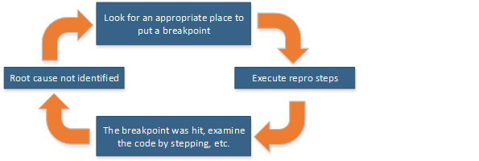

# Depura&#231;&#227;o de hist&#243;rico
[!INCLUDE[vs2017banner](../code-quality/includes/vs2017banner.md)]

Depuração de histórico é um modo de depuração que depende das informações coletadas pelo IntelliTrace.  Ele permite voltar e por meio da execução do seu aplicativo e verificar seu estado.  
  
 Você pode usar o IntelliTrace no Visual Studio Enterprise edition \(mas não as edições Professional ou comunidade\).  
  
## Por que usar a depuração de histórico?  
 Pontos de interrupção para encontrar bugs podem ser uma questão bastante inexata.  Você define um ponto de interrupção perto o local no código onde você suspeitar que o bug seja e executa o aplicativo no depurador e espero que seu ponto de interrupção obtém acertos e que o local onde a execução quebra pode revelar a origem do erro.  Caso contrário, você terá que tente definir um ponto de interrupção em outro lugar no código e executar novamente o depurador, executando as etapas de teste repetidamente até encontrar o problema.  
  
   
  
 Você pode usar o IntelliTrace e a depuração de histórico circulem por em seu aplicativo e inspecionar o estado \(pilha de chamadas e variáveis locais\) sem precisar definir pontos de interrupção, reinicie a depuração e repita as etapas de teste.  Isso pode economizar muito tempo, especialmente quando o bug está localizado abaixo em um cenário de teste que leva muito tempo para executar.  
  
## Como iniciar usando a depuração de histórico?  
 IntelliTrace está ativado por padrão.  Tudo o que você precisa fazer é decidir quais eventos e chamadas de função são de interesse.  Para obter mais informações sobre como definir o que você deseja procurar, consulte[Recursos do IntelliTrace](../debugger/intellitrace-features.md).  Para uma conta de passo a passo de depuração com o IntelliTrace, consulte[Passo a passo: usando o IntelliTrace](../debugger/walkthrough-using-intellitrace.md).  
  
## Seu código com depuração de histórico de navegação  
 Vamos começar com um programa simples que tem um bug.  Em um aplicativo de console c\#, adicione o seguinte código:  
  
```c#  
static void Main(string[] args)  
{  
    int testInt = 0;  
    int resultInt = AddAll(testInt);  
    Console.WriteLine(resultInt);  
}  
private static int AddAll(int j)  
{  
    for (int i = 0; i < 20; i++)  
    {  
        j = AddInt(j);  
    }  
    return j;  
}  
  
private static int AddInt(int add)  
{  
    if (add == 10)  
    {  
        return add += 25;  
    }  
    return ++add;  
}  
```  
  
 Vamos supor que o valor esperado de`resultInt`depois de chamar`AddAll()`é 20 \(o resultado do incremento dos`testInt`20 vezes\).  \(Vamos também supor que você não consegue ver o bug no`AddInt()`\). Mas o resultado é, na verdade, 44.  Como podemos encontrar o bug sem percorrendo`AddAll()`10 vezes?  Podemos usar depuração de histórico para localizar o bug mais rápida e facilmente.  Veja como:  
  
1.  Em Ferramentas \/ opções \/ IntelliTrace \/ geral, verifique se IntelliTrace estiver habilitado e selecionar eventos do IntelliTrace e informações de opção de chamada.  Se você não selecionar essa opção, você não poderá ver a medianiz de navegação \(como explicado abaixo\).  
  
2.  Definir um ponto de interrupção no`Console.WriteLine(resultInt);`linha.  
  
3.  Inicie a depuração.  O código é executado no ponto de interrupção.  No**locais**janela, você pode ver que o valor de`resultInt`é 44.  
  
4.  Abra o**Ferramentas de diagnóstico**janela \(**Debug \/ Mostrar ferramentas de diagnóstico**\).  A janela de código deve ter esta aparência:  
  
       
  
5.  Você deve ver uma seta dupla na margem esquerda, logo acima do ponto de interrupção.  Essa área é chamada a medianiz de navegação e é usada para depuração de histórico.  Clique na seta.  
  
     Na janela de código, você verá que a linha de código anterior \(`int resultInt = AddIterative(testInt);`\) é colorido rosa.  Acima da janela, você verá uma mensagem que agora você está na depuração de histórico.  
  
     Agora, a janela de código é semelhante a:  
  
       
  
6.  Agora você pode entrar no`AddAll()`método \(**F11**ou**Step Into**botão na medianiz de navegação.  Avançar uma etapa \(**F10**ou**Ir para próxima chamada**na medianiz de navegação.  A linha rosa está agora no`j = AddInt(j);`linha.  **F10**nesse caso não passar para a próxima linha de código.  Em vez disso, ele passa para a próxima chamada de função.  Depuração de histórico navega entre uma chamada e ignora a linhas de código que não inclua uma chamada de função.  
  
7.  Entrar agora o`AddInt()`método.  Você deve ver imediatamente o bug no código.  
  
 Esse procedimento apenas uma pequena amostra do que você pode fazer com a depuração de histórico.  Para saber mais sobre as diferentes configurações e os efeitos dos botões diferentes na medianiz de navegação, consulte[Recursos do IntelliTrace](../debugger/intellitrace-features.md).