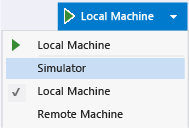
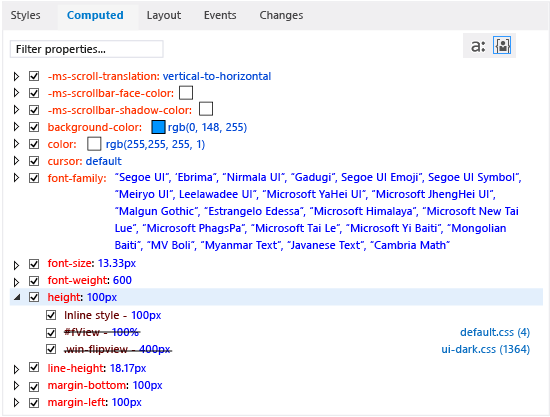
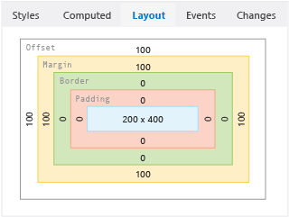

# <a name="debug-html-and-css-in-uwp-apps-in-visual-studio"></a>Depurar HTML e CSS em aplicativos UWP no Visual Studio
  
 Para aplicativos em JavaScript, Visual Studio fornece uma experiência de depuração abrangente que inclui recursos que são familiares para desenvolvedores do Internet Explorer e Visual Studio. Esses recursos têm suporte para aplicativos UWP e para aplicativos criados usando ferramentas do Visual Studio para Apache Cordova.  
  
 Com o uso do modelo de depuração interativo fornecido pelas ferramentas de inspeção do DOM, você pode ver e modificar o código HTML e CSS renderizado. Você pode fazer tudo isso sem parar e reiniciar o depurador.
  
 Para obter informações sobre outros recursos, como usando a janela do Console do JavaScript e configuração de pontos de interrupção, de depuração do JavaScript, consulte [início rápido: depurar JavaScript](../debugger/quickstart-debug-javascript-using-the-console.md) e [depurar aplicativos no Visual Studio](../debugger/debug-store-apps-in-visual-studio.md).  
  
##  <a name="InspectingDOM"></a>Inspecionando o DOM ativo  
 O Explorador de DOMs mostra a página renderizada, e você pode usá-lo para alterar valores e imediatamente ver os resultados. Isso permite que você teste as mudanças sem parar e reiniciar o depurador. O código-fonte em seu projeto não muda quando você interage com a página usando esse método; então, quando você encontra as correções de código desejadas, você faz as mudanças no seu código-fonte.  
  
> [!TIP]
>  Para evitar parar e reiniciar o depurador quando você fizer alterações no código-fonte, você pode atualizar seu aplicativo usando o **atualizar aplicativo do Windows** botão na barra de ferramentas Depurar (ou pressionando F4). Para obter mais informações, consulte [atualizar um aplicativo (JavaScript)](../debugger/refresh-an-app-javascript.md).  
  
 Você pode usar o Explorador de DOMs para:  
  
-   Navegue pela subárvore de elementos do DOM e inspecione o código HTML, CSS e JavaScript renderizado.  
  
-   Edite de forma dinâmica atributos e estilos CSS de elementos renderizados e veja os resultados imediatamente.  
  
-   Inspecione como os estilos CSS foram aplicados aos elementos da página e rastreie as regras que foram aplicadas.  
  
 Ao depurar aplicativos, muitas vezes é preciso selecionar elementos no Explorador de DOMs. Quando você seleciona um elemento, os valores que aparecem nas guias à direita do Explorador do DOM são automaticamente atualizados para refletir o elemento selecionado no Explorador do DOM. Estas são as guias: **estilos**, **calculado**, **Layout**. Aplicativos UWP também dão suporte a **eventos** e **alterações** guias. Para obter mais informações sobre como selecionar elementos, consulte [selecionar elementos](#SelectingElements).  
  
> [!TIP]
>  Se a janela Explorador do DOM estiver fechada, escolha **depurar**>**Windows** > **Explorador do DOM** para abri-la novamente. A janela só aparece durante uma sessão de depuração de script.  
  
 No procedimento a seguir, avançaremos pelo processo de depurar interativamente um aplicativo usando o Explorador de DOMs. Vamos criar um aplicativo que usa um controle `FlipView` e depurá-lo. O aplicativo contém vários erros.  
  
> [!WARNING]
>  O aplicativo de exemplo a seguir é um aplicativo UWP. Os mesmos recursos têm suporte para Cordova, mas o aplicativo deve ser diferente.  
  
#### <a name="to-debug-by-inspecting-the-live-dom"></a>Para depurar inspecionando o DOM ativo  
  
1.  Crie uma nova solução no Visual Studio escolhendo **arquivo** > **novo projeto**.  
  
2.  Escolha **JavaScript** > **Windows Universal**e, em seguida, escolha **WinJS App**.  
  
3.  Digite um nome para o projeto, como `FlipViewApp`e escolha **Okey** para criar o aplicativo.  
  
4.  No elemento BODY de index. HTML, adicione este código:  
  
    ```html  
    <div id="flipTemplate" data-win-control="WinJS.Binding.Template"  
             style="display:none">  
        <div class="fixedItem" >  
              
        </div>  
    </div>  
    <div id="fView" style="width:100px;height:100px"  
        data-win-control="WinJS.UI.FlipView" data-win-options="{  
        itemDataSource: Data.items.dataSource, itemTemplate: flipTemplate }">  
    </div>  
    ```  
  
5.  Abra os arquivos default.css e adicione o seguinte CSS:  
  
    ```css  
    #fView {  
        background-color:#0094ff;  
        height: 100%;  
        width: 100%;  
        margin: 25%;  
    }  
    ```  
  
6.  Substitua o código em default.js por este código:  
  
    ```javascript  
    (function () {  
        "use strict";  
  
        var app = WinJS.Application;  
        var activation = Windows.ApplicationModel.Activation;  
  
        var myData = [];  
        for (var x = 0; x < 4; x++) {  
            myData[x] = { flipImg: "/images/logo.png" }  
        };  
  
        var pages = new WinJS.Binding.List(myData, { proxy: true });  
  
        app.onactivated = function (args) {  
            if (args.detail.kind === activation.ActivationKind.launch) {  
                if (args.detail.previousExecutionState !==  
                activation.ApplicationExecutionState.terminated) {  
                    // TODO: . . .  
                } else {  
                    // TODO: . . .  
                }  
                args.setPromise(WinJS.UI.processAll());  
  
                updateImages();  
            }  
        };  
  
        function updateImages() {  
  
            pages.setAt(0, { flipImg: "http://public-domain-photos.com/free-stock-photos-1/flowers/cactus-76.jpg" });  
            pages.setAt(1, { flipImg: "http://public-domain-photos.com/free-stock-photos-1/flowers/cactus-77.jpg" });  
            pages.setAt(2, { flipImg: "http://public-domain-photos.com/free-stock-photos-1/flowers/cactus-78.jpg" });  
        };  
  
        app.oncheckpoint = function (args) {  
        };  
  
        app.start();  
  
        var publicMembers = {  
            items: pages  
        };  
  
        WinJS.Namespace.define("Data", publicMembers);  
  
    })();  
    ```  
  
     A ilustração a seguir mostra o que queremos ver se executarmos esse aplicativo. No entanto, para colocar o aplicativo nesse estado, teremos de corrigir uma série de bugs primeiro.  
  
       
  
7.  Escolha **Máquina Local** na lista suspensa lista ao lado de **iniciar depuração** botão o **depurar** barra de ferramentas:  
  
       
  
8.  Escolha **depurar** > **iniciar depuração**, ou pressione F5 para executar seu aplicativo no modo de depuração.  
  
     Isso executará o aplicativo, mas você verá uma tela basicamente em branco porque o estilo contém alguns bugs. Uma primeira imagem `FlipView` aparecerá em um pequeno quadrado próximo ao meio da tela.  
  
10. Alterne para o Visual Studio e escolha o **Explorador do DOM** guia.  
  
    > [!TIP]
    >  Você pode pressionar Alt+Tab ou F12 para alternar entre o Visual Studio e o aplicativo em execução.  
  
11. Na janela Explorador do DOM, selecione o elemento DIV correspondente à seção cuja ID é `"fView"`. Use as teclas de seta para exibir e selecionar o elemento DIV correto. (A tecla de seta para a direita permite que você exiba os filhos de um elemento.)  
  
       
  
    > [!TIP]
    >  Você também pode selecionar o elemento DIV no canto inferior esquerdo da janela do Console do JavaScript digitando `select(fView)` no >> entrada prompt e pressionando Enter.  
  
     Os valores que aparecem nas guias à direita da janela Explorador de DOMs são atualizados automaticamente para refletir o elemento atual no Explorador de DOMs.  
  
12. Escolha o **calculado** guia à direita.  
  
     Essa guia mostra o valor calculado ou final de cada propriedade do elemento DOM selecionado.  
  
13. Abra a regra CSS de altura. Observe que há um estilo embutido definido como 100px, que aparece inconsistente com o valor da altura de 100% definido para o `#fView` seletor de CSS. O texto tachado do seletor `#fView` indica que o estilo embutido está tendo precedência sobre esse estilo.  
  
     A ilustração a seguir mostra o **calculado** guia.  
  
       
  
14. Na janela principal do Explorador do DOM, clique duas vezes no estilo embutido para ver a altura e a largura do elemento DIV `fView`. Agora você pode editar os valores aqui. Nesse cenário, queremos removê-los completamente.  
  
15. Na janela principal, clique duas vezes em `width: 100px;height: 100px;`, pressione a **excluir** chave e, em seguida, pressione **Enter**. Depois que você pressiona Enter, os novos valores são refletidos imediatamente no aplicativo, embora você não tenha interrompido a sessão de depuração.  
  
    > [!IMPORTANT]
    >  Como você pode atualizar atributos na janela do Explorador do DOM, você também pode atualizar os valores que aparecem no **estilos**, **calculado**, e **Layout** guias. Para obter mais informações, consulte [estilos de CSS depurar usando o Explorador do DOM](../debugger/debug-css-styles-using-dom-explorer.md) e [layout de depuração usando o Explorador do DOM](../debugger/debug-layout-using-dom-explorer.md).  
  
16. Alterne para o aplicativo, selecionando-o ou usando Alt + Tab.  
  
     Agora o controle `FlipView` parece maior do que o tamanho da tela do Simulador ou do Emulador do Windows Phone. Esse não é o resultado esperado. Para investigar, retorne ao Visual Studio.  
  
17. No Explorador do DOM, selecione o **calculado** guia novamente e abra a regra de altura. O elemento fView ainda mostrará o valor de 100%, conforme o esperado do CSS, mas o valor calculado será igual à altura da tela do aplicativo (por exemplo, 800px, 667.67 px ou algum outro valor), que não é o que queremos para este aplicativo. Para investigar, nas etapas a seguir é remover a altura e largura para o `fView` elemento DIV.  
  
18. No **estilos** guia, desmarque as propriedades de altura e largura para o `#fView` seletor de CSS.  
  
     O **calculado** guia agora mostrará a altura de 400px. As informações indicam que esse valor é proveniente do seletor .win-flipview especificado em ui-dark.css, que é um arquivo CSS da plataforma.  
  
19. Retorne ao aplicativo.  
  
     As coisas melhoraram. No entanto, ainda há um problema a ser corrigido: as margens parecem muito grandes.  
  
20. Para investigar, alterne para o Visual Studio e escolha o **Layout** tab para ver o modelo da caixa do elemento.  
  
     No **Layout** guia, você verá o seguinte:  
  
    -   255px (deslocamento) e 255px (margem) ou valores semelhantes, dependendo da resolução do dispositivo. 
  
     A ilustração a seguir mostra como o **Layout** aparência da guia se você estiver usando um emulador com 100 px deslocamento e margem).  
  
       
  
     Isso não parece estar correto. O **calculado** guia também mostra os mesmos valores de margem.  
  
21. Escolha o **estilos** guia e localize o `#fView` seletor de CSS. Aqui, você vê um valor de 25% para o **margem** propriedade.  
  
22. Selecione o valor 25%, altere-o para 25px e pressione Enter.  
  
23. Também no **estilos** guia, escolha a regra de altura do seletor. Win-flipview, altere de 400px para 500px e pressione Enter.  
  
24. Retorne ao aplicativo e você verá que o posicionamento dos elementos parecerá correto. Para fazer correções na origem e atualizar o aplicativo sem interromper e reiniciar o depurador, consulte o procedimento a seguir.  
  
#### <a name="to-refresh-your-app-while-debugging"></a>Para atualizar o aplicativo durante a depuração  
  
1.  Enquanto o aplicativo ainda está em execução, alterne para o Visual Studio.  
  
2.  Abra o default.html e modifique o código-fonte alterando a altura e a largura do elemento DIV `"fView"` para 100%.  
  
3.  Escolha o **atualizar aplicativo do Windows** botão na barra de ferramentas Depurar (ou pressione F4). O botão tem esta aparência: .  
  
     As páginas do aplicativo são recarregadas e o Simulador ou Emulador do Windows Phone volta para o primeiro plano.  
  
     Para obter mais informações sobre o recurso de atualização, consulte [atualizar um aplicativo (JavaScript)](../debugger/refresh-an-app-javascript.md).  
  
##  <a name="SelectingElements"></a>Selecionando elementos  
 Você pode selecionar elementos DOM de três maneiras ao depurar um aplicativo:  
  
-   Clicando diretamente nos elementos na janela Explorador de DOMs (ou usando as teclas de direção).  
  
-   Usando o **selecionar elemento** botão (Ctrl + B).  
  
-   Usando o `select` comando, que é um do [comandos do JavaScript Console](../debugger/javascript-console-commands.md).  
  
 Quando você usa a janela Explorador de DOMs para selecionar elementos e posiciona o ponteiro do mouse em um elemento, o elemento correspondente é realçado no aplicativo em execução. Você deve clicar no elemento no Explorador do DOM para selecioná-la, ou você pode usar as teclas de direção para realçar e selecionar elementos. Você também pode selecionar elementos no Explorador do DOM usando o **elemento Select** botão. A ilustração a seguir mostra o **selecionar elemento** botão.  
  
   
  
 Quando você clica em **elemento Select** (ou pressione Ctrl + B), isso altera o modo de seleção para que você pode selecionar um item no Explorador do DOM clicando no aplicativo em execução. O modo retorna à seleção normal após um único clique. Quando você clica em **elemento Select**, o aplicativo vai para o primeiro plano e o cursor muda para refletir o novo modo de seleção. Quando você clica no elemento com o contorno, o Explorador de DOMs volta para o primeiro plano com o elemento especificado selecionado.  
  
 Antes de escolher **selecionar elemento**, você pode especificar se deseja realçar os elementos no aplicativo em execução ativando/desativando o **Exibir realces de página da web** botão. A ilustração a seguir mostra esse botão. Os realces são exibidos por padrão.  
  
   
  
 Quando você escolhe realçar os elementos, os elementos que você focalizar no Simulador são realçados. As cores dos elementos realçados correspondem ao modelo de caixa que aparece no **Layout** guia do Explorador do DOM.  
  
> [!NOTE]
>  Realçar elementos ao focalizá-los só tem suporte parcial no Emulador do Windows Phone.  
  
## <a name="see-also"></a>Consulte também  
 [Depurar aplicativos no Visual Studio](../debugger/debug-store-apps-in-visual-studio.md)   
 [Atualizar um aplicativo (JavaScript)](../debugger/refresh-an-app-javascript.md)   
 [Depurar um controle WebView](../debugger/debug-a-webview-control.md)   
 [Atalhos de teclado](../debugger/keyboard-shortcuts-html-and-javascript.md)   
 [Comandos do Console do JavaScript](../debugger/javascript-console-commands.md)   
 [Depurar o código de exemplo HTML, CSS e JavaScript](../debugger/debug-html-css-and-javascript-sample-code.md)   
 [Suporte ao produto e acessibilidade](http://msdn.microsoft.com/library/tzbxw1af\(VS.120\).aspx)