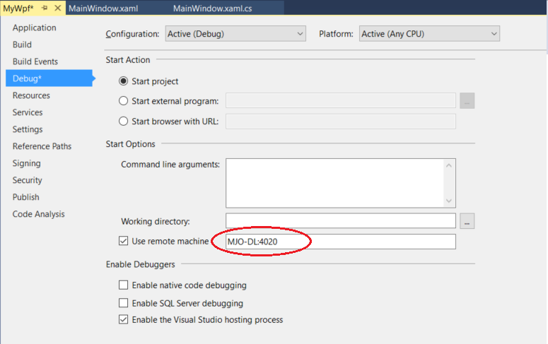

# Um projeto c# ou Visual Basic no Visual Studio de depuração remota
Para depurar um aplicativo do Visual Studio que foi implantado em um computador diferente, instalar e executar as ferramentas remotas no computador onde você implantou seu aplicativo, configure seu projeto para se conectar ao computador remoto do Visual Studio e execute seu aplicativo.

  
Para obter informações sobre aplicativos de Windows Universal (UWP) a depuração remota, consulte [depurar um pacote de aplicativos instalado](debug-installed-app-package.md).

## Requisitos

O depurador remoto é suportado no Windows 7 e versões mais recentes (não phone) e versões do Windows Server, iniciando com o Windows Server 2008 Service Pack 2. Para obter uma lista completa dos requisitos, consulte [requisitos](../debugger/remote-debugging.md#requirements_msvsmon).

> [!NOTE]
> Não há suporte para a depuração entre dois computadores conectados por meio de um proxy. Depuração em uma conexão de baixa largura de banda, como dial-up da Internet, ou de alta latência, ou pela Internet entre países não é recomendado e pode falhar ou ser muito lento.
  
## Baixe e instale as ferramentas remotas

[!INCLUDE [remote-debugger-download](../debugger/includes/remote-debugger-download.md)]

> [!TIP]
> Em alguns cenários, pode ser mais eficiente para executar o depurador remoto de um compartilhamento de arquivos. Para obter mais informações, consulte [executar o depurador remoto de um compartilhamento de arquivo](../debugger/remote-debugging.md#fileshare_msvsmon).
  
## Configurar o depurador remoto

[!INCLUDE [remote-debugger-configuration](../debugger/includes/remote-debugger-configuration.md)]

> [!NOTE]
> Se você precisa adicionar permissões para usuários adicionais, alterar o modo de autenticação ou número da porta para o depurador remoto, consulte [configurar o depurador remoto](../debugger/remote-debugging.md#configure_msvsmon).
  
## O projeto de depuração remota
O depurador não pode implantar aplicativos de desktop Visual c# ou Visual Basic para um computador remoto, mas você ainda poderá depurá-los remotamente da seguinte maneira. O procedimento a seguir supõe que você deseja depurá-lo em um computador chamado **MJO DL**, conforme mostrado na ilustração abaixo.
  
1.  Crie um projeto WPF chamado **MyWpf**.  
  
2.  Defina um ponto de interrupção em algum lugar no código que é facilmente acessado.  
  
     Por exemplo, você pode definir um ponto de interrupção em um manipulador de botão. Para fazer isso, abra MainWindow. XAML e adicionar um controle de botão da caixa de ferramentas, clique duas vezes no botão para abrir seu manipulador.
  
3.  No Gerenciador de soluções, clique com o botão direito e escolha **propriedades**.  
  
4.  Sobre o **propriedades** página, escolha o **depurar** guia.  
  
       
  
5.  Verifique se o **diretório de trabalho** caixa de texto está vazia.  
  
6.  Escolha **máquina remota Use**e o tipo **MJO-DL:4022** na caixa de texto. (4022 é o número de porta mostrado na janela do depurador remoto. O número da porta incrementa 2 em cada versão do Visual Studio).
  
7.  Verifique se **habilitar a depuração de código nativo** não estiver selecionada.  
  
8.  Compile o projeto.  
  
9. Crie uma pasta no computador remoto que é o mesmo caminho que o **depurar** pasta no computador Visual Studio:  **\<caminho de origem > \MyWPF\MyWPF\bin\Debug**.  
  
10. Copie o executável que você acabou de criar do seu computador do Visual Studio para a pasta criada recentemente no computador remoto.
  
    > [!CAUTION]
    >  Não faça alterações no código ou rebuild (ou você deve repetir esta etapa). O executável que você copiou para o computador remoto deve corresponder exatamente, seu local de origem e símbolos.

    Você pode copiar o projeto manualmente, use Xcopy, Robocopy, Powershell ou outras opções.
  
11. Verifique se o depurador remoto está em execução no computador de destino (se não estiver, procure **depurador remoto** no **iniciar** menu). A janela de depurador remoto tem esta aparência.  
  
       
  
12. No Visual Studio, iniciar a depuração (**Depurar > Iniciar depuração**, ou **F5**).  
  
13. Se solicitado, insira as credenciais de rede para se conectar ao computador remoto.  
  
     As credenciais necessárias variam dependendo da configuração de segurança da sua rede. Por exemplo, em um computador de domínio, você pode inserir seu nome de domínio e senha. Em um computador de fora do domínio, insira o nome do computador e um nome de conta de usuário válido, como  **MJO-DL\name@something.com** , junto com a senha correta.

     Você deve ver que a janela principal do aplicativo do WPF está aberta no computador remoto.
  
14. Se necessário, execute a ação para o ponto de interrupção. Você verá que o ponto de interrupção está ativo. Se não estiver, os símbolos para o aplicativo ainda não carregado. Tente novamente e se isso não funcionar, obter informações sobre carregamento de símbolos e como solucioná-los em [Noções básicas sobre arquivos de símbolo e o Visual Studio símbolo configurações](http://blogs.msdn.com/b/visualstudioalm/archive/2015/01/05/understanding-symbol-files-and-visual-studio-s-symbol-settings.aspx).
  
15. No computador do Visual Studio, você verá que a execução foi interrompida no ponto de interrupção.
  
 Se você tiver arquivos de código não precisam ser usados pelo aplicativo, você precisa incluí-las no projeto do Visual Studio. Crie uma pasta de projeto para os arquivos adicionais (da **Solution Explorer**, clique em **Adicionar > nova pasta**). Em seguida, adicionar os arquivos na pasta (no **Solution Explorer**, clique em **Adicionar > Item existente**, em seguida, selecione os arquivos). Sobre o **propriedades** para cada arquivo, defina **copiar para diretório de saída** para **copiar sempre**.

## Configurar a depuração com símbolos remotos 

[!INCLUDE [remote-debugger-symbols](../debugger/includes/remote-debugger-symbols.md)]  
  
## Consulte também  
 [Depurando no Visual Studio](../debugger/index.md)  
 [Tour dos recursos do depurador](../debugger/debugger-feature-tour.md)   
 [Configurar o Firewall do Windows para depuração remota](../debugger/configure-the-windows-firewall-for-remote-debugging.md)   
 [Atribuições de porta do depurador remoto](../debugger/remote-debugger-port-assignments.md)   
 [Depuração Remota de ASP.NET em um computador remoto IIS](../debugger/remote-debugging-aspnet-on-a-remote-iis-computer.md)  
 [Erros e solução de problemas de depuração remota](../debugger/remote-debugging-errors-and-troubleshooting.md)