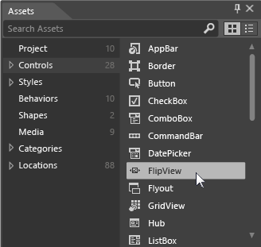

# Inserir controles e modificar seu comportamento no XAML Designer
[!INCLUDE[vs2017banner](../code-quality/includes/vs2017banner.md)]

Controles permitem aos usuários interagir com seu aplicativo. Você pode usá\-los para coletar informações e executar ações como animar um objeto ou consultar uma fonte de dados.  
  
 **Neste tópico:**  
  
-   [Adicionar controles à prancheta](#Insert)  
  
-   [Faça controles fazer coisas](#Modify)  
  
##   Adicionar controles à prancheta  
 Você pode arrastar controles do **ativos** painel para o **prancheta**, e, em seguida, modificá\-las no **propriedades** janela.  
  
   
  
 Esses vídeos mostram como usar alguns dos controles mais comuns.  
  
|Controle|Assista a um vídeo curto|  
|--------------|------------------------------|  
|`Menu` | [Adicionar os controles](https://www.youtube.com/watch?v=ra4AHfgD4Ys&list=PLBDF977B2F1DAB358&index=45)|  
|`Button` | [Criar um botão](http://www.popscreen.com/v/6A4gb/Microsoft-Expression-Blend-Designing-a-Button)|  
|`Textblock` | [Adicionar imagens a um textblock](http://www.popscreen.com/v/6A4du/Microsoft-Expression-Blend-Adding-Images-to-a-TextBlock)|  
|`Slider` | [Criar um controle deslizante com uma dica de ferramenta](http://www.bing.com/videos/search?q=slider%20expression%20blend&qs=n&form=QBVR&pq=slider%20expression%20blend&sc=1-23&sp=-1&sk=#view=detail&mid=F1BB7DB91B2772A8CA2AF1BB7DB91B2772A8CA2A)|  
|`GridSplitter` | [Trabalhar com um GridSplitter](http://msdn.microsoft.com/expression/cc188687.aspx)|  
  
### Tornar um controle fora de uma imagem, forma ou caminho  
 Você pode transformar qualquer objeto em um controle.  
  
   
  
 Por exemplo, imagine uma imagem de uma televisão no centro da página. Você pode fazer controles sem imagens pequenas que se parecem com botões de televisão. Em seguida, os usuários poderiam clique esses botões para alterar o canal.  
  
 Isso é possível porque os botões agora são controles. Com controles, você pode responder às interações do usuário; Nesse caso, quando o usuário clica em um botão.  
  
 Para criar um controle, selecione um objeto. Em seguida, no **ferramentas** menu, clique em **transformar controle**.  
  
##   Faça controles fazer coisas  
 Controles podem executar ações quando os usuários interagem com eles. Por exemplo, eles podem iniciar uma animação, atualizar uma fonte de dados ou reproduzir um vídeo.  
  
 Use *gatilhos*, *comportamentos*, e *eventos* para tornar os controles fazer coisas.  
  
### Gatilhos  
 Um *gatilho* altere uma propriedade ou executa uma tarefa em resposta a um evento ou uma alteração em outra propriedade. Por exemplo, você pode alterar a cor de um botão quando os usuários passar o mouse sobre ele.  
  
   
  
 **Assistir a um vídeo curto:**  [Adicionar um gatilho de propriedade](http://www.popscreen.com/v/6A4gO/Microsoft-Expression-Blend-Adding-a-Property-Trigger).  
  
### Comportamentos  
 Um *comportamento* é um pacote reutilizável de código. Ele pode fazer um pouco mais de alterar as propriedades. Ele pode realizar ações como um serviço de dados de consulta. Blend vem com uma pequena coleção deles, mas você pode adicionar mais. Arraste um comportamento para qualquer objeto na sua prancheta e personalizar o comportamento definindo propriedades.  
  
   
  
 **Assistir a um vídeo curto:**  [dicas de mesclagem: Introdução ao uso de comportamentos parte 1](http://www.bing.com/videos/search?q=Expression%20blend%20behaviors&qs=n&form=QBVR&pq=expression%20blend%20behavior&sc=4-25&sp=-1&sk=#view=detail&mid=CF0DD797ED84DE740904CF0DD797ED84DE740904).  
  
### Eventos  
 Para máxima flexibilidade, manipular um *evento*. Você precisará escrever algum código.  
  
 **Assistir a um vídeo curto:**  [Adicionar um evento de Mouse](https://www.youtube.com/watch?v=2PMxAlb-x_E).