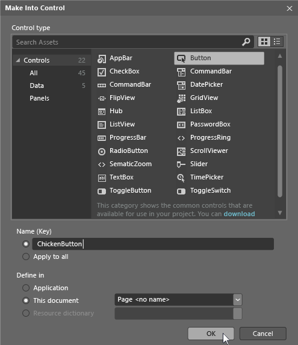
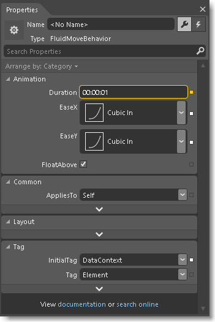

# Inserir controles e modificar seu comportamento no XAML Designer
Controles permitem que usuários interajam com seu aplicativo. Você pode usá-los para coletar informações e executar ações como animar um objeto ou consultar uma fonte de dados.  
  
 **Neste tópico:**  
  
-   [Adicionar controles ao formulário](#Insert)  
  
-   [Fazer com que controles façam coisas](#Modify)  
  
##   Adicionar controles à prancheta  
 Você pode arrastar controles do painel **Ativos** para a **prancheta** e, em seguida, modificá-los na janela **Propriedades**.  
  
   
  
 Esses vídeos mostram como usar alguns dos controles mais comuns.  
  
|Controle|Assista a um breve vídeo|  
|-------------|-------------------------|  
|`Menu` |[Adicionar os controles](https://www.youtube.com/watch?v=ra4AHfgD4Ys&list=PLBDF977B2F1DAB358&index=45)|  
|`Button` |[Projetar um botão](http://www.popscreen.com/v/6A4gb/Microsoft-Expression-Blend-Designing-a-Button)|  
|`Textblock` |[Adicionar imagens a um textbook](http://www.popscreen.com/v/6A4du/Microsoft-Expression-Blend-Adding-Images-to-a-TextBlock)|  
|`Slider` | [Criar um Controle Deslizante com uma Dica de Ferramenta](http://www.bing.com/videos/search?q=slider%20expression%20blend&qs=n&form=QBVR&pq=slider%20expression%20blend&sc=1-23&sp=-1&sk=#view=detail&mid=F1BB7DB91B2772A8CA2AF1BB7DB91B2772A8CA2A)|  
|`GridSplitter` | [Trabalhar com um GridSplitter](http://msdn.microsoft.com/expression/cc188687.aspx)|  
  
### Fazer um controle de uma imagem, forma ou caminho  
 Você pode transformar qualquer objeto em um controle.  
  
   
  
 Por exemplo, imagine uma imagem de uma televisão no centro da página. Você pode criar controles de imagens pequenas que se parecem com botões de televisão. Em seguida, os usuários podem clicar nesses botões para trocar de canal.  
  
 Isso é possível porque os botões agora são controles. Com controles, você pode responder às interações do usuário; Nesse caso, quando o usuário clica em um botão.  
  
 Para criar um controle, selecione um objeto. No menu **Ferramentas**, clique em **Transformar em Controle**.  
  
##   Fazer com que controles façam coisas  
 Controles podem executar ações quando os usuários interagem com eles. Por exemplo, eles podem iniciar uma animação, atualizar uma fonte de dados ou reproduzir um vídeo.  
  
 Use *gatilhos*, *comportamentos* e *eventos* para fazer com que os controles façam coisas.  
  
### Gatilhos  
 O *gatilho* altera uma propriedade ou executa uma tarefa em resposta a um evento ou uma alteração em outra propriedade. Por exemplo, você pode alterar a cor de um botão quando os usuários passarem o mouse sobre ele.  
  
   
  
 **Assista a um breve vídeo:**  [Adicionar um gatilho de propriedade](http://www.popscreen.com/v/6A4gO/Microsoft-Expression-Blend-Adding-a-Property-Trigger).  
  
### Comportamentos  
 Um *comportamento* é um pacote reutilizável de código. Ele pode fazer um pouco mais além de alterar as propriedades. Ele pode realizar ações como consultar um serviço de dados. A combinação vem com uma pequena coleção deles, mas você pode adicionar mais. Arraste um comportamento para qualquer objeto na sua prancheta e personalize o comportamento configurando propriedades.  
  
   
  
 **Assista a um breve vídeo:**  [Dicas de combinação: Introdução para usar comportamentos Parte 1](http://www.bing.com/videos/search?q=Expression%20blend%20behaviors&qs=n&form=QBVR&pq=expression%20blend%20behavior&sc=4-25&sp=-1&sk=#view=detail&mid=CF0DD797ED84DE740904CF0DD797ED84DE740904).  
  
### Eventos  
 Para máxima flexibilidade, manipule um *evento*. Você precisará gravar algum código.  
  
 **Assista a um breve vídeo:**  [Adicionar um evento de Mouse](https://www.youtube.com/watch?v=2PMxAlb-x_E).
