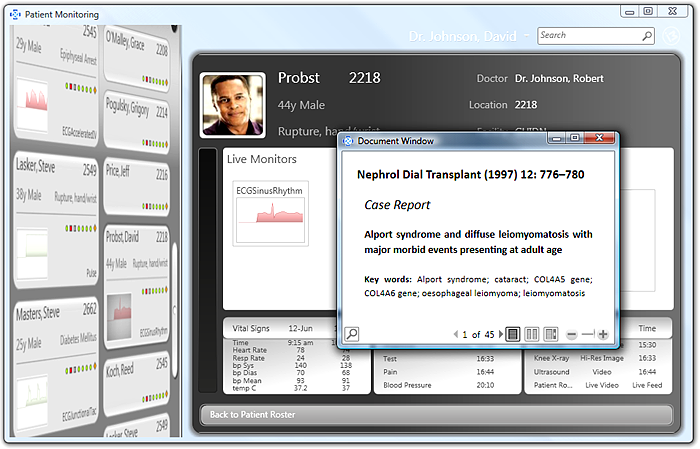
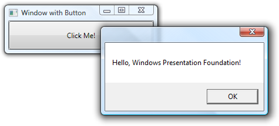
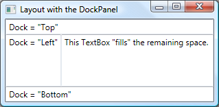
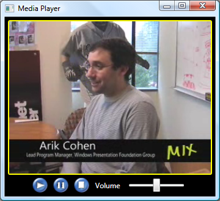
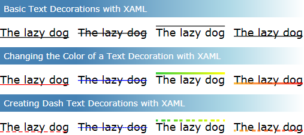
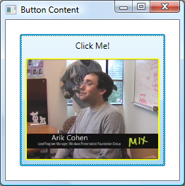
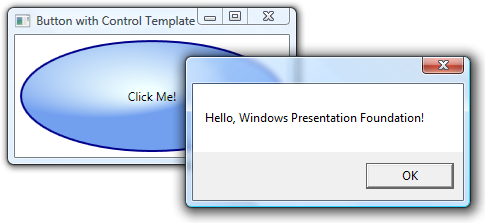
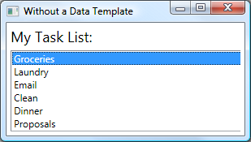
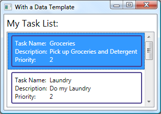
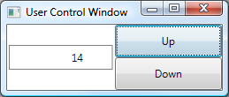

# Introdu&#231;&#227;o ao WPF
[!INCLUDE[vs2017banner](../code-quality/includes/vs2017banner.md)]

Windows Presentation Foundation \(WPF\) permite criar aplicativos para Windows do cliente de desktop com experiências de usuário visualmente impressionantes.  
  
   
  
 O núcleo do WPF é um mecanismo de renderização de resolução e baseado em vetor que é criado para tirar proveito do hardware de gráficos modernos. WPF estende o núcleo com um conjunto abrangente de recursos de desenvolvimento de aplicativos que incluem Extensible Application marcação idioma \(XAML\), controles, associação de dados, layout, elementos gráficos 2D e 3D, animação, estilos, modelos, documentos, mídia, texto e tipografia. WPF está incluído no .NET Framework, portanto você pode criar aplicativos que incorporam outros elementos da biblioteca de classes do .NET Framework.  
  
 Esta visão geral é destinada para principiantes e aborda os principais recursos e conceitos do WPF.  
  
##  <a name="Programming_with_WPF"></a> Programação com o WPF  
 WPF existe como um subconjunto de tipos do .NET Framework que geralmente estão localizados na <xref:System.Windows> namespace. Se você tiver criado anteriormente aplicativos com o .NET Framework usando tecnologias gerenciadas como ASP.NET e Windows Forms, WPF fundamental experiência em programação deve estar familiarizado; Você pode instanciar classes, definir propriedades, chamar métodos e eventos alça, usando o .NET favorita de linguagem de programação, como c\# ou Visual Basic.  
  
 O WPF inclui adicionais construções de programação que aprimoram as propriedades e eventos: [Propriedades de dependência](https://msdn.microsoft.com/en-us/library/ms752914\(v=vs.100\).aspx) e [eventos roteados](https://msdn.microsoft.com/en-us/library/ms742806\(v=vs.100\).aspx).  
  
##  <a name="Markup_And_Codebehind"></a> Marcação e Code\-Behind  
 O WPF permite que você desenvolver um aplicativo usando os dois *marcação* e *de lógica*, uma experiência que os desenvolvedores de ASP.NET devem estar familiarizados com. Você geralmente usa marcação XAML para implementar a aparência de um aplicativo enquanto estiver usando linguagens gerenciadas de programação \(lógica\) para implementar seu comportamento. Essa separação de aparência e comportamento apresenta os seguintes benefícios:  
  
-   Custos de desenvolvimento e manutenção são reduzidos pois a marcação específica da aparência não está acoplada ao comportamento específico do código.  
  
-   Desenvolvimento é mais eficiente porque os designers podem implementar a aparência de um aplicativo simultaneamente com os desenvolvedores que estiverem implementando o comportamento do aplicativo.  
  
-   [Globalização e localização](https://msdn.microsoft.com/en-us/library/ms788718\(v=vs.100\).aspx) para WPF aplicativos é simplificada.  
  
 A seguir está uma breve introdução ao WPF marcação e code\-behind.  
  
### Marcação  
 XAML é uma linguagem de marcação baseada em XML que é usada para implementar a aparência de um aplicativo declarativamente. Ele é normalmente usado para criar janelas, caixas de diálogo, páginas e controles de usuário e para preenchê\-las com controles, formas e gráficos.  
  
 O exemplo a seguir usa XAML para implementar a aparência de uma janela que contém um único botão.  
  
```xaml  
<Window  
    xmlns="http://schemas.microsoft.com/winfx/2006/xaml/presentation"  
    Title="Window with Button"  
    Width="250" Height="100">  
  
  <!-- Add button to window -->  
  <Button Name="button">Click Me!</Button>  
  
</Window>  
```  
  
 Especificamente, esse XAML define uma janela e um botão usando o `Window` e `Button` elementos, respectivamente. Cada elemento está configurado com atributos, como o `Window` do elemento `Title` atributo para especificar o texto da barra de título da janela. Em tempo de execução, o WPF converte os elementos e atributos que são definidos na marcação para instâncias de classes do WPF. Por exemplo, o `Window` elemento é convertido em uma instância do <xref:System.Windows.Window> classe cuja <xref:System.Windows.Window.Title%2A> propriedade é o valor da `Title` atributo.  
  
 A figura a seguir mostra a interface do usuário \(IU\) que é definida pelo XAML no exemplo anterior.  
  
   
  
 Como o XAML é baseado em XML, a interface do usuário que você escreve com ele é montado em uma hierarquia de elementos aninhados conhecida como um [árvore de elementos](https://msdn.microsoft.com/en-us/library/ms753391\(v=vs.100\).aspx). A elemento árvore fornece uma maneira lógica e intuitiva para criar e gerenciar interfaces do usuário.  
  
### Code\-Behind  
 O comportamento principal de um aplicativo é implementar a funcionalidade que responde às interações do usuário, incluindo a manipulação de eventos \(por exemplo, clicar em um menu, barra de ferramentas ou botão\) e chamar a lógica de negócios e lógica de acesso a dados na resposta. No WPF, esse comportamento geralmente é implementado no código que está associado com a marcação. Esse tipo de código é conhecido como code\-behind. O exemplo a seguir mostra a marcação atualizada do exemplo anterior e o code\-behind.  
  
```xaml  
<Window  
    xmlns="http://schemas.microsoft.com/winfx/2006/xaml/presentation"  
    xmlns:x="http://schemas.microsoft.com/winfx/2006/xaml"  
    x:Class="SDKSample.AWindow"  
    Title="Window with Button"  
    Width="250" Height="100">  
  
  <!-- Add button to window -->  
  <Button Name="button" Click="button_Click">Click Me!</Button>  
  
</Window>  
```  
  
```c#  
using System.Windows; // Window, RoutedEventArgs, MessageBox   
  
namespace SDKSample  
{  
    public partial class AWindow : Window  
    {  
        public AWindow()  
        {  
            // InitializeComponent call is required to merge the UI   
            // that is defined in markup with this class, including    
            // setting properties and registering event handlers  
            InitializeComponent();  
        }  
  
        void button_Click(object sender, RoutedEventArgs e)  
        {  
            // Show message box when button is clicked  
            MessageBox.Show("Hello, Windows Presentation Foundation!");  
        }  
    }  
}  
```  
  
```vb  
Namespace SDKSample  
  
    Partial Public Class AWindow  
        Inherits System.Windows.Window  
  
        Public Sub New()  
  
            ' InitializeComponent call is required to merge the UI   
            ' that is defined in markup with this class, including    
            ' setting properties and registering event handlers  
            InitializeComponent()  
  
        End Sub   
  
        Private Sub button_Click(ByVal sender As Object, ByVal e As RoutedEventArgs)  
  
            ' Show message box when button is clicked  
            MessageBox.Show("Hello, Windows Presentation Foundation!")  
  
        End Sub   
  
    End Class   
  
End Namespace  
  
```  
  
 Neste exemplo, o code\-behind implementa uma classe que deriva de <xref:System.Windows.Window> classe. O `x:Class` atributo é usado para associar a marcação com a classe code\-behind.`InitializeComponent` é chamado de construtor da classe de code\-behind para mesclar a interface do usuário que é definida na marcação com a classe code\-behind. \(`InitializeComponent` é gerado para você quando seu aplicativo é criado, o motivo pelo qual você não precisa implementá\-lo manualmente.\) A combinação de `x:Class` e `InitializeComponent` Certifique\-se de que sua implementação é inicializada corretamente sempre que ela é criada. A classe code\-behind também implementa um manipulador de eventos para o botão <xref:System.Windows.Controls.Primitives.ButtonBase.Click> eventos. Quando o botão é clicado, o manipulador de eventos mostra uma caixa de mensagem chamando o <xref:System.Windows.MessageBox.Show%2A?displayProperty=fullName> método.  
  
 A figura a seguir mostra o resultado quando o botão é clicado.  
  
   
  
##  <a name="Controls"></a> Controles  
 As experiências de usuário que são entregues pelo modelo de aplicativo são controles construídos. No WPF, "controle" é um termo abrangente que se aplica a uma categoria de classes do WPF hospedado em uma janela ou uma página, tem uma interface de usuário e implementa algum comportamento.  
  
 Para obter mais informações, consulte [controles](../Topic/Controls.md).  
  
### Controles do WPF por função  
 Os controles internos do WPF são listados aqui.  
  
-   **Botões**: <xref:System.Windows.Controls.Button> e <xref:System.Windows.Controls.Primitives.RepeatButton>.  
  
-   **Exibição de dados**: <xref:System.Windows.Controls.DataGrid>, <xref:System.Windows.Controls.ListView>,e <xref:System.Windows.Controls.TreeView>.  
  
-   **Exibição e a seleção de data**: <xref:System.Windows.Controls.Calendar> e <xref:System.Windows.Controls.DatePicker>.  
  
-   **Caixas de diálogo**: <xref:Microsoft.Win32.OpenFileDialog>, <xref:System.Windows.Controls.PrintDialog>, e <xref:Microsoft.Win32.SaveFileDialog>.  
  
-   **Tinta digital**: <xref:System.Windows.Controls.InkCanvas> e <xref:System.Windows.Controls.InkPresenter>.  
  
-   **Documents**: <xref:System.Windows.Controls.DocumentViewer>, <xref:System.Windows.Controls.FlowDocumentPageViewer>, <xref:System.Windows.Controls.FlowDocumentReader>, <xref:System.Windows.Controls.FlowDocumentScrollViewer>, and <xref:System.Windows.Controls.StickyNoteControl>.  
  
-   **Input**: <xref:System.Windows.Controls.TextBox>, <xref:System.Windows.Controls.RichTextBox>, and <xref:System.Windows.Controls.PasswordBox>.  
  
-   **Layout**: <xref:System.Windows.Controls.Border>, <xref:System.Windows.Controls.Primitives.BulletDecorator>, <xref:System.Windows.Controls.Canvas>, <xref:System.Windows.Controls.DockPanel>, <xref:System.Windows.Controls.Expander>, <xref:System.Windows.Controls.Grid>, <xref:System.Windows.Controls.GridView>, <xref:System.Windows.Controls.GridSplitter>, <xref:System.Windows.Controls.GroupBox>, <xref:System.Windows.Controls.Panel>, <xref:System.Windows.Controls.Primitives.ResizeGrip>, <xref:System.Windows.Controls.Separator>, <xref:System.Windows.Controls.Primitives.ScrollBar>, <xref:System.Windows.Controls.ScrollViewer>, <xref:System.Windows.Controls.StackPanel>, <xref:System.Windows.Controls.Primitives.Thumb>, <xref:System.Windows.Controls.Viewbox>, <xref:System.Windows.Controls.VirtualizingStackPanel>, <xref:System.Windows.Window>, and <xref:System.Windows.Controls.WrapPanel>.  
  
-   **Media**: <xref:System.Windows.Controls.Image>, <xref:System.Windows.Controls.MediaElement>, and <xref:System.Windows.Controls.SoundPlayerAction>.  
  
-   **Menus**: <xref:System.Windows.Controls.ContextMenu>, <xref:System.Windows.Controls.Menu>, and <xref:System.Windows.Controls.ToolBar>.  
  
-   **Navigation**: <xref:System.Windows.Controls.Frame>, <xref:System.Windows.Documents.Hyperlink>, <xref:System.Windows.Controls.Page>, <xref:System.Windows.Navigation.NavigationWindow>, and <xref:System.Windows.Controls.TabControl>.  
  
-   **Selection**: <xref:System.Windows.Controls.CheckBox>, <xref:System.Windows.Controls.ComboBox>, <xref:System.Windows.Controls.ListBox>, <xref:System.Windows.Controls.RadioButton>, and <xref:System.Windows.Controls.Slider>.  
  
-   **Informações do usuário**: <xref:System.Windows.Controls.AccessText>, <xref:System.Windows.Controls.Label>, <xref:System.Windows.Controls.Primitives.Popup>, <xref:System.Windows.Controls.ProgressBar>, <xref:System.Windows.Controls.Primitives.StatusBar>, <xref:System.Windows.Controls.TextBlock>, e <xref:System.Windows.Controls.ToolTip>.  
  
##  <a name="Input_And_Commanding"></a> Entrada e comando  
 Controles normalmente detectam e respondem à entrada do usuário. O [sistema de entrada do WPF](https://msdn.microsoft.com/en-us/library/ms754010\(v=vs.100\).aspx) usa tanto os eventos diretos como os roteados para dar suporte a entrada de texto, o foco de gerenciamento e o posicionamento do mouse.  
  
 Aplicativos geralmente têm requisitos complexos de entrada. O WPF fornece um [comando system](https://msdn.microsoft.com/en-us/library/ms752308\(v=vs.100\).aspx) que separa ações de entrada do usuário do código que responde a essas ações.  
  
##  <a name="Layout"></a> Layout  
 Quando você cria uma interface do usuário, você organiza os controles por local e tamanho para formar um layout. Um requisito chave de qualquer layout é se adaptar a alterações no tamanho da janela e exibir as configurações. Em vez de forçá\-lo a escrever o código para adaptar um layout nessas circunstâncias, o WPF fornece um sistema extensível de layout de primeira classe para você.  
  
 A base do sistema de layout é o posicionamento relativo, que aumenta a capacidade de se adaptar às modificações da janela e exibirá as condições. Além disso, o sistema de layout gerencia a negociação entre os controles para determinar o layout. A negociação é um processo de duas etapas: primeiro, um controle informa ao pai o local e tamanho requerido; segundo, o pai informa ao controle qual espaço ele pode ter.  
  
 O sistema de layout é exposto aos controles filho por meio de classes base do WPF. Para layouts comuns, como grades, empilhamento e encaixe, o WPF inclui vários controles de layout:  
  
-   <xref:System.Windows.Controls.Canvas>: Controles filho fornecem seu próprio layout.  
  
-   <xref:System.Windows.Controls.DockPanel>: Controles filho são alinhados com as bordas do painel.  
  
-   <xref:System.Windows.Controls.Grid>: Controles filho são posicionados por linhas e colunas.  
  
-   <xref:System.Windows.Controls.StackPanel>: Controles filho são empilhados verticalmente ou horizontalmente.  
  
-   <xref:System.Windows.Controls.VirtualizingStackPanel>: Controles filho são virtualizados e organizados em uma única linha que é orientada horizontal ou verticalmente.  
  
-   <xref:System.Windows.Controls.WrapPanel>: Controles filho são posicionados em ordem da esquerda para a direita e quebrados para a próxima linha quando há mais controles na linha atual que o espaço permite.  
  
 O exemplo a seguir usa um <xref:System.Windows.Controls.DockPanel> para formatar vários <xref:System.Windows.Controls.TextBox> controles.  
  
 [!CODE [IntroToWPFSnippets#LayoutMARKUP](../CodeSnippet/VS_Snippets_Wpf/IntroToWPFSnippets#layoutmarkup)]  
  
 O <xref:System.Windows.Controls.DockPanel> permite que o filho <xref:System.Windows.Controls.TextBox> controles para informá\-lo como organizá\-los. Para fazer isso, o <xref:System.Windows.Controls.DockPanel> implementa um <xref:System.Windows.Controls.DockPanel.Dock%2A> propriedade que é exposta aos controles filho para permitir que cada um deles especifique um estilo da plataforma.  
  
> [!NOTE]
>  Uma propriedade que é implementada por um controle pai para uso por controles filho é uma construção WPF chamada um [propriedade anexada](https://msdn.microsoft.com/en-us/library/ms749011\(v=vs.100\).aspx).  
  
 A figura a seguir mostra o resultado da marcação XAML no exemplo anterior.  
  
   
  
##  <a name="Data_Binding"></a> Associação de dados  
 A maioria dos aplicativos são criados para fornecer aos usuários os meios para exibir e editar dados. Para aplicativos do WPF, o trabalho de armazenar e acessar dados já é fornecido por tecnologias, como SQL Server e ADO.NET. Depois que os dados são acessados e carregados em objetos gerenciados do aplicativo, inicia o trabalho pesado para aplicativos WPF. Essencialmente, isso envolve duas coisas:  
  
1.  Copiando os dados dos objetos gerenciados para controles, onde os dados podem ser exibidos e editados.  
  
2.  Garantir que as alterações feitas nos dados usando controles são copiadas para os objetos gerenciados.  
  
 Para simplificar o desenvolvimento de aplicativos, o WPF fornece um mecanismo de associação de dados para executar essas etapas automaticamente. A unidade principal do mecanismo de associação de dados é o <xref:System.Windows.Data.Binding> classe, cujo trabalho é para associar um controle \(o destino de associação\) a um objeto de dados \(a origem de associação\). Essa relação é ilustrada pela figura a seguir.  
  
   
  
 O exemplo a seguir demonstra como associar um <xref:System.Windows.Controls.TextBox> para uma instância de um personalizado `Person` objeto. O `Person` implementação é mostrada no código a seguir.  
  
 [!code-vb[SimpleDataBindingSnippets#PersonClassCODE](../designers/codesnippet/VisualBasic/introduction-to-wpf_1.vb)]
 [!code-cs[SimpleDataBindingSnippets#PersonClassCODE](../designers/codesnippet/CSharp/introduction-to-wpf_1.cs)]  
  
 A marcação a seguir associa o <xref:System.Windows.Controls.TextBox> para uma instância de um personalizado `Person` objeto.  
  
 [!code-xml[SimpleDataBindingSnippets#DataBindingMARKUP1](../designers/codesnippet/Xaml/introduction-to-wpf_2.xaml)]  
[!code-xml[SimpleDataBindingSnippets#DataBindingMARKUP2](../designers/codesnippet/Xaml/introduction-to-wpf_3.xaml)]  
[!code-xml[SimpleDataBindingSnippets#DataBindingMARKUP3](../designers/codesnippet/Xaml/introduction-to-wpf_4.xaml)]  
  
 [!code-vb[SimpleDataBindingSnippets#DataBindingCODEBEHIND](../designers/codesnippet/VisualBasic/introduction-to-wpf_5.vb)]
 [!code-cs[SimpleDataBindingSnippets#DataBindingCODEBEHIND](../designers/codesnippet/CSharp/introduction-to-wpf_5.cs)]  
  
 Neste exemplo, a `Person` classe é instanciada no code\-behind e é definida como o contexto de dados para o `DataBindingWindow`. Na marcação, o <xref:System.Windows.Controls.TextBox.Text%2A> propriedade o <xref:System.Windows.Controls.TextBox> está associada ao `Person.Name` propriedade \(usando o "`{Binding ... }`" sintaxe XAML\). Esse XAML informa ao WPF para associar o <xref:System.Windows.Controls.TextBox> o controle para o `Person` objeto armazenado na <xref:System.Windows.FrameworkElement.DataContext%2A> propriedade da janela.  
  
 O mecanismo de vinculação de dados do WPF fornece suporte adicional que inclui a validação, classificação, filtragem e agrupamento. Além disso, a associação de dados oferece suporte ao uso de modelos de dados para criar a interface do usuário personalizada para dados associados quando a interface do usuário exibida pelos controles WPF padrão não é apropriada.  
  
 Para obter mais informações, consulte [Geral da vinculação de dados](https://msdn.microsoft.com/en-us/library/ms752347\(v=vs.100\).aspx).  
  
##  <a name="Graphics"></a> Gráficos  
 O WPF introduz um conjunto amplo, escalonável e flexível de recursos gráficos que possuem os seguintes benefícios:  
  
-   **Independente de resolução e dispositivo gráfico**. A unidade básica de medida no sistema gráfico do WPF é o pixel independente de dispositivo, que é 1\/96 de polegada, independentemente da resolução de tela e fornece a base para a renderização de resolução e independentes de dispositivo. Cada pixel independente de dispositivo pode ser dimensionado automaticamente para corresponder à configuração de pontos por polegada \(dpi\) do sistema que ele processa em.  
  
-   **Melhor precisão**. O sistema de coordenadas do WPF é medido com números de ponto flutuante de precisão dupla em vez de precisão única. Transformações e valores opacidade também são expressos como de precisão dupla. WPF também suporta uma gama de cores \(scRGB\) e fornece suporte integrado para gerenciar as entradas de espaços de cores diferentes.  
  
-   **Suporte a gráficos e animação avançados**. WPF simplifica a programação de elementos gráficos ao gerenciar cenas de animação para você; não é necessário se preocupar sobre o processamento da cena, loops de renderização e interpolação bilinear. Além disso, o WPF fornece suporte sucessos\-teste e suporte completo alpha\-composição.  
  
-   **a aceleração de hardware**. Sistema gráfico do WPF tira proveito do hardware de gráficos para minimizar o uso da CPU.  
  
### Formas 2D  
 O WPF fornece uma biblioteca de formas comuns vetoriais 2D, como retângulos e elipses que são mostradas na ilustração a seguir.  
  
   
  
 Um recurso interessante de formas é que eles não são apenas para exibição; formas implementam muitos dos recursos que você espera de controles, incluindo teclado e entrada de mouse. A exemplo a seguir mostra o <xref:System.Windows.UIElement.MouseUp> eventos de um <xref:System.Windows.Shapes.Ellipse> que estão sendo manipuladas.  
  
 [!CODE [IntroToWPFSnippets#HandleEllipseMouseUpEventMARKUP](../CodeSnippet/VS_Snippets_Wpf/IntroToWPFSnippets#handleellipsemouseupeventmarkup)]  
  
 [!CODE [IntroToWPFSnippets#HandleEllipseMouseUpEventCODEBEHIND](../CodeSnippet/VS_Snippets_Wpf/IntroToWPFSnippets#handleellipsemouseupeventcodebehind)]  
  
 A figura a seguir mostra o que é produzido pelo código anterior.  
  
   
  
 Para obter mais informações, consulte [formas e desenho básico no WPF Overview](https://msdn.microsoft.com/en-us/library/ms747393\(v=vs.100\).aspx).  
  
### Geometrias 2D  
 As formas 2D fornecidas pelo WPF abrangem o conjunto padrão de formas básicas. No entanto, talvez seja necessário criar formas personalizadas para facilitar o design de uma interface de usuário personalizada. Para essa finalidade, o WPF fornece geometrias. A figura a seguir demonstra o uso de geometrias para criar uma forma personalizada que pode ser desenhada diretamente, usada como um pincel ou usada para recortar outras formas e controles.  
  
 <xref:System.Windows.Shapes.Path> objetos podem ser usados para desenhar formas fechadas ou abertas, várias formas e até mesmo formas curvas.  
  
 <xref:System.Windows.Media.Geometry> objetos podem ser usados para recorte, sucessos\-teste e tornando os dados gráficos 2D.  
  
   
  
 Para obter mais informações, consulte [Visão geral da geometria](https://msdn.microsoft.com/en-us/library/ms751808\(v=vs.100\).aspx)  
  
### Efeitos 2D  
 Um subconjunto de recursos do WPF 2D inclui efeitos visuais, como gradientes, bitmaps, desenhos, pintura com vídeos, rotação, dimensionamento e inclinação. Essas são todas obtidas com cursores; a figura a seguir mostra alguns exemplos.  
  
   
  
 Para obter mais informações, consulte [Visão geral de pincéis do WPF](https://msdn.microsoft.com/en-us/library/aa970904\(v=vs.100\).aspx).  
  
### Renderização 3D  
 O WPF também inclui recursos de renderização 3D que se integram com elementos gráficos em 2D para permitir a criação de interfaces do usuário mais interessantes e interessantes. Por exemplo, a figura a seguir mostra imagens 2D renderizadas nas formas 3D.  
  
   
  
 Para obter mais informações, consulte [Visão geral de elementos gráficos 3D](https://msdn.microsoft.com/en-us/library/ms747437\(v=vs.100\).aspx).  
  
##  <a name="Animation"></a> Animação  
 WPF animação suporte permite que você faça controles crescimento, agite, rodarem e terminarem, para criar interessante página transições e muito mais. Você pode animar a maioria das classes do WPF, mesmo as classes personalizadas. A figura a seguir mostra uma simple animação em ação.  
  
   
  
 Para obter mais informações, consulte [Visão geral da animação](https://msdn.microsoft.com/en-us/library/ms752312\(v=vs.100\).aspx).  
  
##  <a name="Media"></a> Mídia  
 Uma maneira de transmitir conteúdo rico é com o uso de mídia audiovisual. WPF oferece suporte especial para imagens, vídeo e áudio.  
  
### Imagens  
 Imagens são comuns à maioria dos aplicativos e o WPF fornece várias maneiras de usá\-los. A figura a seguir mostra uma interface do usuário com uma caixa de listagem que contém imagens em miniatura. Quando uma miniatura é selecionada, a imagem é mostrada em tamanho normal.  
  
   
  
 Para obter mais informações, consulte [Imaging Overview](https://msdn.microsoft.com/en-us/library/ms748873\(v=vs.100\).aspx).  
  
### Áudio e vídeo  
 O <xref:System.Windows.Controls.MediaElement> controle é capaz de executar vídeo e áudio, e ele é flexível o suficiente para ser a base para um reprodutor de mídia personalizado. A marcação XAML a seguir implementa um media player.  
  
 [!CODE [IntroToWPFSnippets#MediaElementMARKUP](../CodeSnippet/VS_Snippets_Wpf/IntroToWPFSnippets#mediaelementmarkup)]  
  
 A janela na figura a seguir mostra o <xref:System.Windows.Controls.MediaElement> controle em ação.  
  
   
  
 Para obter mais informações, consulte [gráficos do WPF, animação e visão geral de mídia](https://msdn.microsoft.com/en-us/library/ms742562\(v=vs.100\).aspx).  
  
##  <a name="Text_and_Typography"></a> Texto e tipografia  
 Para facilitar a renderização de texto de alta qualidade, o WPF oferece os seguintes recursos:  
  
-   Suporte de fonte OpenType.  
  
-   Aprimoramentos de ClearType.  
  
-   Alto desempenho que tira proveito de aceleração de hardware.  
  
-   Integração do texto com mídia, elementos gráficos e animação.  
  
-   Mecanismos de suporte e retorno fonte internacional.  
  
 Como uma demonstração de integração de texto com elementos gráficos, a figura a seguir mostra o aplicativo de decoração de texto.  
  
   
  
 Para obter mais informações, consulte [Tipografia no Windows Presentation Foundation](https://msdn.microsoft.com/en-us/library/ms742190\(v=vs.100\).aspx).  
  
##  <a name="WPF_Customization"></a> Personalizando aplicativos WPF  
 Até este ponto, você viu os WPF principais blocos de construção para o desenvolvimento de aplicativos. Você pode usar o modelo de aplicativo para hospedar e entregar conteúdo do aplicativo, que consiste principalmente de controles. Para simplificar a organização dos controles em uma interface de usuário e para garantir que a organização é mantida na face de alterações para o tamanho da janela e exibir as configurações, você deve usar o sistema de layout do WPF. Porque a maioria dos aplicativos permite aos usuários interagir com os dados, você usa a ligação de dados para reduzir o trabalho de integração de sua interface do usuário com dados. Para melhorar a aparência visual do seu aplicativo, você deve usar a ampla gama de suporte a elementos gráficos, animação e mídia fornecido pelo WPF.  
  
 Muitas vezes, no entanto, os conceitos básicos não são suficientes para criar e gerenciar um realmente distinta e visualmente impressionantes experiência do usuário. Os controles WPF padrão podem não se integrar com a aparência desejada do seu aplicativo. Dados não podem ser exibidos da maneira mais eficiente. Experiência do usuário do seu aplicativo pode não ser adequada para a aparência padrão de temas do Windows. Em muitos aspectos, uma tecnologia de apresentação precisa de extensibilidade visual assim como qualquer outro tipo de extensibilidade.  
  
 Por esse motivo, o WPF fornece uma variedade de mecanismos para criar experiências de usuário exclusivo, incluindo um modelo rico de conteúdo para controles, disparadores, controle e modelos de dados, estilos, recursos de interface do usuário, temas e capas.  
  
### Modelo de conteúdo  
 É o principal objetivo da maioria dos controles WPF exibir o conteúdo. No WPF, o tipo e o número de itens que podem constituir o conteúdo de um controle é conhecido como o controle *modelo de conteúdo*. Alguns controles podem conter um único item e o tipo de conteúdo. Por exemplo, o conteúdo de um <xref:System.Windows.Controls.TextBox> é um valor de cadeia de caracteres que é atribuído a de <xref:System.Windows.Controls.TextBox.Text%2A> propriedade. O exemplo a seguir define o conteúdo de um <xref:System.Windows.Controls.TextBox>.  
  
 [!CODE [IntroToWPFSnippets#TextBoxContentMARKUP1](../CodeSnippet/VS_Snippets_Wpf/IntroToWPFSnippets#textboxcontentmarkup1)]  
[!CODE [IntroToWPFSnippets#TextBoxContentMARKUP2](../CodeSnippet/VS_Snippets_Wpf/IntroToWPFSnippets#textboxcontentmarkup2)]  
[!CODE [IntroToWPFSnippets#TextBoxContentMARKUP3](../CodeSnippet/VS_Snippets_Wpf/IntroToWPFSnippets#textboxcontentmarkup3)]  
  
 A figura a seguir mostra o resultado.  
  
   
  
 Outros controles, entretanto, podem conter vários itens de diferentes tipos de conteúdo. o conteúdo de um <xref:System.Windows.Controls.Button>, especificado pelo <xref:System.Windows.Controls.ContentControl.Content%2A> propriedade pode conter uma variedade de itens, incluindo controles de layout, texto, imagens e formas. A exemplo a seguir mostra um <xref:System.Windows.Controls.Button> com conteúdo que inclui um <xref:System.Windows.Controls.DockPanel>, um <xref:System.Windows.Controls.Label>, um <xref:System.Windows.Controls.Border>, e um <xref:System.Windows.Controls.MediaElement>.  
  
 [!CODE [IntroToWPFSnippets#ButtonContentMARKUP1](../CodeSnippet/VS_Snippets_Wpf/IntroToWPFSnippets#buttoncontentmarkup1)]  
[!CODE [IntroToWPFSnippets#ButtonContentMARKUP2](../CodeSnippet/VS_Snippets_Wpf/IntroToWPFSnippets#buttoncontentmarkup2)]  
[!CODE [IntroToWPFSnippets#ButtonContentMARKUP3](../CodeSnippet/VS_Snippets_Wpf/IntroToWPFSnippets#buttoncontentmarkup3)]  
  
 A figura a seguir mostra o conteúdo desse botão.  
  
   
  
 Para obter mais informações sobre os tipos de conteúdo que são suportados pelo vários controles, consulte [modelo de conteúdo WPF](https://msdn.microsoft.com/en-us/library/bb613548\(v=vs.100\).aspx).  
  
### Gatilhos  
 Embora o objetivo principal da marcação XAML é implementar a aparência de um aplicativo, você também pode usar XAML para implementar alguns aspectos do comportamento do aplicativo. Um exemplo é o uso de disparadores para alterar a aparência de um aplicativo com base em interações do usuário. Para obter mais informações, consulte [estilo e modelagem](https://msdn.microsoft.com/en-us/library/ms745683\(v=vs.100\).aspx).  
  
### Modelos de controle  
 As interfaces de usuário padrão para o WPF controles normalmente são construídas de outros controles e formas. Por exemplo, um <xref:System.Windows.Controls.Button> é composto de dois <xref:Microsoft.Windows.Themes.ButtonChrome> e <xref:System.Windows.Controls.ContentPresenter> controles. O <xref:Microsoft.Windows.Themes.ButtonChrome> fornece a aparência padrão botão, enquanto o <xref:System.Windows.Controls.ContentPresenter> exibe conteúdo do botão, conforme especificado pelo <xref:System.Windows.Controls.ContentControl.Content%2A> propriedade.  
  
 Às vezes, a aparência padrão de um controle pode ser incongruente com a aparência geral de um aplicativo. Nesse caso, você pode usar um <xref:System.Windows.Controls.ControlTemplate> para alterar a aparência do controle interface do usuário sem alterar seu conteúdo e comportamento.  
  
 Por exemplo, o exemplo a seguir mostra como alterar a aparência de um <xref:System.Windows.Controls.Button> usando um <xref:System.Windows.Controls.ControlTemplate>.  
  
 [!CODE [IntroToWPFSnippets#ButtonControlTemplateWindowMARKUP](../CodeSnippet/VS_Snippets_Wpf/IntroToWPFSnippets#buttoncontroltemplatewindowmarkup)]  
  
 [!CODE [IntroToWPFSnippets#ButtonControlTemplateWindowCODEBEHIND](../CodeSnippet/VS_Snippets_Wpf/IntroToWPFSnippets#buttoncontroltemplatewindowcodebehind)]  
  
 Neste exemplo, a interface de usuário do botão padrão foi substituída por um <xref:System.Windows.Shapes.Ellipse> que tem uma borda azul\-escuro e é preenchida usando um <xref:System.Windows.Media.RadialGradientBrush>. O <xref:System.Windows.Controls.ContentPresenter> controle exibe o conteúdo de <xref:System.Windows.Controls.Button>, "Click Me\!" Quando o <xref:System.Windows.Controls.Button> é clicado, o <xref:System.Windows.Controls.Primitives.ButtonBase.Click> evento ainda é gerado como parte do <xref:System.Windows.Controls.Button> comportamento padrão do controle. O resultado é mostrado na figura a seguir.  
  
   
  
### Modelos de dados  
 Enquanto um modelo de controle permite que você especifique a aparência de um controle, um modelo de dados permite que você especifique a aparência do conteúdo do controle. Modelos de dados são frequentemente usados para aprimorar como os dados associados é exibida. A figura a seguir mostra a aparência padrão para um <xref:System.Windows.Controls.ListBox> que é associado a uma coleção de `Task` objetos, onde cada tarefa tem um nome, descrição e prioridade.  
  
   
  
 A aparência padrão é o que você esperaria de um <xref:System.Windows.Controls.ListBox>. No entanto, a aparência padrão de cada tarefa contém somente o nome da tarefa. Para mostrar o nome da tarefa, a descrição e a prioridade, a aparência padrão do <xref:System.Windows.Controls.ListBox> itens da lista associada do controle devem ser alteradas usando um <xref:System.Windows.DataTemplate>. O XAML a seguir define uma <xref:System.Windows.DataTemplate>, que é aplicado a cada tarefa usando o <xref:System.Windows.Controls.ItemsControl.ItemTemplate%2A> atributo.  
  
 [!CODE [IntroToWPFSnippets#DataTemplateMARKUP1](../CodeSnippet/VS_Snippets_Wpf/IntroToWPFSnippets#datatemplatemarkup1)]  
[!CODE [IntroToWPFSnippets#DataTemplateMARKUP2](../CodeSnippet/VS_Snippets_Wpf/IntroToWPFSnippets#datatemplatemarkup2)]  
[!CODE [IntroToWPFSnippets#DataTemplateMARKUP3](../CodeSnippet/VS_Snippets_Wpf/IntroToWPFSnippets#datatemplatemarkup3)]  
[!CODE [IntroToWPFSnippets#DataTemplateMARKUP4](../CodeSnippet/VS_Snippets_Wpf/IntroToWPFSnippets#datatemplatemarkup4)]  
  
 A figura a seguir mostra o efeito desse código.  
  
   
  
 Observe que o <xref:System.Windows.Controls.ListBox> manteve seu comportamento e a aparência geral; apenas a aparência do conteúdo que está sendo exibido pela caixa de listagem foi alterado.  
  
 Para obter mais informações, consulte [Visão geral de modelagem de dados](https://msdn.microsoft.com/en-us/library/ms742521\(v=vs.100\).aspx).  
  
### Estilos  
 Os estilos permitem que os desenvolvedores e designers padronizem uma determinada aparência para seus produtos. O WPF fornece um modelo de estilo forte, a base do qual está o <xref:System.Windows.Style> elemento. O exemplo a seguir cria um estilo que define a cor de plano de fundo para cada <xref:System.Windows.Controls.Button> em uma janela para `Orange`.  
  
 [!CODE [IntroToWPFSnippets#StyleMARKUP1](../CodeSnippet/VS_Snippets_Wpf/IntroToWPFSnippets#stylemarkup1)]  
[!CODE [IntroToWPFSnippets#StyleMARKUP2](../CodeSnippet/VS_Snippets_Wpf/IntroToWPFSnippets#stylemarkup2)]  
[!CODE [IntroToWPFSnippets#StyleMARKUP3](../CodeSnippet/VS_Snippets_Wpf/IntroToWPFSnippets#stylemarkup3)]  
[!CODE [IntroToWPFSnippets#StyleMARKUP4](../CodeSnippet/VS_Snippets_Wpf/IntroToWPFSnippets#stylemarkup4)]  
  
 Porque esse estilo atinge todos <xref:System.Windows.Controls.Button> controles, o estilo é aplicado automaticamente a todos os botões na janela, conforme mostrado na figura a seguir.  
  
   
  
 Para obter mais informações, consulte [estilo e modelagem](https://msdn.microsoft.com/en-us/library/ms745683\(v=vs.100\).aspx).  
  
### Recursos  
 Controles em um aplicativo devem compartilhar a mesma aparência, que pode incluir qualquer coisa entre fontes e cores de plano de fundo em estilos, modelos de dados e modelos de controle. Você pode usar o suporte do WPF para recursos de interface do usuário para encapsular esses recursos em um único local para reutilização.  
  
 O exemplo a seguir define uma cor de plano de fundo comum que é compartilhada por um <xref:System.Windows.Controls.Button> e um <xref:System.Windows.Controls.Label>.  
  
 [!CODE [IntroToWPFSnippets#ResourceWindowMARKUP1](../CodeSnippet/VS_Snippets_Wpf/IntroToWPFSnippets#resourcewindowmarkup1)]  
[!CODE [IntroToWPFSnippets#ResourceWindowMARKUP2](../CodeSnippet/VS_Snippets_Wpf/IntroToWPFSnippets#resourcewindowmarkup2)]  
[!CODE [IntroToWPFSnippets#ResourceWindowMARKUP3](../CodeSnippet/VS_Snippets_Wpf/IntroToWPFSnippets#resourcewindowmarkup3)]  
  
 Este exemplo implementa um recurso de cor de plano de fundo usando o `Window.Resources` elemento property. Este recurso está disponível para todos os filhos do <xref:System.Windows.Window>. Há uma variedade de recursos escopos, incluindo o seguinte, listados na ordem em que eles são resolvidos:  
  
1.  Um controle individual \(usando o herdadas <xref:System.Windows.FrameworkElement.Resources%2A?displayProperty=fullName> propriedade\).  
  
2.  Um <xref:System.Windows.Window> ou um <xref:System.Windows.Controls.Page> \(também usando o herdadas <xref:System.Windows.FrameworkElement.Resources%2A?displayProperty=fullName> propriedade\).  
  
3.  Um <xref:System.Windows.Application> \(usando o <xref:System.Windows.Application.Resources%2A?displayProperty=fullName> propriedade\).  
  
 A variedade de escopos oferece flexibilidade em relação a maneira na qual você pode define e compartilha seus recursos.  
  
 Como uma alternativa a associar diretamente os seus recursos com um escopo específico, você pode compactar um ou mais recursos usando um separado <xref:System.Windows.ResourceDictionary> que pode ser referenciado em outras partes de um aplicativo. Por exemplo, o exemplo a seguir define uma cor de plano de fundo padrão em um dicionário de recursos.  
  
 [!CODE [IntroToWPFSnippets#ResourceDictionaryMARKUP1](../CodeSnippet/VS_Snippets_Wpf/IntroToWPFSnippets#resourcedictionarymarkup1)]  
[!CODE [IntroToWPFSnippets#ResourceDictionaryMARKUP2](../CodeSnippet/VS_Snippets_Wpf/IntroToWPFSnippets#resourcedictionarymarkup2)]  
  
 O exemplo a seguir faz referência o dicionário de recursos definido no exemplo anterior para que ele seja compartilhado por um aplicativo.  
  
 [!CODE [IntroToWPFSnippets#ApplicationScopedResourceDictionaryMARKUP1](../CodeSnippet/VS_Snippets_Wpf/IntroToWPFSnippets#applicationscopedresourcedictionarymarkup1)]  
[!CODE [IntroToWPFSnippets#ApplicationScopedResourceDictionaryMARKUP2](../CodeSnippet/VS_Snippets_Wpf/IntroToWPFSnippets#applicationscopedresourcedictionarymarkup2)]  
  
 Recursos e dicionários de recurso são a base de suporte WPF para temas e capas.  
  
 Para obter mais informações, consulte [Visão geral de recursos](https://msdn.microsoft.com/en-us/library/ms750613\(v=vs.100\).aspx).  
  
### Controles personalizados  
 Embora o WPF fornece um host de suporte de personalização, você poderá encontrar situações onde os controles WPF existentes não atenderem às necessidades de seu aplicativo ou seus usuários. Isso pode ocorrer quando:  
  
-   Não é possível criar a interface do usuário que você precisa ao personalizar a aparência de implementações existentes do WPF.  
  
-   O comportamento que você precisa não é suportado \(ou não facilmente suportado\) por implementações existentes do WPF.  
  
 Neste ponto, no entanto, você pode tirar proveito de um dos três modelos do WPF para criar um novo controle. Cada modelo tem como alvo um cenário específico e requer o controle personalizado para derivar de uma classe base específica do WPF. Os três modelos são listados aqui:  
  
-   **o modelo de controle de usuário**. Um controle personalizado derivado de <xref:System.Windows.Controls.UserControl> e é composto de um ou mais controles.  
  
-   **o modelo de controle**. Um controle personalizado derivado de <xref:System.Windows.Controls.Control> e é usado para criar implementações que separam o seu comportamento de sua aparência usando modelos, bem como a maioria dos controles do WPF. Derivando de <xref:System.Windows.Controls.Control> proporciona mais liberdade para criar uma interface do usuário personalizada de controles de usuário, mas ele pode exigir mais esforço.  
  
-   **Framework elemento modelo**. Um controle personalizado derivado de <xref:System.Windows.FrameworkElement> quando sua aparência é definida pela lógica de processamento personalizada \(não modelos\).  
  
 O exemplo a seguir mostra um personalizado numérico para cima\/para baixo de controle que é derivado de <xref:System.Windows.Controls.UserControl>.  
  
 [!CODE [IntroToWPFSnippets#UserControlMARKUP](../CodeSnippet/VS_Snippets_Wpf/IntroToWPFSnippets#usercontrolmarkup)]  
  
 [!CODE [IntroToWPFSnippets#UserControlCODEBEHIND1](../CodeSnippet/VS_Snippets_Wpf/IntroToWPFSnippets#usercontrolcodebehind1)]  
[!CODE [IntroToWPFSnippets#UserControlCODEBEHIND2](../CodeSnippet/VS_Snippets_Wpf/IntroToWPFSnippets#usercontrolcodebehind2)]  
[!CODE [IntroToWPFSnippets#UserControlCODEBEHIND3](../CodeSnippet/VS_Snippets_Wpf/IntroToWPFSnippets#usercontrolcodebehind3)]  
  
 O exemplo a seguir ilustra o XAML que é necessário para incorporar o controle de usuário em um <xref:System.Windows.Window>.  
  
 [!CODE [IntroToWPFSnippets#UserControlWindowMARKUP1](../CodeSnippet/VS_Snippets_Wpf/IntroToWPFSnippets#usercontrolwindowmarkup1)]  
[!CODE [IntroToWPFSnippets#UserControlWindowMARKUP2](../CodeSnippet/VS_Snippets_Wpf/IntroToWPFSnippets#usercontrolwindowmarkup2)]  
[!CODE [IntroToWPFSnippets#UserControlWindowMARKUP3](../CodeSnippet/VS_Snippets_Wpf/IntroToWPFSnippets#usercontrolwindowmarkup3)]  
  
 A figura a seguir mostra o `NumericUpDown` controle hospedado em um <xref:System.Windows.Window>.  
  
   
  
 Para obter mais informações sobre controles personalizados, consulte [Visão geral de criação do controle](https://msdn.microsoft.com/en-us/library/ms745025\(v=vs.100\).aspx).  
  
##  <a name="WPF_Best_Practices"></a> Práticas recomendadas de WPF  
 Como com qualquer plataforma de desenvolvimento, o WPF pode ser usado em uma variedade de maneiras para atingir o resultado desejado. Como uma maneira de garantir que o WPF aplicativos fornecem a experiência de usuário necessários e atender às demandas do público em geral, há são práticas recomendados para acessibilidade, globalização e localização e desempenho. Para obter mais informações, consulte:  
  
-   [Práticas recomendadas de acessibilidade](https://msdn.microsoft.com/en-us/library/aa350483\(v=vs.100\).aspx)práticas recomendadas de acessibilidade  
  
-   [Visão geral de localização e globalização do WPF](https://msdn.microsoft.com/en-us/library/ms788718\(v=vs.100\).aspx)  
  
-   [Otimizando o desempenho do aplicativo WPF](https://msdn.microsoft.com/en-us/library/aa970683\(v=vs.100\).aspx)  
  
-   [Segurança do Windows Presentation Foundation](https://msdn.microsoft.com/en-us/library/aa970906\(v=vs.100\).aspx)  
  
##  <a name="Summary"></a> Resumo  
 O WPF é uma tecnologia de apresentação abrangente para criar uma ampla variedade de aplicativos do cliente visualmente surpreendentes. Esta introdução forneceu um olhar os principais recursos do WPF.  
  
 A próxima etapa é criar aplicativos WPF\!  
  
 Como criá\-los, você pode voltar a esta introdução para uma atualização sobre os principais recursos e para localizar referências a cobertura mais detalhada dos recursos abordados nesta introdução.  
  
## Consulte também  
 [Introdução ao WPF](../designers/getting-started-with-wpf.md)   
 [Criar modernos aplicativos de área de trabalho com o Windows Presentation Foundation](../designers/create-modern-desktop-applications-with-windows-presentation-foundation.md)   
 [Windows Presentation Foundation](https://msdn.microsoft.com/en-us/library/ms754130\(v=vs.100\).aspx)