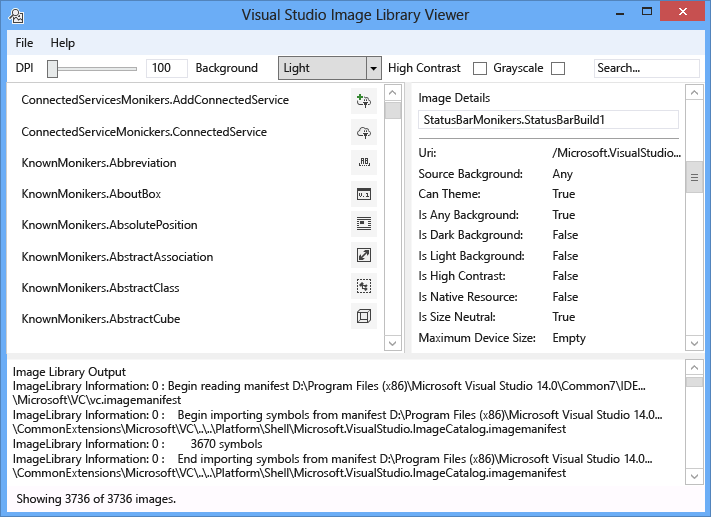
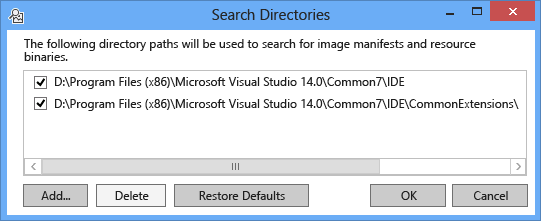
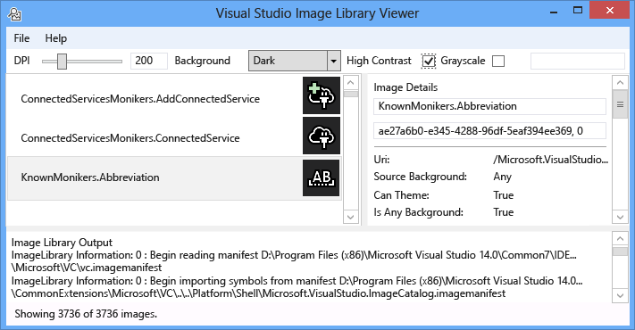
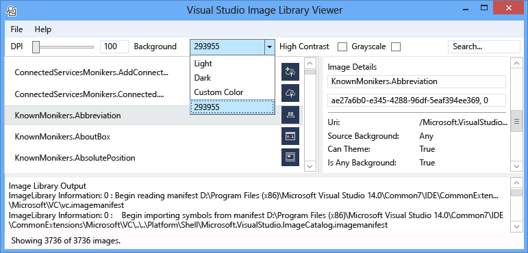
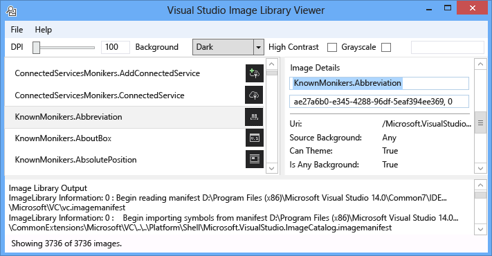
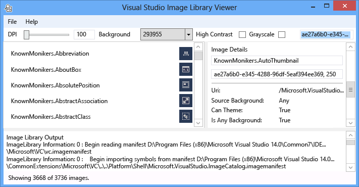

# <a name="image-library-viewer"></a>Visualizador de biblioteca de imagens
A ferramenta Visualizador de biblioteca de imagens do Visual Studio pode carregar e pesquisar os manifestos de imagem, permitindo que o usuário para manipulá-los da mesma maneira que faria de Visual Studio. O usuário pode alterar o plano de fundo, tamanhos, DPI, alto contraste e outras configurações. A ferramenta também exibe informações de carregamento de manifesto cada imagem e exibe informações de origem para cada imagem no manifesto de imagem. Essa ferramenta é útil para:  
  
1.  Diagnóstico de erros  
  
2.  Garantindo atributos estão definidos corretamente nos manifestos de imagem personalizada  
  
3.  Procurando por imagens no catálogo de imagem do Visual Studio para que uma extensão do Visual Studio pode usar imagens de acordo com o estilo do Visual Studio  
  
   
  
 **O identificador de origem da imagem**  
  
 Um moniker imagem (ou o moniker de forma abreviada) é um par de GUID:ID que identifica exclusivamente um ativo de imagem ou um ativo de lista de imagens na biblioteca de imagens.  
  
 **Arquivos de manifesto de imagem**  
  
 Arquivos de imagem de manifesto (.imagemanifest) são arquivos XML que definem um conjunto de ativos de imagem, os identificadores que representam os ativos e a imagem real ou imagens que representam cada ativo. Manifestos de imagem podem definir imagens autônomo ou listas de imagens para suporte legado de interface do usuário. Além disso, há atributos que podem ser definidos no ativo ou nas imagens individuais por trás de cada ativo para alterar quando e como esses ativos são exibidos.  
  
 **Esquema de manifesto de imagem**  
  
 Um manifesto de imagem completa tem esta aparência:  
  
```xml  
<ImageManifest>  
      <!-- zero or one Symbols elements -->  
      <Symbols>  
        <!-- zero or more Guid, ID, or String elements -->  
      </Symbols>  
      <!-- zero or one Images elements -->  
      <Images>  
        <!-- zero or more Image elements -->  
      </Images>  
      <!-- zero or one ImageLists elements -->  
      <ImageLists>  
        <!-- zero or more ImageList elements -->  
      </ImageLists>  
</ImageManifest>  
```  
  
 **Símbolos**  
  
 Como ajudam a legibilidade e a manutenção, o manifesto de imagem pode usar símbolos para valores de atributo. Símbolos são definidos assim:  
  
```xml  
<Symbols>  
      <Import Manifest="manifest" />  
      <Guid Name="ShellCommandGuid" Value="8ee4f65d-bab4-4cde-b8e7-ac412abbda8a" />  
      <ID Name="cmdidSaveAll" Value="1000" />  
      <String Name="AssemblyName" Value="Microsoft.VisualStudio.Shell.UI.Internal" />  
</Symbols>  
```  
  
|||  
|-|-|  
|**Subelemento**|**Definição**|  
|Importar|Importa os símbolos do arquivo de manifesto determinado para uso no manifesto do atual.|  
|GUID|O símbolo representa um GUID e deve corresponder a formatação de GUID.|  
|ID|O símbolo representa uma ID e deve ser um inteiro não negativo.|  
|Cadeia de caracteres|O símbolo representa um valor de cadeia de caracteres arbitrária.|  
  
 Os símbolos são referenciados usando a sintaxe $(symbol-name) e diferencia maiusculas de minúsculas:  
  
```xml  
<Image Guid="$(ShellCommandGuid)" ID="$(cmdidSaveAll)" >  
      <Source Uri="/$(AssemblyName);Component/Resources/image.xaml" />  
</Image>  
```  
  
 Alguns símbolos são predefinidos para todos os manifestos. Eles podem ser usados no atributo de Uri de \<fonte > ou \<importação > elemento para caminhos de referência na máquina local.  
  
|||  
|-|-|  
|**Símbolo**|**Descrição**|  
|CommonProgramFiles|O valor da variável de ambiente % CommonProgramFiles %|  
|LocalAppData|O valor da variável de ambiente % LocalAppData %|  
|ManifestFolder|A pasta que contém o arquivo de manifesto|  
|Meus documentos|O caminho completo da pasta Meus documentos do usuário atual|  
|ProgramFiles|O valor da variável de ambiente % ProgramFiles %|  
|Sistema|A pasta Windows\System32|  
|WinDir|O valor da variável de ambiente % WinDir %|  
  
 **Imagem**  
  
 O \<imagem > elemento define uma imagem que pode ser referenciada por um moniker. O GUID e ID juntos formam o moniker de imagem. O identificador de origem da imagem deve ser exclusivo entre a biblioteca de imagem inteira. Se mais de uma imagem tem um moniker determinado, o primeiro encontrado ao criar a biblioteca é aquele que é mantido.  
  
 Ele deve conter pelo menos uma fonte. Embora fontes de tamanho neutro fornecerá os melhores resultados em uma ampla variedade de tamanhos, eles não são necessários. Se o serviço é solicitado para uma imagem de tamanho não definido na \<imagem > elemento e não há neutros em relação ao tamanho da fonte, o serviço será escolher a melhor fonte de tamanho específico e dimensioná-lo para o tamanho solicitado.  
  
```xml  
<Image Guid="guid" ID="int" AllowColorInversion="true/false">  
      <Source ... />  
      <!-- optional additional Source elements -->  
</Image>  
```  
  
|||  
|-|-|  
|**Atributo**|**Definição**|  
|GUID|[Obrigatório] A parte GUID do moniker imagem|  
|ID|[Obrigatório] A parte de identificação do moniker imagem|  
|AllowColorInversion|[Opcional, padrão Verdadeiro] Indica se a imagem pode ter suas cores invertidas programaticamente quando usada em um plano de fundo escuro.|  
  
 **Source**  
  
 O \<fonte > elemento define um ativo de origem única imagem (PNG e XAML).  
  
```xml  
<Source Uri="uri" Background="background">  
      <!-- optional NativeResource element -->  
 </Source>  
```  
  
|||  
|-|-|  
|**Atributo**|**Definição**|  
|URI|[Obrigatório] Um URI que define onde a imagem pode ser carregada do. Ele pode ser um dos seguintes:<br /><br /> -A [Pack URI](http://msdn.microsoft.com/en-US/library/aa970069\(v=vs.100\).aspx) usando o aplicativo: / / / autoridade<br /><br /> -Referência de recurso um componente absoluto<br /><br /> -Um caminho para um arquivo que contém um recurso nativo|  
|Informações preliminares|[Opcional] Indica o tipo de plano de fundo que a fonte destina-se a ser usado.<br /><br /> Ele pode ser um dos seguintes:<br /><br /> - *Luz*: A origem pode ser usada em um plano de fundo claro.<br /><br /> - *Escuro*: A origem pode ser usada em um plano de fundo escuro.<br /><br /> - *Alto contraste será*: A origem pode ser usada em qualquer plano de fundo no modo de alto contraste.<br /><br /> - *HighContrastLight*: A origem pode ser usada em um plano de fundo claro no modo de alto contraste.<br /><br /> -*HighContrastDark*: A origem pode ser usada em um plano de fundo escuro no modo de alto contraste.<br /><br /> Se o **fundo** atributo for omitido, a origem pode ser usada em qualquer plano de fundo.<br /><br /> Se **fundo** é *luz*, *escuro*, *HighContrastLight*, ou *HighContrastDark*, as cores da fonte nunca são invertidas. Se **fundo** for omitido ou definido como *alto contraste será*, a inversão de cores da fonte é controlado pela imagem de **AllowColorInversion** atributo.|  
  
 Um \<fonte > elemento pode ter exatamente um dos seguintes subelementos opcionais:  
  
||||  
|-|-|-|  
|**Elemento**|**Atributos (todas obrigatórias)**|**Definição**|  
|\<Tamanho >|Valor|A fonte será usada para imagens de determinado tamanho (em unidades de dispositivo). A imagem será quadrada.|  
|\<SizeRange >|MinSize, MaxSize|Inclusive, a fonte será usada para imagens de MinSize para MaxSize (em unidades de dispositivo). A imagem será quadrada.|  
|\<Dimensões >|Largura, altura|A fonte será usada para imagens de determinada largura e altura (em unidades de dispositivo).|  
|\<DimensionRange >|MinWidth, MinHeight,<br /><br /> MaxWidth, MaxHeight|Inclusive, a fonte será usada para imagens da largura/altura mínima para a largura/altura máxima (em unidades de dispositivo).|  
  
 A \<fonte > elemento também pode ter um opcional \<NativeResource > subelemento, que define um \<fonte > que é carregado de um assembly nativo em vez de um assembly gerenciado.  
  
```xml  
<NativeResource Type="type" ID="int" />  
```  
  
|||  
|-|-|  
|**Atributo**|**Definição**|  
|Tipo|[Obrigatório] O tipo do recurso nativo, XAML ou PNG|  
|ID|[Obrigatório] A parte de identificação de inteiro do recurso nativo|  
  
 **ImageList**  
  
 O \<ImageList > elemento define uma coleção de imagens que podem ser retornadas em uma única faixa. A faixa é criada sob demanda, conforme necessário.  
  
```xml  
<ImageList>  
      <ContainedImage Guid="guid" ID="int" External="true/false" />  
      <!-- optional additional ContainedImage elements -->  
 </ImageList>  
```  
  
|||  
|-|-|  
|**Atributo**|**Definição**|  
|GUID|[Obrigatório] A parte GUID do moniker imagem|  
|ID|[Obrigatório] A parte de identificação do moniker imagem|  
|Externo|[Opcional, padrão é false] Indica se o identificador de origem de imagem faz referência a uma imagem no manifesto do atual.|  
  
 O moniker da imagem independente não precisa fazer referência a uma imagem definida no manifesto do atual. Se a imagem independente não pode ser encontrada na biblioteca de imagens, uma imagem de alocador de espaço em branco será usada em seu lugar.  
  
## <a name="how-to-use-the-tool"></a>Como usar a ferramenta  
 **Validando um manifesto de imagem personalizada**  
  
 Para criar um manifesto personalizado, recomendamos que você use a ferramenta de ManifestFromResources para gerar o manifesto. Para validar o manifesto personalizado, inicie o Visualizador de biblioteca de imagens e selecione o arquivo > definir caminhos... Para abrir a caixa de diálogo diretórios de pesquisa. A ferramenta usará as pastas de pesquisa para carregar a imagem manifestos, mas ele também usá-lo a localizar os arquivos. dll que contêm as imagens em um manifesto, certifique-se de incluir o manifesto e os diretórios DLL nesta caixa de diálogo.  
  
   
  
 Clique em **adicionar...** para selecionar novos diretórios de pesquisa para procurar manifestos e suas DLLs correspondentes. A ferramenta irá lembrar desses diretórios de pesquisa, e pode ser ativados ou desativada, marcando ou desmarcando um diretório.  
  
 Por padrão, a ferramenta tentará localizar o diretório de instalação do Visual Studio e adicione os diretórios para a lista de pastas de pesquisa. Você pode adicionar manualmente os diretórios que não encontra a ferramenta.  
  
 Depois que todos os manifestos são carregados, a ferramenta pode ser usada para alternar **fundo** cores, **DPI**, **alto contraste**, ou **escala de cinza** para as imagens para que um usuário pode inspecionar visualmente ativos de imagem para verificar se são sendo processados corretamente para várias configurações.  
  
   
  
 A cor de plano de fundo pode ser definida como luz, escuro ou um valor personalizado. Selecionar "Cor personalizada" abrirá uma caixa de diálogo de seleção de cor e adicionar essa cor personalizada na parte inferior da caixa de combinação de plano de fundo para fácil recuperação posterior.  
  
   
  
 Selecionar um moniker imagem exibe as informações de cada imagem real por trás desse moniker no painel de detalhes da imagem à direita. O painel também permite aos usuários copiar um moniker por nome ou valor de GUID:ID brutos.  
  
   
  
 As informações exibidas para cada fonte de imagem incluem o tipo de plano de fundo para exibi-lo, se ele pode ter tema ou oferece suporte a alto contraste, quais são os tamanhos é válido para ou é neutro de tamanho e se a imagem é proveniente de um assembly nativo.  
  
   
  
 Ao validar um manifesto de imagem, é recomendável que você implantar o manifesto e imagem DLL em seus locais reais. Isso irá verificar se todos os caminhos relativos estão funcionando corretamente e que a biblioteca de imagens pode localizar e carregar o manifesto e imagem DLL.  
  
 **Pesquisando o catálogo de imagem KnownMonikers**  
  
 Para melhorar a correspondência do estilo do Visual Studio, uma extensão do Visual Studio pode usar imagens no catálogo de imagens do Visual Studio em vez de criar e usar seu próprio. Isso tem a vantagem de não precisar manter as imagens e garante que a imagem terá uma imagem de backup com alto DPI para que pareça correto no Visual Studio oferece suporte a todas as configurações de DPI.  
  
 O Visualizador da biblioteca de imagens permite um manifesto a ser pesquisada para que um usuário possa localizar o identificador de origem que representa um ativo de imagem e usar esse identificador de origem no código. Para procurar imagens, digite o termo de pesquisa desejado na caixa de pesquisa e pressione Enter. A barra de status na parte inferior exibirá quantas correspondências foram encontradas fora do total de imagens em todos os manifestos.  
  
   
  
 Ao procurar identificadores de imagem nos manifestos existentes, recomendamos que você pesquise e usar somente identificadores de origem do Visual Studio imagem do catálogo, outros identificadores intencionalmente publicamente acessíveis ou sua própria monikers personalizados. Se você usar monikers confidenciais, interface do usuário personalizada pode ser interrompida ou suas imagens mudaram de maneiras inesperadas se ou quando esses identificadores confidenciais e imagens são alteradas ou atualizadas.  
  
 Além disso, é possível pesquisar por GUID. Esse tipo de pesquisa é útil para filtrar a lista para um único manifesto ou única subseção de um manifesto se esse manifesto contém várias GUIDs.  
  
   
  
 Por fim, pesquisa por ID também é possível.  
  
   
  
## <a name="notes"></a>Observações  
  
-   Por padrão, a ferramenta irá receber vários manifestos de imagem presentes no diretório de instalação do Visual Studio. É o único que tem identificadores consumíveis publicamente a **Microsoft.VisualStudio.ImageCatalog** de manifesto. GUID: ae27a6b0-e345-4288-96df-5eaf394ee369 (fazer **não** substituir esse GUID em um manifesto personalizado) tipo: KnownMonikers  
  
-   A ferramenta tenta na inicialização carregar todos os manifestos de imagem encontra, e pode levar vários segundos para o aplicativo, na verdade, são exibidos. Também pode ser lenta ou que não responde ao carregar os manifestos.  
  
## <a name="sample-output"></a>Saída de Exemplo  
 Essa ferramenta não gera nenhuma saída.
