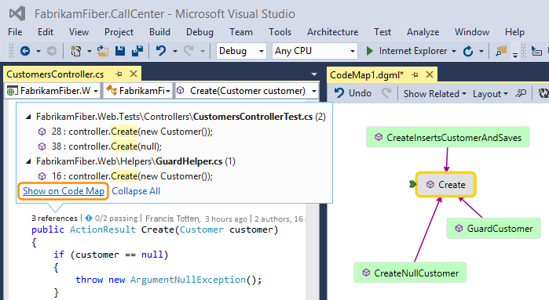
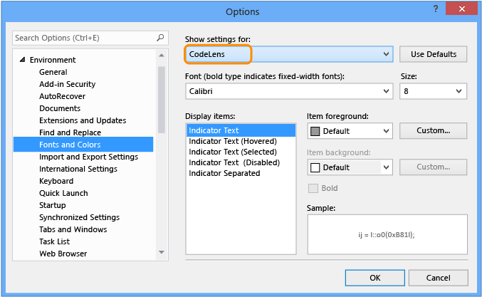
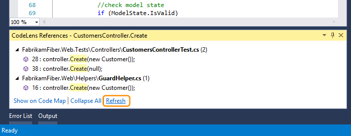

# Localizar alterações de código e outro histórico com o CodeLens

Mantenha o foco no trabalho enquanto descobre o que aconteceu com seu código – sem sair do editor. Localize referências e alterações em seu código, bugs vinculados, itens de trabalho, revisões de código e testes de unidade.

> [!NOTE]
> O CodeLens está disponível apenas nas edições Visual Studio Enterprise e Visual Studio Professional. Ele não está disponível na edição Visual Studio Community.  

Ver onde e como as partes individuais do código são usadas em sua solução:  

  

Entre em contato com sua equipe sobre alterações em seu código sem sair do editor:  

  

Para escolher os indicadores que você deseja ver ou para ativar e desativar o CodeLens, vá para **Ferramentas**, **Opções**, **Editor de Texto**, **Todas as linguagens**, **CodeLens**.  

##  Localize referências ao seu código

Itens necessários:

-  Visual Studio Enterprise ou Visual Studio Professional

-  Código Visual C# .NET ou Visual Basic .NET

Escolha o indicador **referências** (**Alt + 2**). Se você vir referências **0 referências**, você não terá nenhuma referência do código Visual C# ou Visual Basic. Isso não inclui referências de outros itens como arquivos XAML e ASPX.

  

Para exibir o código de referência, mova seu mouse na parte superior da referência.  

  

Para abrir o arquivo que contém a referência, clique duas vezes na referência.  

Para ver as relações entre esse código e suas referências, [crie um mapa de código](../modeling/map-dependencies-across-your-solutions.md) e escolha **Mostrar todas as referências** no menu de atalho do mapa de código.

  

##  Localize o histórico e os itens vinculados do seu código

Examine o histórico do seu código para descobrir o que aconteceu com o seu código. Ou examine as alterações antes que elas tenham sido mescladas em seu código para que você possa entender melhor como as alterações em outras ramificações podem afetar seu código.

Itens necessários:

- Visual Studio Enterprise ou Visual Studio Professional

- O Team Foundation Server 2013 ou posterior, Visual Studio Team Services ou Git

- [Lync 2010 ou posterior ou Skype for Business](http://technet.microsoft.com/en-us/lync), para entrar em contato com sua equipe no editor de códigos  

Para o código Visual C# .NET ou Visual Basic .NET armazenado com o TFVC (controle de versão do Team Foundation) ou Git, você obtém detalhes do CodeLens nos níveis de classe e de método (indicadores do *nível de elemento do código*). Se seu repositório Git estiver hospedado no TfGit, você receberá links para itens de trabalho do TFS.  

  

Para todos os outros tipos de arquivos que podem ser abertos no editor do Visual Studio, você recebe detalhes do CodeLens para o arquivo inteiro em um local na parte inferior da janela (indicadores de *nível de arquivo*).

  

Para usar o teclado para selecionar indicadores, pressione e segure a tecla **ALT** para exibir as teclas numéricas relacionadas.  

  

### Encontre alterações no código

Descubra quem alterou seu código C# ou Visual Basic, e as alterações feitas, em indicadores de nível de elemento de código. Isso é o que você vê ao usar TFVC (Controle de Versão do Team Foundation) no Team Foundation Server ou no Visual Studio Team Services.  

  

O período de tempo padrão são os últimos 12 meses. Se seu código estiver armazenado no Team Foundation Server, será possível alterar isso executando o [comando TFSConfig](http://msdn.microsoft.com/en-us/94424190-3b6b-4f33-a6b6-5807f4225b62) com o [comando CodeIndex](../ide/codeindex-command.md) e com o sinalizador **/indexHistoryPeriod**.  

Para ver um histórico detalhado de todas as alterações, inclusive aquelas de mais de um ano atrás, escolha **Mostrar todas as alterações do arquivo**.  

  

Isso abre a janela Histórico dos conjuntos de alterações.  

  

Quando seus arquivos estão em um repositório Git e você escolhe o indicador de alterações de nível de elemento de código, isso é o que você vê.  

  

Localize alterações para um arquivo inteiro (exceto para arquivos C# e Visual Basic) nos indicadores de nível de arquivo na parte inferior da janela.  

  

Para ver mais detalhes sobre uma alteração, clique com o botão direito do mouse nesse item. Dependendo se você estiver usando o TFVC ou o Git, você obterá uma série de opções para comparar as versões do arquivo, exibir detalhes e acompanhar o conjunto de alterações, obter a versão selecionada do arquivo e enviar por email para o autor dessa alteração. Alguns desses detalhes são exibidos no Team Explorer.  

É possível ver quem alterou seu código ao longo do tempo. Isso pode ajudá-lo a encontrar padrões nas alterações da sua equipe e avaliar o impacto delas.  

  

#### Encontre alterações na sua ramificação atual

Suponha que sua equipe tenha várias ramificações - uma ramificação principal e um desenvolvimento filho - para reduzir o risco de ruptura de código estável:  

  

Descubra quantas pessoas alteraram seu código e quantas alterações foram feitas (**Alt + 6**) no seu branch principal:  

  

#### Descubra quando o código foi ramificado

Acesse o código na ramificação filha, por exemplo, a ramificação Dev aqui. Escolha o indicador de alterações (**Alt + 6**):  

  

#### Descubra alterações recebidas de outras ramificações

  

…como essa correção de bug na ramificação Dev aqui:

  

É possível revisar essa alteração sem sair da ramificação atual (principal):  

  

#### Descubra onde as alterações foram mescladas

Assim é possível ver que alterações foram incluídas na sua ramificação:  

  

Por exemplo, agora, o código na ramificação Principal tem a correção de bug da ramificação Dev:  

  

#### Compare uma alteração recebida com a versão local (Shift + F10)

  

Você também pode clicar duas vezes em um conjunto de alterações.

#### O que os ícones significam?

|**Ícone**|**De onde a alteração veio?**|  
|--------------|-----------------------------------------|  
||A ramificação atual|  
||A ramificação pai|  
||Uma ramificação filha|  
||Uma ramificação par|  
||Uma ramificação mais distante que uma pai, filha ou par|  
||Uma mesclagem da ramificação pai para uma ramificação filha|
||Uma mesclagem de uma ramificação filha para a ramificação pai|  
||Uma mesclagem de uma ramificação não relacionada (mesclagem sem base)|  

### Localizar itens de trabalho vinculados

  

### Localizar revisões de código vinculadas

  

### Localizar bugs vinculados

  

### Contatar o proprietário de um item

  

Abra o menu de atalho de um item para ver as opções de contato. Se você tiver o Lync ou o Skype for Business instalado, você verá estas opções:  

  

##   Localizar testes de unidade para seu código

Saiba mais sobre testes de unidade que existem para seu código sem abrir o Gerenciador de Testes. Itens necessários:  

-   Visual Studio Enterprise ou Visual Studio Professional  
  
-   Código Visual C# .NET ou Visual Basic .NET  
  
-   Um [projeto de teste de unidade](../test/unit-test-your-code.md) que tem testes de unidade para o código do seu aplicativo  
  
1.  Vá para o código do aplicativo que tem testes de unidade.  
  
2.  Examine os testes para esse código (**Alt + 3**).  
  
       
  
3.  Se você vir um ícone de aviso , execute os testes.  
  
       
  
4.  Para examinar a definição de um teste, clique duas vezes no item de teste na janela do indicador CodeLens para abrir o arquivo de código no editor.  
  
       
  
5.  Examinar os resultados do teste. Escolha o indicador de status do teste ( ou ) ou pressione **Alt + 1**.  
  
       
  
6.  Para ver quantas pessoas alteraram esse teste, quem alterou esse teste ou quantas alterações foram feitas nesse teste, [Localize o histórico e os itens vinculados do seu código](#FindCodeHistory).

##   Perguntas e respostas

###   P: como ativar ou desativar o CodeLens? Ou escolher quais indicadores ver?

**R:** é possível ativar ou desativar indicadores, exceto o indicador de referências. Acesse **Ferramentas**, **Opções**, **Editor de Texto**, **Todos os Idiomas**, **CodeLens**.  
  
 Quando os indicadores são ativados, você pode abrir as opções do CodeLens nos indicadores.  
  
   
  
 Ative e desative os indicadores de nível de arquivo do CodeLens usando os ícones de divisas na parte inferior da janela do editor.  
  
   
  
###   P: onde fica o CodeLens?

**R:** o CodeLens é exibido no código Visual C# .NET e Visual Basic .NET no nível de método, classe, indexador e propriedade. O CodeLens é exibido no nível de arquivo para todos os outros tipos de arquivos.

- Certifique-se que o CodeLens está ativado. Acesse **Ferramentas**, **Opções**, **Editor de Texto**, **Todos os Idiomas**, **CodeLens**.  
  
- Se seu código estiver armazenado no TFS, certifique-se de que a indexação do código está ativada usando o [comando CodeIndex](../ide/codeindex-command.md) com o [comando TFS Config](http://msdn.microsoft.com/en-us/94424190-3b6b-4f33-a6b6-5807f4225b62).  

- Os indicadores relacionados ao TFS são exibidos apenas quando os itens de trabalho são vinculados ao código e quando você tem permissão para abrir itens de trabalho vinculados. [Confirme se você tem permissões de membro da equipe.](http://msdn.microsoft.com/en-us/f58805de-ba61-4d09-8f2d-d3ab9662ecfd)  

- Os indicadores de teste de unidade não são exibidos quando o código do aplicativo não tem testes de unidade. Os indicadores de status do teste aparecem automaticamente em projetos de teste. Se você souber que seu código do aplicativo tem testes de unidade, mas os indicadores de teste não são exibidos, experimente criar a solução (**Ctrl + Shift + B**).  

### P: Por que eu não vejo os detalhes de item de trabalho para uma confirmação?

**R:** Isso pode acontecer porque o CodeLens não pode localizar os itens de trabalho no TFS. Verifique se você está conectado ao projeto de equipe que tenha os itens de trabalho e que você tenha permissões para ver os itens de trabalho. Isso pode acontecer se a descrição de confirmação tiver informações incorretas sobre as IDs de item de trabalho no TFS.  

###   P: por que não vejo os indicadores do Lync ou do Skype?

**R:** eles não serão exibidos se você não tiver entrado no Lync ou no Skype for Business, não tiver um desses instalados ou não tiver uma configuração com suporte. Mas você ainda pode enviar um email:  

  

 **Há suporte para quais configurações do Lync e do Skype?**

-   Skype for Business (32 bits ou 64 bits)  

-   Lync 2010 ou posterior sozinho (32 bits ou 64 bits), mas não Lync Basic 2013 com o Windows 8.1  

O CodeLens não dá suporte a diferentes versões do Lync ou do Skype instaladas. Talvez elas não estejam localizadas para todas as versões localizadas do Visual Studio.  

### P: como posso alterar a fonte e a cor do CodeLens?

**R:** vá para **Ferramentas**, **Opções**, **Ambiente**, **Fontes e Cores**.  

  

Para usar o teclado:

1.  Pressione **Alt + T + O** para abrir a caixa **Opções**.  

2.  Pressione **Seta para cima** ou **Seta para baixo** para acessar o nó **Ambiente**. Em seguida, pressione **Seta para a esquerda** para expandir o nó.  

3.  Pressione **Seta para baixo** para acessar **Fontes e Cores**.  

4.  Pressione **TAB** para acessar a lista **Mostrar configurações de** e, em seguida, pressione **Seta para baixo** para selecionar **CodeLens**.  

### P: Posso mover o HUD do CodeLens?

**R:** sim, escolha  para encaixar o CodeLens como uma janela.  

  

  

### P: Como posso atualizar os indicadores?

**R:** isso depende do indicador:  

-   **Referências**: este indicador é atualizado automaticamente quando o código é alterado. Se você tiver esse indicador encaixado como uma janela separada, atualize o indicador manualmente aqui:  

       

-   **Equipe**: atualize esses indicadores manualmente aqui:  

       

-   **Teste**: [localize os testes de unidade do seu código](#FindRunUnitTests) para atualizar este indicador.  

###   P: o que é “versão local”?

**R:** a seta **Versão local** aponta para o conjunto de alterações mais recente em sua versão local deste arquivo. Quando o servidor tem um conjunto de alterações mais recente, elas são exibidas acima ou abaixo da seta **Versão local**, dependendo da ordem usada para classificar os conjuntos de alterações.  

### P: posso gerenciar a maneira como o CodeLens processa o código para mostrar o histórico e os itens vinculados?

**R:** sim, se seu código estiver no TFS, use o [comando CodeIndex](../ide/codeindex-command.md) com o [comando TFS Config](http://msdn.microsoft.com/en-us/94424190-3b6b-4f33-a6b6-5807f4225b62).

## Consulte também

[Gravando código no editor](../ide/writing-code-in-the-code-and-text-editor.md)