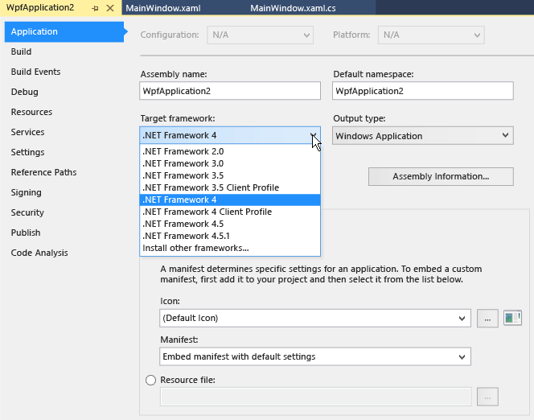

# Como definir uma versão do .NET Framework como destino

Este documento descreve como destinar a uma versão do .NET Framework quando você cria um projeto e como alterar a versão de destino em um projeto existente do Visual Basic, C# ou Visual F#.

> [!IMPORTANT]
> Para obter informações sobre como alterar a versão de destino de projetos do C++, consulte [Como modificar a estrutura de destino e o conjunto de ferramentas da plataforma](/cpp/build/how-to-modify-the-target-framework-and-platform-toolset).

## Para destinar uma versão ao criar um projeto

Quando você cria um projeto, as versões do .NET Framework disponíveis dependem de quais versões estão instaladas e o modelo selecionado na caixa de diálogo **Novo Projeto**.

1. Na barra de menus, selecione **Arquivo** > **Novo** > **Projeto...**

1. Na lista de modelos instalados, escolha o tipo de projeto que você deseja criar, e insira um nome para o projeto.

1. Na lista suspensa de **Framework** na parte inferior da caixa de diálogo **Novo Projeto**, escolha a versão do .NET Framework que você deseja que o projeto tenha como destino.

    A lista de estruturas mostra somente as versões que são aplicáveis para o modelo que você escolheu. Alguns tipos de projeto, como .NET Core, não exigem o .NET Framework. Nesses casos, a lista suspensa **Framework** está oculta.

    

1. Escolha o botão **OK**.

## Para alterar a versão de destino

É possível alterar a versão de destino do .NET Framework em um projeto do Visual Basic, C# ou Visual F# seguindo este procedimento.

Para obter informações sobre como alterar a versão de destino de projetos do C++, consulte [Como modificar a estrutura de destino e o conjunto de ferramentas da plataforma](/cpp/build/how-to-modify-the-target-framework-and-platform-toolset).

1. No **Gerenciador de Soluções**, abra o menu de atalho do projeto que você deseja alterar e, em seguida, escolha **Propriedades**.

    

1. Na coluna esquerda da janela Propriedades, escolha a guia **Aplicativo**.

    

    > [!NOTE]
    > Depois de criar um aplicativo UWP, não é possível alterar a versão de destino do Windows ou do .NET Framework.

1. Na lista **Estrutura de Destino**, escolha a versão desejada.

1. Na caixa de diálogo de verificação exibida, escolha o botão **Sim**.

    O projeto é descarregado. Quando é recarregado, ele se destina à versão do .NET Framework que você acabou de escolher.

    > [!NOTE]
    > Se seu código contiver referências a outra versão do .NET Framework que não seja a que você o destinou, mensagens de erro poderão aparecer quando você compilar ou executar o código. Para resolver esses erros, você deverá modificar as referências. Consulte [Solução de problemas de erros de definição de destino do .NET Framework](../msbuild/troubleshooting-dotnet-framework-targeting-errors.md).

## Consulte também

[Visão Geral do Visual Studio Multiplataforma](../ide/visual-studio-multi-targeting-overview.md)  
[Solução de problemas com erros de direcionamento do .NET Framework](../msbuild/troubleshooting-dotnet-framework-targeting-errors.md)  
[Página Aplicativo, Designer de Projeto (C#)](../ide/reference/application-page-project-designer-csharp.md)  
[Página de Aplicativo, Designer de Projeto (Visual Basic)](../ide/reference/application-page-project-designer-visual-basic.md)  
[Como modificar a estrutura de destino e o conjunto de ferramentas da plataforma (C++)](/cpp/build/how-to-modify-the-target-framework-and-platform-toolset)