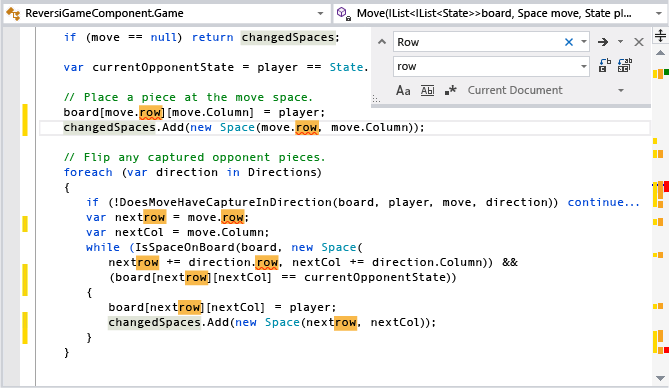
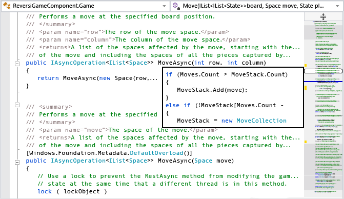

# Como acompanhar o código personalizando a barra de rolagem

Quando você está trabalhando com arquivos de código longo, pode ser difícil manter controle de tudo. Você pode personalizar a barra de rolagem da janela de código para ter um panorama geral do que está acontecendo em seu código.

## Para mostrar anotações na barra de rolagem

1. É possível configurar a barra de rolagem para mostrar alterações de código, pontos de interrupção, erros e indicadores.

    Abra a página de opções da **Barra de Rolagem**, selecionando **Ferramentas** > **Opções** > **Editor de Texto**  >  **Todas as Linguagens** ou uma linguagem específica, ou digitando **barra de rolagem** na janela **Início Rápido**.

2. Selecione **Mostrar anotações sobre a barra de rolagem vertical** e selecione as anotações que deseja ver.

    A opção **Marcas** inclui pontos de interrupção e indicadores.

3. Agora tente. Abra um arquivo de código grande e substitua algo que ocorre em vários locais do arquivo. A barra de rolagem mostra o efeito das substituições, de modo que você pode desfazer suas alterações se tiver substituído algo que não deveria.

    Esta é a aparência da barra de rolagem após o usuário pesquisar por uma cadeia de caracteres. Observe que todas as instâncias da cadeia de caracteres são exibidas.

    ![A barra de rolagem após pesquisar por uma cadeia de caracteres. ] (../ide/media/enhancedscrollbarsearch.png "EnhancedScrollbarSearch")

    Esta é a barra de rolagem após a substituição de todas as instâncias da cadeia de caracteres. Você pode ver imediatamente que a operação causou alguns problemas.

    

## Para definir o modo de exibição para a barra de rolagem

1. A barra de rolagem tem dois modos: o modo de barra (padrão) e o modo de mapa. O modo de barra exibe apenas indicadores de anotação na barra de rolagem. No modo de mapa, as linhas de código são representadas na barra de rolagem. Você pode escolher sua largura e se elas mostram o código subjacente quando você posiciona o ponteiro sobre elas. Quando você clica em um local na barra de rolagem, o cursor se move para esse local no código. Regiões recolhidas são sombreadas de forma diferente; elas são expandidas quando você clica duas vezes nelas.

    Na página de opções **Barra de Rolagem**, selecione **Usar modo de barra para barra de rolagem vertical** ou **Usar modo de mapa para barra de rolagem vertical**. Você pode escolher a largura na lista suspensa **Visualização da fonte**.

    Veja qual é a aparência do exemplo de pesquisa quando o modo de mapa está ativado e a largura está definida como **Médio**:

    

2. No modo de mapa, para habilitar visualizações do código quando você move o cursor para cima e para baixo na barra de rolagem, selecione a opção **Mostrar Dica de Ferramenta de Visualização**. Veja como deve ser sua aparência:

    

    Se quiser manter o comportamento de rolagem do modo de mapa e a dica de ferramenta de visualização, mas não quiser ter a visão geral do código-fonte, defina a **Visualização da fonte** como **Desativada**.

## Consulte também

- [Escrever código no editor](../ide/writing-code-in-the-code-and-text-editor.md)