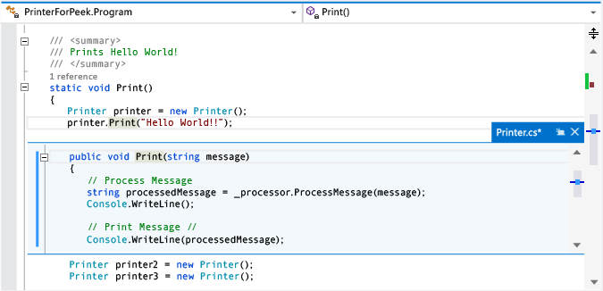

# Como visualizar e editar códigos usando a janela Inspecionar Definição (Alt+F12)

Você pode usar o comando **Inspecionar Definição** para exibir e editar código sem abandonar o código que está escrevendo. **Inspecionar Definição** e **Ir Para Definição** mostram as mesmas informações, mas **Inspecionar Definição** faz a exibição em uma janela pop-up e **Ir Para Definição** mostra o código em uma janela de código separada. **Ir Para Definição** faz com que seu contexto (ou seja, a janela de código ativo, a linha atual e a posição do cursor) mude para a janela de código de definição. Usando **Espiar Definição**, você pode exibir e editar a definição e percorrer o arquivo de definição enquanto mantém seu local no arquivo original do código.

Você pode usar **Inspecionar Definição** com código C#, Visual Basic e C++. No Visual Basic, **Inspecionar Definição** mostra um link para o **Pesquisador de Objetos** de símbolos sem metadados de definição (por exemplo, os tipos internos do .NET Framework).

## Trabalhando com Inspecionar Definição

### Para abrir uma janela Inspecionar Definição

1. Você pode espiar uma definição escolhendo **Inspecionar Definição** no menu de contexto para um tipo ou membro que deseja explorar. No Visual Studio 2017 versão 15.4 e posteriores, se a opção estiver habilitada, você também poderá espiar uma definição usando o mouse pressionando **Ctrl** (ou outro modificador) e clicando no nome do membro. Ou, usando o teclado, pressione **Alt**+**F12**.

     Esta ilustração mostra a janela **Inspecionar Definição** de um método que é chamado `Print()`:

     

     A janela de definição aparece abaixo da linha `printer.Print("Hello World!")` no arquivo original. A janela não oculta nenhum dos códigos em seu arquivo original. As linhas após `printer.Print("Hello World!")` aparecem na janela de definição.

1. Você pode mover o cursor para locais diferentes na janela de inspeção de definição. Além disso, você ainda pode percorrer a janela original do código.

1. Você pode copiar uma cadeia de caracteres da janela de definição e colá-la no código original. Também é possível arrastar e soltar a cadeia de caracteres da janela de definição para o código original sem excluí-la da janela de definição.

1. Você pode fechar a janela de definição, escolhendo a tecla **Esc** ou o botão **Fechar** na guia da janela de definição.

### Abrir uma janela Inspecionar Definição desde uma janela Inspecionar Definição

Se você já tiver uma janela **Inspecionar Definição** aberta, será possível chamar **Inspecionar Definição** novamente no código nessa janela. Outra janela de definição é aberta. Um conjunto de pontos de trilha aparece ao lado da guia da janela de definição, que você pode usar para navegar entre as janelas de definição. A dica de ferramenta em cada ponto mostra o nome do arquivo e o caminho do arquivo de definição que o ponto representa.

   

### Usar Inspecionar Definição com vários resultados

Se você usar **Inspecionar Definição** no código com mais de uma definição (por exemplo, uma classe parcial), uma lista de resultados aparecerá à direita do modo de exibição de definição de código. É possível escolher qualquer resultado na lista para exibir sua definição.

   

### Editar na janela Inspecionar Definição

Quando você começa a editar dentro de uma janela **Espiar Definição**, o arquivo que está sendo modificado é aberto automaticamente como uma guia separada no editor de códigos e reflete as alterações já feitas. Você pode continuar fazendo, desfazendo e salvando alterações na janela **Inspecionar Definição** e a guia continuará refletindo essas alterações. Mesmo se você fechar a janela **Espiar Definição** sem salvar as alterações, ainda será possível fazer, desfazer e salvar mais alterações na guia, exatamente no ponto em que você parou na janela **Espiar Definição**.

   

### Para alterar as opções de Espiar Definição

1. Vá até **Ferramentas** > **Opções** > **Editor de Texto** > **Geral**.

1. Selecione a opção **Abrir definição na exibição de espiada**.

1. Clique em **OK** para fechar a caixa de diálogo **Opções**.

     

### Atalhos de teclado para Inspecionar Definição

Você pode usar estes atalhos de teclado com a janela **Inspecionar Definição**:

|Funcionalidade|Atalho de teclado|
|-------------------|:-----------------------:|
|Abrir a janela de definição|Alt+F12|
|Fechar a janela de definição|ESC|
|Promover a janela de definição para uma guia de documento regular|Shift+Alt+Home|
|Navegar entre janelas de definição|Ctrl+Alt+- e Ctrl+Alt+=|
|Navegar entre vários resultados|F8 e Shift+F8|
|Alternar entre a janela do editor de códigos e a janela de definição|Shift+Esc|

> [!NOTE]
> Você também pode usar os mesmos atalhos de teclado para editar código em uma janela **Inspecionar Definição**, como usa em qualquer outro lugar no Visual Studio.

## Consulte também

[Navegando no código](../ide/navigating-code.md)  
[Ir para Definição e Definição de Pico](../ide/go-to-and-peek-definition.md)  
[Dicas de produtividade](../ide/productivity-tips-for-visual-studio.md)