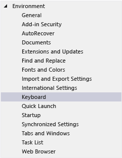
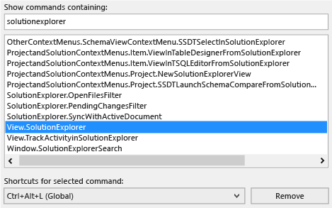

# Identificação e personalização de atalhos de teclado no Visual Studio

Você pode identificar atalhos de teclado para comandos do Visual Studio, personalizar esses atalhos e exportá-los para que outras pessoas os usem. Muitos atalhos sempre invocam os mesmos comandos, mas o comportamento de um atalho pode variar de acordo com as seguintes condições:

- Quais configurações de ambiente padrão você escolheu na primeira vez que executou o Visual Studio (por exemplo, Desenvolvimento Geral ou Visual C#).

- Se você personalizou o comportamento do atalho.

- Em que contexto você está quando escolhe o atalho. Por exemplo, o atalho F2 invocará o comando Edit.EditCell se você estiver usando o Designer de Configurações e o comando File.Rename se estiver usando o Team Explorer.

Independentemente das configurações, da personalização e do contexto, você sempre pode localizar e alterar um atalho de teclado na caixa de diálogo **Opções**. Também é possível procurar os atalhos de teclado padrão de várias dezenas de comandos em [Atalhos de teclado padrão para comandos frequentes](../ide/default-keyboard-shortcuts-for-frequently-used-commands-in-visual-studio.md), e pode encontrar uma lista completa de todos os atalhos padrão (com base nas Configurações Gerais de Desenvolvimento) em [Atalhos de teclado padrão](../ide/default-keyboard-shortcuts-in-visual-studio.md).

Se um atalho for atribuído a um comando no contexto Global e em mais nenhum outro contexto, esse atalho sempre invocará o comando em questão. Porém, um atalho pode ser atribuído a um comando no contexto Global e a um comando diferente em um contexto específico. Se você usar tal atalho quando estiver no contexto específico, o atalho invocará o comando para o contexto específico, e não para o contexto Global.

> [!NOTE]
> Suas configurações e a edição do Visual Studio podem alterar os nomes e os locais dos comandos de menu, bem como as opções que aparecem nas caixas de diálogo. Este tópico se baseia nas **Configurações Gerais de Desenvolvimento**.

## Identificando um atalho de teclado

1. Na barra de menus, escolha **Ferramentas**, **Opções**.

2. Expanda **Ambiente** e escolha **Teclado**.

   

3. Na caixa **Mostrar comandos que contenham**, digite todo ou parte do nome do comando sem espaços.

   Por exemplo, você pode localizar os comandos para `solutionexplorer`.

4. Na lista, escolha o comando correto.

    Por exemplo, você pode escolher **View.SolutionExplorer**.

5. Se o comando tiver um atalho de teclado, ele será exibido na lista **Atalho(s) para o comando selecionado**.

   

## Personalizando um atalho de teclado

1. Na barra de menus, escolha **Ferramentas**, **Opções**.

2. Expanda a pasta **Ambiente** e escolha **Teclado**.

3. Opcional: filtre a lista de comandos inserindo todo ou parte do nome do comando, sem espaços, na caixa **Mostrar comandos que contenham**.

4. Na lista, escolha o comando ao qual você deseja atribuir um atalho de teclado.

Na lista **Usar novo atalho em**, escolha a área do recurso em que deseja usar o atalho.

    For example, you can choose **Global** if you want the shortcut to work in all contexts. You can use any shortcut that isn't mapped (as Global) in another editor. Otherwise, the editor overrides the shortcut.

    > [!NOTE]
    > You can't assign the following keys as part of a keyboard shortcut in **Global**: Print Scrn/Sys Rq, Scroll Lock, Pause/Break, Tab, Caps Lock, Insert, Home, End, Page Up, Page Down, the Windows logo key, the Application key, any of the Arrow keys, or Enter; Num Lock, Delete, or Clear on the numeric keypad; the Ctrl+Alt+Delete key combination.

6. Na caixa **Pressionar tecla(s) de atalho**, digite o atalho que deseja usar.

    > [!NOTE]
    > É possível criar um atalho que combine uma letra com a tecla Alt, a tecla Ctrl, ou ambas. Você também pode criar um atalho que combine a tecla Shift e uma letra com a tecla Alt, a tecla Ctrl, ou ambas.

     Se um atalho já estiver atribuído a outro comando, ele aparecerá na caixa **Atalho usado atualmente por**. Nesse caso, escolha a tecla Backspace para excluir esse atalho antes de tentar outro.

    

7. Escolha o botão **Atribuir**.

    > [!NOTE]
    > Se você especificar um atalho diferente para um comando, escolha o botão **Atribuir** e, em seguida, **Cancelar**; a caixa de diálogo é fechada, mas a alteração não é revertida.

## Compartilhando atalhos de teclado personalizados

Você pode compartilhar os atalhos de teclado personalizados exportando-os para um arquivo e fornecendo o arquivo a outras pessoas para que elas importem os dados.

### Para exportar apenas atalhos de teclado

1. Na barra de menus, escolha **Ferramentas**, **Importar e Exportar Configurações**.

2. Escolha **Exportar configurações de ambiente selecionadas** e escolha o botão **Avançar**.

3. Em **Quais configurações você deseja exportar?**, desmarque a caixa de seleção **Todas as Configurações**, expanda **Opções** e expanda **Ambiente**.

4. Marque a caixa de seleção **Teclado** e escolha o botão **Avançar**.

    

5. Nas caixas **Que nome deseja dar a seu arquivo de configurações?** e **Armazenar meu arquivo de configurações neste diretório**, deixe os valores padrão ou especifique valores diferentes e escolha o botão **Finalizar**.

    Por padrão, seus atalhos são salvos em um arquivo na pasta %USERPROFILE%\Documentos\Visual Studio 2017\Configurações. O nome do arquivo reflete a data em que você exportou as configurações, e a extensão é .vssettings.

### Para importar apenas atalhos de teclado

1. Na barra de menus, escolha **Ferramentas**, **Importar e Exportar Configurações**.

2. Escolha o botão de opção **Importar configurações de ambiente selecionadas** e o botão **Avançar**.

3. Escolha o botão de opção **Não, apenas importe as novas configurações, substituindo minhas configurações atuais** e o botão **Avançar**.

4. Em **Minhas Configurações**, escolha o arquivo que contém os atalhos que deseja importar, ou escolha o botão **Procurar** para localizar o arquivo correto.

5. Escolha o botão **Avançar**.

6.  Em **Quais configurações você deseja importar?**, desmarque a caixa de seleção **Todas as Configurações**, expanda **Opções** e expanda **Ambiente**.

7. Marque a caixa de seleção **Teclado** e escolha o botão **Finalizar**.

    

## Consulte também

[Recursos de Acessibilidade do Visual Studio](../ide/reference/accessibility-features-of-visual-studio.md)