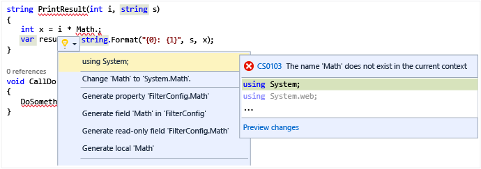

# Realizar ações rápidas com lâmpadas
As lâmpadas são um recurso de produtividade do Visual Studio. Eles são ícones que aparecem no editor do Visual Studio e que você pode clicar para realizar ações rápidas, incluindo a refatoração e correção de erros. As lâmpadas levam a assistência de correção de erros e refatoração para um único ponto focal, em geral, exatamente na linha em que você está digitando.  

   

 No C# e no Visual Basic, você verá uma lâmpada se houver um rabisco vermelho e o Visual Studio tiver uma sugestão para corrigir o problema. Por exemplo se você tiver um erro indicado por um rabisco vermelho, uma lâmpada aparecerá quando correções estiverem disponíveis para esse erro. No C++, ao adicionar uma nova função a um arquivo de cabeçalho, você verá uma lâmpada que se oferece para criar uma implementação de stub dessa função. Para qualquer idioma, terceiros podem oferecer diagnóstico e sugestões personalizados, por exemplo, como parte de um SDK, e as lâmpadas do Visual Studio serão acesas de acordo com essas regras.  

## Para ver uma lâmpada  

1.  Em muitos casos, as lâmpadas aparecem espontaneamente ao focalizar o mouse no ponto de um erro ou na margem esquerda do editor ao mover o cursor em uma linha que contém um erro. Quando você vir um rabisco vermelho, poderá focalizar o mouse sobre ele para exibir a lâmpada. Você também poderá fazer com que uma lâmpada seja exibida ao usar o mouse ou o teclado para ir para qualquer lugar da linha em que ocorre o problema.  

2.  Pressione **Ctrl + .** em qualquer lugar de uma linha para invocar a lâmpada e ir diretamente para a lista de possíveis correções.  

   

## Para ver as possíveis correções  
 Clique na seta para baixo ou no link Mostrar possíveis correções para exibir uma lista de ações rápidas que a lâmpada pode executar para você.  

   

## Para fazer uma refatoração  
 Você ainda poderá executar refatorações clicando com o botão direito do mouse para abrir o menu de contexto, mas também poderá pressionar Ctrl + . para exibir opções de refatoração. Na ilustração a seguir, a refatoração Extrair Método é oferecida depois de pressionar Ctrl + . em algum lugar da linha que contém a chamada `Math.Abs`:  

 

