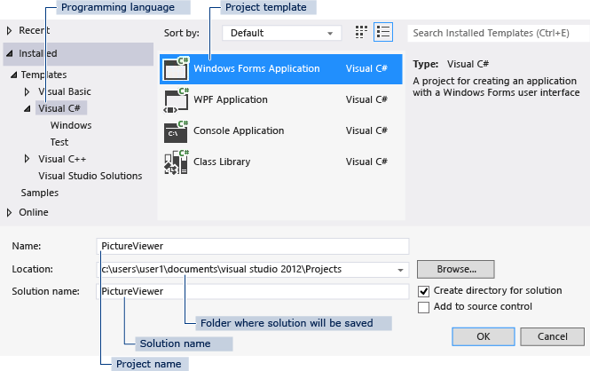

# Etapa 1: Criar um projeto de aplicativo do Windows Forms
Ao criar um visualizador de imagens, a primeira etapa é criar um projeto de aplicativo do Windows Forms.  
  
 Para uma versão em vídeo deste tópico, consulte o [Tutorial 1: criar um Visualizador de Imagens no Visual Basic – Vídeo 1](http://go.microsoft.com/fwlink/?LinkId=205209) ou o [Tutorial 1: criar um Visualizador de Imagens em C# – Vídeo 1](http://go.microsoft.com/fwlink/?LinkId=205199). Esses vídeos usam uma versão anterior do Visual Studio, portanto, existem pequenas diferenças em alguns comandos de menu e em outros elementos da interface do usuário. No entanto, os conceitos e procedimentos funcionam de maneiras semelhantes na versão atual do Visual Studio.  
  
### Para criar um projeto de aplicativo do Windows Forms  
  
1.  Na barra de menus, escolha **Arquivo**, **Novo**, **Projeto**. A caixa de diálogo deve ser assim.  
  
       
Caixa de diálogo Novo Projeto  
  
2.  Escolha **Visual C#** ou **Visual Basic** na lista de **Modelos Instalados**.  
  
3.  Na lista de modelos, escolha o ícone **Aplicativo do Windows Forms**. Dê o nome de **PictureViewer** ao novo formulário e escolha o botão **OK**.  
  
     O Visual Studio cria uma solução para seu programa. Uma solução atua como um recipiente para todos os projetos e arquivos necessários pelo seu programa. Esses termos serão explicados em mais detalhes posteriormente neste tutorial.  
  
4.  A ilustração a seguir mostra o que você deve ver agora na interface do Visual Studio.  
  
    > [!NOTE]
    >  O layout da janela pode não ser exatamente como esta ilustração. O layout preciso da janela depende da versão do Visual Studio, da linguagem de programação usada e de outros fatores. Entretanto, você deve verificar que todas as três janelas aparecem.  
  
       
Janela IDE  
  
     A interface contém três janelas: uma janela principal, o **Gerenciador de Soluções** e a janela **Propriedades**.  
  
     Se qualquer uma das janelas estiver faltando, restaure o layout de janela padrão ao escolher, na barra de menus, **Janela**, **Redefinir Layout da Janela**. Você também pode exibir janelas usando os comandos de menu. Na barra de menus, escolha **Modo de Exibição**, **Janela Propriedades** ou **Gerenciador de Soluções**. Se qualquer outra janela está aberta, feche-a escolhendo o botão **Fechar** (x) no canto superior direito.  
  
5.  A ilustração a seguir mostra as seguintes janelas (no sentido horário a partir do canto superior esquerdo):  
  
    -   **Janela principal** Nesta janela você fará a maior parte de seu trabalho, como trabalhar com formulários e editar códigos. Na ilustração, a janela mostra um formulário no Editor de Formulários. Na parte superior da janela, a guia **Página Inicial** e a guia **Form1.cs [Design]** aparecem. (No Visual Basic, o nome da guia termina com .vb, em vez de .cs.)  
  
    -   **Janela do Gerenciador de Soluções** Nesta janela, você pode exibir e navegar em todos os itens na solução. Se você escolher um arquivo, o conteúdo da janela **Propriedades** será alterado. Se você abrir um arquivo de código (que termine com .cs no Visual C# e com .vb no Visual Basic), o arquivo de código ou um designer para o arquivo de código será exibido. Um designer é uma superfície visual na qual você pode adicionar controles, como botões e listas. Para formulários do Visual Studio, o designer é chamado no Designer do Windows Forms.  
  
    -   **Janela Propriedades** Nessa janela, você pode alterar as propriedades dos itens escolhidos nas outras janelas. Por exemplo, se você escolher o Form1, você poderá alterar o título configurando a propriedade **Text** e você poderá alterar a cor da tela de fundo configurando a propriedade **Backcolor**.  
  
    > [!NOTE]
    >  A linha superior no **Gerenciador de Soluções** mostra **Solução "PictureViewer" (1 projeto)**, o que significa que o Visual Studio criou uma solução para você. Uma solução pode conter mais de um projeto, mas por enquanto, você trabalhará com soluções que contêm somente um projeto.  
  
6.  Na barra de menus, escolha **Arquivo**, **Salvar Todos**.  
  
     Como alternativa, escolha o botão **Salvar Todos** na barra de ferramentas, demostrado na ilustração a seguir.  
  
       
Botão da barra de ferramentas Salvar todos  
  
     O Visual Studio preenche automaticamente o nome da pasta e o nome do projeto e, em seguida, salva o projeto na sua pasta de projeto.  
  
### Para continuar ou revisar  
  
-   Para ir para a próxima etapa do tutorial, consulte [Etapa 2: executar o programa](../ide/step-2-run-your-program.md).  
  
-   Para retornar ao tópico de visão geral, consulte [Tutorial 1: criar um visualizador de imagens](../ide/tutorial-1-create-a-picture-viewer.md).

<!--HONumber=Feb17_HO4-->

