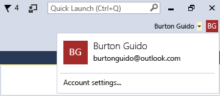
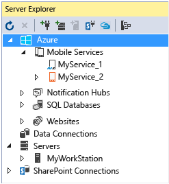
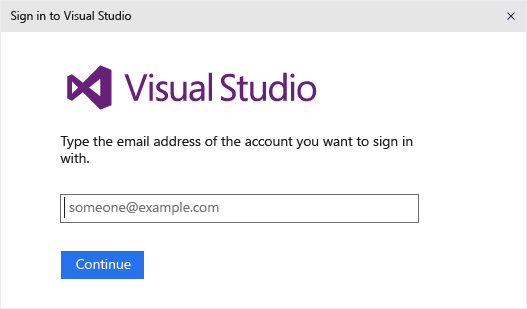

# Trabalhar com várias contas de usuário

Se você tem várias contas da Microsoft e/ou contas corporativas ou de estudante, é possível adicionar todas elas no Visual Studio para acessar os recursos de qualquer conta sem a necessidade de entrar nas contas separadamente. No momento, os serviços Azure, Application Insights, Team Foundation Server e Office 365 oferecem suporte à experiência de logon simplificada. Serviços adicionais podem ser disponibilizados com o passar do tempo.

Depois de adicionar várias contas em um computador, esse conjunto de contas se moverá com você ao entrar no Visual Studio em outro computador. É importante observar que, embora os nomes de conta usem perfil móvel, as credenciais não. Portanto, você será solicitado a inserir as credenciais das outras contas na primeira vez que tentar usar os recursos dessas contas no novo computador.

Este passo a passo mostra como adicionar várias contas no Visual Studio e como ver que os recursos acessíveis dessas contas são refletidos em locais como a caixa de diálogo **Adicionar Serviço Conectado**, o **Gerenciador de Servidores** e o **Team Explorer**.

## Entrar no Visual Studio

- Entre no Visual Studio com uma conta da Microsoft ou uma conta organizacional. Você verá seu nome de usuário exibido no canto superior da janela, semelhante a isso:

     

### Acessar sua conta do Azure no Gerenciador de Servidores

Pressione **Ctrl**+**Alt**+**S** para abrir o **Gerenciador de Servidores**. Escolha o ícone do **Azure** e, quando ele se expandir, você verá os recursos disponíveis na conta do Azure associada à ID que você usou para fazer logon no Visual Studio. Ele deve se parecer com algo semelhante ao seguinte (com a exceção de que você verá seus próprios recursos).

Na primeira vez que você usar o Visual Studio em qualquer dispositivo específico, a caixa de diálogo mostrará apenas as assinaturas registradas na ID que você usou para entrar no IDE. Você pode acessar os recursos de qualquer uma das outras contas diretamente do **Gerenciador de Servidores** clicando com o botão direito do mouse no nó do **Azure** e escolhendo **Gerenciar e Filtrar Assinaturas** e adicionando suas contas por meio do controle de seletor de conta. Você pode escolher outra conta, se desejar, clicando na seta para baixo e escolhendo na lista de contas. Depois de escolher a conta, escolha qual assinatura dessa conta você deseja exibir no **Gerenciador de Servidores**.

Na próxima vez que você abrir o **Gerenciador de Servidores**, os recursos dessas assinaturas serão exibidos.

### Acessar sua conta do Azure através da caixa de diálogo Adicionar Serviço Conectado

1. Crie um projeto de aplicativo UWP em C#.

1. Escolha o nó do projeto no **Gerenciador de Soluções** e, em seguida, escolha **Adicionar** > **Serviço Conectado**. O assistente **Adicionar Serviço Conectado** é exibido e mostra a lista de serviços na conta do Azure que está associada com sua ID de logon do Visual Studio. Observe que você não precisa entrar separadamente no Azure. No entanto, é necessário entrar nas outras contas na primeira vez que você tentar acessar os recursos delas de um determinado computador.

    > [!WARNING]
    > Se esta for a primeira vez que você estiver criando um aplicativo UWP no Visual Studio em um computador específico, você deverá habilitar o dispositivo para o modo de desenvolvimento acessando **Configurações** > **Atualizações e Segurança** > **Para Desenvolvedores** no computador. Para obter mais informações, consulte [Habilitar seu dispositivo para desenvolvimento](/windows/uwp/get-started/enable-your-device-for-development).

###  Acessar o Azure Active Directory em um projeto Web

O Azure AD habilita o suporte para o logon única do usuário final em aplicativos Web ASP.NET MVC ou autenticação AD nos serviços de API Web. A autenticação de domínio é diferente da autenticação de conta de usuário individual. Os usuários que têm acesso ao seu domínio do Active Directory podem usar suas contas existentes do Azure AD para conectar-se aos aplicativos Web. Os aplicativos do Office 365 também podem usar a autenticação de domínio. Para ver isso em ação, crie um aplicativo Web (**Arquivo** > **Novo Projeto** > **C#** > **Nuvem** > **Aplicativo Web ASP.NET**). Na caixa de diálogo **Novo Projeto ASP.NET**, escolha **Alterar Autenticação**. O assistente de autenticação aparece e habilita você a escolher o tipo de autenticação a ser usado em seu aplicativo.

Para obter mais informações sobre os diferentes tipos de autenticação no ASP.NET, consulte [Criar projetos Web ASP.NET no Visual Studio 2013](http://www.asp.net/visual-studio/overview/2013/creating-web-projects-in-visual-studio#orgauth) (as informações sobre a autenticação ainda são relevantes para as versões atuais do Visual Studio).

### Acessar sua organização do TFS (Team Foundation Server)

No menu principal, escolha **Equipe** > **Conectar-se ao Team Foundation Server** para mostrar a janela do **Team Explorer**. Clique em **Selecionar Projetos** e, em seguida, na caixa de listagem em **Selecionar um Team Foundation Server**, você verá a URL de sua organização do TFS. Ao selecionar a URL você será conectado sem precisar reinserir suas credenciais.

## Adicionar uma segunda conta de usuário no Visual Studio

Clique na seta para baixo ao lado de seu nome de usuário no canto superior do Visual Studio. Em seguida, escolha o item de menu **Configurações de Conta**. A caixa de diálogo **Gerenciador de Conta** aparece e exibe a conta com a qual você entrou. Escolha o link **Adicionar uma conta** no canto inferior da caixa de diálogo para adicionar uma nova conta da Microsoft ou uma nova conta corporativa ou de estudante.

Siga as solicitações para ingressar as credenciais da nova conta. A ilustração a seguir mostra o **Gerenciador de Contas** depois que um usuário adicionou sua conta corporativa de *Contoso.com*.

## Rever o Assistente para Adicionar Serviços Conectados e o Gerenciador de Servidores

Agora, acesse novamente o **Gerenciador de Servidores**, clique com o botão direito do mouse no nó **Azure** e escolha **Gerenciar e filtrar assinaturas**. Escolha a nova conta clicando na seta suspensa ao lado da conta atual e, em seguida, escolha quais assinaturas você deseja exibir no **Gerenciador de Servidores**. Você deverá ver todos os serviços associados à assinatura especificada. Embora você não esteja atualmente conectado ao IDE do Visual Studio com a segunda conta, você está conectado aos serviços e recursos dessa conta. O mesmo se aplica a **Projeto** > **Adicionar Serviço Conectado** e **Equipe** > **Conectar-se ao Team Foundation Server**.

## Consulte também

- [Entrar no Visual Studio](signing-in-to-visual-studio.md)
