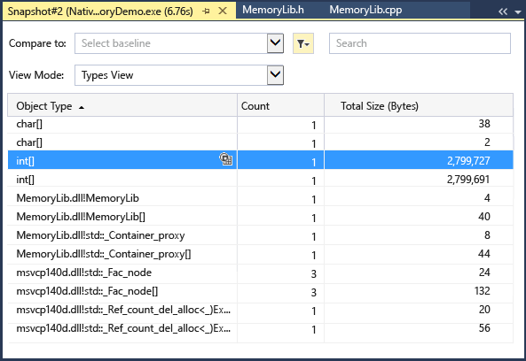
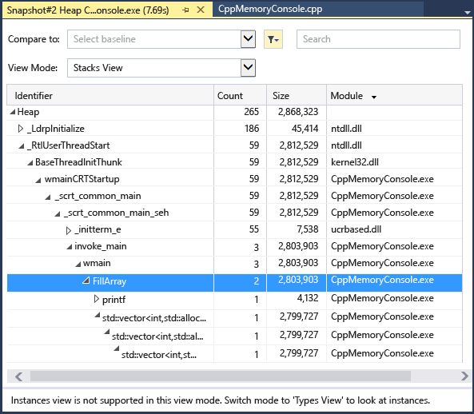

# Uso de mem&#243;ria
[!INCLUDE[vs2017banner](../code-quality/includes/vs2017banner.md)]

Localizar vazamentos de memória e ineficiente de memória enquanto você estiver depurando com o depurador integrado **uso de memória** ferramenta de diagnóstico. A utilização de memória ferramenta permite que você executar um ou mais *instantâneos* do heap gerenciado e nativo de memória. Você pode coletar instantâneos do .NET, aplicativos de modo misto ou nativo \(.NET e nativos\).  
  
-   Você pode analisar um único instantâneo para compreender o impacto relativo dos tipos de objeto no uso de memória e para localizar o código em seu aplicativo que usa memória de maneira ineficiente.  
  
-   Você também pode comparar \(diff\) dois instantâneos de um aplicativo para encontrar áreas no código que causam o uso de memória aumentar ao longo do tempo.  
  
 A gráfico a seguir mostra o **Ferramentas de diagnóstico** janela na atualização 1 do Visual Studio 2015:  
  
   
  
 Embora você pode coletar instantâneos de memória a qualquer momento o **uso de memória** ferramenta, você pode usar o depurador do Visual Studio para controlar como o seu aplicativo é executado ao investigar problemas de desempenho. Definindo pontos de interrupção, passo a passo, interromper tudo e outras ações de depurador podem ajudá\-lo a se concentrar seu investigações de desempenho sobre os caminhos de código que são mais relevantes. Executar essas ações, enquanto o aplicativo é executado pode elimina o ruído do código que não lhe interessam e pode reduzir significativamente a quantidade de tempo que leva para diagnosticar um problema.  
  
 Você também pode usar a ferramenta de memória fora do depurador. Consulte [Analisar o uso da memória sem depuração](../Topic/Memory%20Usage%20without%20Debugging1.md).  
  
> [!NOTE]
>  **Suporte de alocador personalizado** o criador de perfil de memória nativa funciona com a coleta de alocação [ETW](https://msdn.microsoft.com/en-us/library/windows/desktop/bb968803\(v=vs.85\).aspx) dados de eventos emitidos por durante o tempo de execução.  Alocadores no CRT e do SDK do Windows tiveram recebido anotações no nível de origem para que seus dados de alocação podem ser capturados.  Se você estiver escrevendo seus próprio alocadores, que todas as funções que retornam um ponteiro para o heap recém\-alocada memória pode ser decorada com [\_\_declspec](/visual-cpp/cpp/declspec)\(alocador\), como visto neste exemplo para myMalloc:  
>   
>  `__declspec(allocator) void* myMalloc(size_t size)`  
  
## Analisar o uso de memória com o depurador  
  
> [!NOTE]
>  Como coletar memória de dados podem afetar o desempenho de depuração de seus aplicativos de modo misto ou nativos, instantâneos de memória são desabilitados por padrão. Para habilitar aplicativos de modo misto ou nativo de instantâneos, inicie uma sessão de depuração \(tecla de atalho: **F5**\). Quando o **Ferramentas de diagnóstico** janela for exibida, escolha a guia uso da memória e, em seguida, escolha **Habilitar instantâneos**.  
>   
>    
>   
>  Parar \(tecla de atalho: **Shift \+ F5**\) e reinicie a depuração.  
  
 Sempre que você deseja capturar o estado de memória, escolha **tirar instantâneo** sobre o **uso de memória** barra de ferramentas de resumo.  
  
   
  
> [!TIP]
>  -   Para criar uma linha de base para comparações de memória, considere fazer um instantâneo no início da sessão de depuração.  
> -   Porque ele pode ser um desafio para capturar o perfil de memória de uma operação que lhe interessa quando seu aplicativo aloca e desaloca memória com frequência, defina pontos de interrupção no início e no final da operação ou percorrer a operação para localizar o ponto exato que foi alterada de memória.  
  
## Exibindo detalhes do instantâneo de memória  
 As linhas da tabela de resumo do uso de memória lista os instantâneos que você fez durante a sessão de depuração.  
  
 As colunas da linha dependem do modo de depuração, escolha nas propriedades do projeto: .NET, nativo ou misto \(.NET e nativos\).  
  
-   O **objeto gerenciado**s e **alocações nativo** colunas exibem o número de objetos no .NET e memória nativa quando o instantâneo foi tirado.  
  
-   O **tamanho de Heap gerenciado** e **tamanho do Heap nativo** colunas exibem o número de bytes no .NET e heaps nativos  
  
-   Quando você executou vários instantâneos, as células da tabela de resumo incluem a alteração no valor entre o instantâneo de linha e o instantâneo anterior.  
  
       
  
 **Para exibir um relatório de detalhes:**  
  
-   Para exibir detalhes de apenas o instantâneo selecionado escolha o link atual.  
  
-   Para exibir detalhes da diferença entre o instantâneo atual e o instantâneo anterior, escolha o link de alteração.  
  
 O relatório é exibido em uma janela separada.  
  
## Relatórios de detalhes de uso de memória  
  
### Relatórios de tipos de gerenciados  
 Escolha o link atual de um **objetos gerenciados** ou **tamanho de Heap gerenciado** célula da tabela de resumo do uso de memória.  
  
   
  
 O painel superior mostra a contagem e tamanho dos tipos do instantâneo, incluindo o tamanho de todos os objetos que são referenciados pelo tipo \(**tamanho inclusivo**\).  
  
 O **caminhos para a raiz** árvore no painel inferior exibe os objetos que referenciam o tipo selecionado no painel superior. O coletor de lixo do .NET Framework limpa a memória de um objeto somente quando o último tipo que faz referência a ele foi lançado.  
  
 O **tipos referenciados** árvore exibe as referências são mantidas pelo tipo selecionado no painel superior.  
  
   
  
 Para exibir as instâncias de um tipo selecionado no painel superior, escolha o  ícone.  
  
   
  
 O **instâncias** exibe as instâncias do objeto selecionado do instantâneo no painel superior. Os caminhos para raiz e objetos referenciados no painel exibem os objetos que fazem referência a instância selecionada e os tipos que referencia a instância selecionada. Quando o depurador é interrompido no ponto em que o instantâneo foi tirado, pode passar o mouse sobre a célula de valor para exibir os valores do objeto em uma dica de ferramenta.  
  
### Relatórios de tipo nativo  
 Escolha o link atual de um **alocações nativo** ou **tamanho do Heap nativo** célula na tabela de resumo de uso de memória do **Ferramentas de diagnóstico** janela.  
  
   
  
 O **exibição tipos** exibe o número e tamanho dos tipos do instantâneo.  
  
-   Escolha o ícone de instâncias \(\) de um tipo selecionado para exibir informações sobre os objetos do tipo selecionado no instantâneo.  
  
     O **instâncias** exibir cada instância do tipo selecionado. Selecionar uma instância exibe a pilha de chamadas resultou na criação da instância no **a pilha de chamadas de alocação** painel.  
  
       
  
-   Escolha **exibição pilhas** no **modo de exibição** lista para ver a pilha de alocação para o tipo selecionado.  
  
       
  
### Relatórios de alterações \(Diff\)  
  
-   Escolha o link de alteração em uma célula da tabela de resumo do **uso de memória** guia de **Ferramentas de diagnóstico** janela.  
  
       
  
-   Escolha um instantâneo de **Comparar com** lista de um relatório gerenciado ou nativo.  
  
       
  
 O relatório de alterações adiciona colunas \(marcados com **\(Diff\)**\) para o relatório que mostra a diferença entre o valor de base de instantâneo e o instantâneo de comparação. Aqui está a aparência de um relatório de comparação de modo nativo do tipo:  
  
   
  
## Blogs e vídeos  
 [Janela do depurador ferramentas diagnóstico no Visual Studio 2015](http://blogs.msdn.com/b/visualstudioalm/archive/2015/01/16/diagnostic-tools-debugger-window-in-visual-studio-2015.aspx)  
  
 [Blog: Ferramenta de uso de memória durante a depuração no Visual Studio 2015](http://blogs.msdn.com/b/visualstudioalm/archive/2014/11/13/memory-usage-tool-while-debugging-in-visual-studio-2015.aspx)  
  
 [Blog do Visual C\+\+: Diagnóstico de memória nativa na visualização VS2015](http://blogs.msdn.com/b/vcblog/archive/2014/11/21/native-memory-diagnostics-in-vs2015-preview.aspx)  
  
 [Blog do Visual C\+\+: Ferramentas de diagnóstico de memória nativa para Visual Studio 2015 CTP](http://blogs.msdn.com/b/vcblog/archive/2014/06/04/native-memory-diagnostic-tools-for-visual-studio-14-ctp1.aspx)