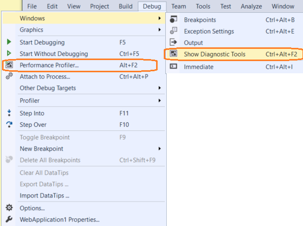
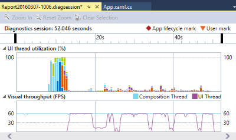

# Ferramentas de Criação de Perfil
Ferramentas de Diagnóstico e Criação de Perfil ajudam você a diagnosticar o uso de memória e uso de CPU e outros problemas em nível de aplicativo. Com essas ferramentas, você pode acumular dados (como valores de variáveis, chamadas de função e eventos) ao longo do tempo em que você executar o aplicativo no depurador. Você pode exibir o estado do seu aplicativo em pontos diferentes durante a execução do seu código.  
  
 Confira o resumo na parte inferior para ver quais ferramentas estão disponíveis para o tipo de projeto (por exemplo, área de trabalho, UWP, ASP.NET).  
  
 Você pode acessar as ferramentas de criação de perfil usando **Depurar/Janelas/Mostrar Ferramentas de Diagnóstico** para usar as ferramentas durante a sessão de depuração ou você pode fazer uma análise post-mortem usando algumas outras abordagens.  Consulte [Executando ferramentas de criação de perfil com ou sem o depurador](../profiling/running-profiling-tools-with-or-without-the-debugger.md) para obter mais informações sobre as diferentes abordagens.
  
 
  
 Consulte [O que há de novo nas ferramentas de criação de perfil](../profiling/what-s-new-in-profiling-tools.md) para saber mais sobre as novas funcionalidades desta versão.
  
 As seções a seguir descrevem as diferentes ferramentas de desempenho que estão disponíveis no Visual Studio.
  
## Uso de Memória  
   
  
 Localize vazamentos de memória e memória ineficiente enquanto estiver depurando com a ferramenta **Uso de Memória**. A ferramenta permite que você tire instantâneos do heap de memória gerenciada e do heap de memória nativa. Você pode usar essa ferramenta com aplicativos ASP.NET, aplicativos universais do Windows e aplicativos da área de trabalho. A ferramenta **Uso da Memória** pode ser executada da janela **Ferramentas de Diagnóstico** enquanto você está depurando (**Depurar/Janelas/Mostrar Ferramentas de Diagnóstico**) ou fora do depurador (**Depurar/Criador de Perfil de Desempenho...**). Consulte [Uso da Memória](../profiling/memory-usage.md) e [Uso da Memória sem Depuração](../profiling/Memory-Usage-without-Debugging2.md) para obter mais informações.  
  
## Uso da CPU  
   
  
 A ferramenta **Uso da CPU** mostra em que a CPU está dedicando tempo a executar código C++, C#/VB e JavaScript.  Você pode usar essa ferramenta com aplicativos de área de trabalho e universais do Windows, bem como aplicativos do Serviço de Aplicativo do Azure e ASP.NET. A ferramenta **Uso de CPU** pode ser executada da janela **Ferramentas de Diagnóstico** enquanto você está depurando (**Depurar/Janelas/Mostrar Ferramentas de Diagnóstico**) ou fora do depurador (**Depurar/Criador de Perfil de Desempenho...**). Para obter mais informações, consulte o [Guia de Iniciantes para a Criação de Perfil de Desempenho](../profiling/beginners-guide-to-performance-profiling.md) e [Uso de CPU](../profiling/cpu-usage.md).
  
## Uso de GPU  
   
  
 Use a ferramenta [Uso de GPU](../debugger/gpu-usage.md) para compreender melhor a utilização do hardware de alto nível do aplicativo Direct3D. Você pode usar essa ferramenta com aplicativos universais do Windows e aplicativos da área de trabalho, mas não com aplicativos ASP.NET. A ferramenta **Uso de GPU** pode ser executada fora do depurador (**Depurar/Criador de Perfil de Desempenho...**).  
  
## Linha do Tempo do Aplicativo  
   
  
 A ferramenta [Linha do Tempo do Aplicativo](../profiling/application-timeline.md) ajuda a melhorar o desempenho de aplicativos XAML fornecendo uma exibição detalhada do consumo de recursos por esses aplicativos. Você pode usar a **Linha do Tempo do Aplicativo** com aplicativos universais do Windows e aplicativos da área de trabalho, mas não com aplicativos ASP.NET. A ferramenta **Linha do Tempo do Aplicativo** pode ser executada fora do depurador (**Depurar/Criador de Perfil de Desempenho...**).
  
## PerfTips  
   
  
 Quando o depurador interrompe a execução em um ponto de interrupção ou operação passo a passo, o tempo decorrido entre a interrupção e o ponto de interrupção anterior aparece como uma dica na janela do editor. Essas [PerfTips](../profiling/perftips.md) ajudam você a monitorar e analisar o desempenho de seu aplicativo enquanto você está depurando. Você pode ver **PerfTips** em aplicativos da área de trabalho, universais do Windows e ASP.NET.

## Performance Explorer  
   
  
 O **Gerenciador de Desempenho** (**Depurar/Criador de Perfil/Gerenciador de Desempenho**) permite que você use várias ferramentas diferentes, incluindo **Amostragem de CPU**, **Instrumentação**, **Alocação de Memória .NET** e **Contenção de Recursos**. Você pode usar ferramentas do Gerenciador de Desempenho com aplicativos de área de trabalho e aplicativos ASP.NET, mas não com aplicativos universais do Windows. Para obter mais informações, consulte [Gerenciador de Desempenho](../profiling/performance-explorer.md).

 > [!NOTE]
 > A menos que você deseje executar uma tarefa especializada como a instrumentação, use as ferramentas de diagnóstico como o uso de memória e o uso de CPU em vez do Gerenciador de Desempenho (que agora é uma ferramenta herdada).
  
## Memória JavaScript  
   
  
 A ferramenta [Memória JavaScript](../profiling/javascript-memory.md) permite localizar vazamentos de memória e uso ineficiente de memória nos aplicativos. A ferramenta permite que você tire instantâneos do heap de JavaScript. Você pode usar essa ferramenta com aplicativos HTML universais do Windows. A ferramenta **Memória JavaScript** pode ser executada fora do depurador (**Depurar/Criador de Perfil de Desempenho...**).  
  
## Capacidade de Resposta da Interface de Usuário HTML  
   
  
 A ferramenta [Capacidade de resposta da interface do usuário HTML](../profiling/html-ui-responsiveness.md) ajuda você a isolar problemas de desempenho em seus aplicativos, incluindo a falta de capacidade de resposta, tempo de carregamento lento e atualizações visuais que são menos frequentes do que o esperado. Você pode usar essa ferramenta com aplicativos HTML universais do Windows. A ferramenta **Capacidade de Resposta de Interface do Usuário HTML** pode ser executada fora do depurador (**Depurar/Criador de Perfil de Desempenho...**).  
  
## IntelliTrace  
   
  
 O [IntelliTrace](../debugger/intellitrace.md) lhe permite registrar eventos específicos, examinar os dados na janela **Locais** durante eventos do depurador e chamadas de função e depurar erros difíceis de reproduzir.  O IntelliTrace é principalmente uma ferramenta de depuração, mas ela também fornece informações que podem ser usadas para investigações de desempenho. Você pode usar essa ferramenta no Visual Studio Enterprise somente com aplicativos de área de trabalho, aplicativos universais do Windows e C# ASP.NET. Você pode encontrar o IntelliTrace na janela **Ferramentas de Diagnóstico** enquanto você está depurando (**Depurar/Janelas/Mostrar Ferramentas de Diagnóstico**).  
  
## Criação de perfil na produção  
 A abordagem recomendada para criação de perfil na produção é criar o perfil por meio da [linha de comando usando vsperf.exe](../profiling/using-the-profiling-tools-from-the-command-line.md) para coletar um perfil de CPU. Para suporte à criação de perfil remota no Serviço de Aplicativo do Azure, crie o perfil por meio do [Gerenciador de Servidores ou do Portal Kudu](https://azure.microsoft.com/en-us/blog/remote-profiling-support-in-azure-app-service/).  
  
## Qual ferramenta devo usar?  
 Eis aqui uma tabela que lista as diferentes ferramentas que o Visual Studio oferece e os diferentes tipos de projeto com os quais você poderá usá-las:  
  
|Ferramenta de Desempenho|Área de Trabalho do Windows|Windows Universal/Store|ASP.NET/ASP.NET Core|  
|----------------------|---------------------|------------------------------|-------------|  
|[Uso de Memória](../profiling/memory-usage.md)|sim|sim|sim|  
|[Uso da CPU](../profiling/cpu-usage.md)|sim|sim|sim|  
|[Uso de GPU](../debugger/gpu-usage.md)|sim|sim|no|  
|[Linha do tempo do aplicativo](../profiling/application-timeline.md)|sim|sim|no|  
|[PerfTips](../profiling/perftips.md)|sim|sim para XAML, não para HTML|sim|  
|[Gerenciador de Desempenho](../profiling/performance-explorer.md)|sim|no|sim (não para ASP.NET Core)|  
|[IntelliTrace](../debugger/intellitrace.md)|Somente .NET Enterprise|Somente .NET Enterprise|Somente .NET Enterprise|
|[Uso de rede](../profiling/network-usage.md)|no|sim|no| 
|[Capacidade de Resposta de interface do usuário em HTML](../profiling/html-ui-responsiveness.md)|no|sim para HTML, não para XAML|no|  
|[Memória JavaScript](../profiling/javascript-memory.md)|no|sim para HTML, não para XAML|no|  
  
## Consulte também  
 [Visual Studio IDE](../ide/visual-studio-ide.md)
