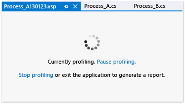

# Definindo op&#231;&#245;es de sess&#227;o de desempenho geral
[!INCLUDE[vs2017banner](../code-quality/includes/vs2017banner.md)]

Você pode definir as convenções de nomenclatura do método e os dados de criação de perfil de coleção para uma sessão de desempenho de [!INCLUDE[vsprvs](../code-quality/includes/vsprvs_md.md)] Ferramentas de Criação de Perfil na página de **Geral** da caixa de diálogo propriedades da sessão de desempenho.  Para abrir essa caixa de diálogo de **Desempenho Explorer**, clique com o botão direito do mouse na sessão de desempenho, e clique em **Propriedades**.  
  
 **Requisitos**  
  
-   [!INCLUDE[vsUltLong](../code-quality/includes/vsultlong_md.md)], [!INCLUDE[vsPreLong](../code-quality/includes/vsprelong_md.md)], [!INCLUDE[vsPro](../code-quality/includes/vspro_md.md)]  
  
## Escolhendo métodos de coleta de dados  
 Você define o método da coleção de base selecionando uma das opções em **Analisando a coleção**.  As opções são descritas depois na seguinte tabela:  
  
|||  
|-|-|  
|**Amostragem**.  O método de amostragem coleta informações de perfil em intervalos regulares.  Este método será útil para localizar problemas de utilização do processador e é o método sugerido para iniciar a maioria de investigações de desempenho.|-   [Coletando estatísticas de desempenho usando amostragem](../profiling/collecting-performance-statistics-by-using-sampling.md)|  
|**Instrumentação**.  O método de instrumentação injeta em uma cópia de um módulo que analisa o código que registra cada entrada, saída, e também chamada de função de funções no módulo executado durante a análise.  Este método será útil para coletar informações de controle de tempo detalhadas sobre uma seção do código e entender o impacto de operações de entrada e saída no desempenho do aplicativo.|-   [Coletando dados de tempo detalhados usando a instrumentação](../profiling/collecting-detailed-timing-data-by-using-instrumentation.md)|  
|**Concorrência**.  O método de simultaneidade coleta dados para cada evento que bloqueia a execução do código, como quando um thread espera acesso a um recurso bloqueado do aplicativo seja liberado.  Este método será útil para analisar aplicativos multi\-threaded.|-   [Coletando dados de simultaneidade do thread e do processo](../profiling/collecting-thread-and-process-concurrency-data.md)|  
  
 Você pode coletar dados de memória .NET usando os métodos de amostragem ou a instrumentação.  Você selecionar o tipo de dados em **Analisar de memória .NET**.  
  
|||  
|-|-|  
|**Coletar informações de alocação do objeto do .NET**.  Por padrão, os dados incluem o número e o tamanho de objetos atribuídos.  Selecione ou desmarque essa caixa de seleção para habilitar ou desabilitar a coleta de dados de memória do .NET.   **Também coletar informações de tempo de vida do objeto do .NET**.  Marque essa caixa de seleção para incluir dados sobre as gerações de coleta de lixo que foram usadas para recuperar os objetos de memória.|-   [Coletando a alocação de memória do .NET e os dados de vida útil](../profiling/collecting-dotnet-memory-allocation-and-lifetime-data.md)|  
  
 Analisando uma página de sessão é exibida quando você inicia para analisar um aplicativo, onde você pode pausar, retomar e parar, de analisar.  
  
   
  
## Definir as opções de Datra Arquivo  
  
|||  
|-|-|  
|**Relatório**.  Por padrão, o arquivo de dados de perfil .vsp \(\) é fornecido o nome do aplicativo analisado e está localizado na pasta da solução ou do projeto.  Uma cadeia de caracteres de data é acrescentada ao nome também, e um número incrementado é adicionado aos arquivos de dados que de outra forma teriam nomes duplicados.  Você poderá alterar essas opções.|-   [Como: definir opções de nome de arquivo de dados de desempenho](../profiling/how-to-set-performance-data-file-name-options.md)|