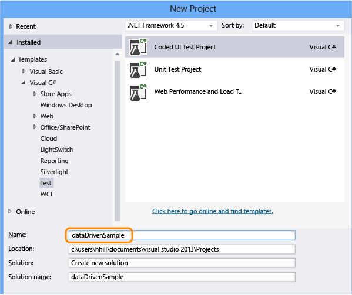
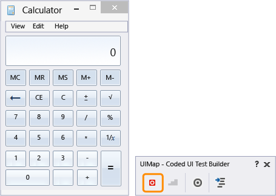
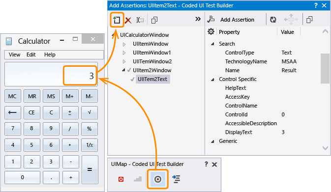
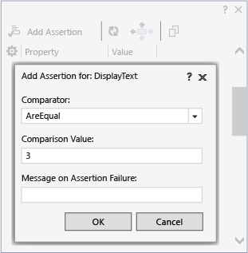
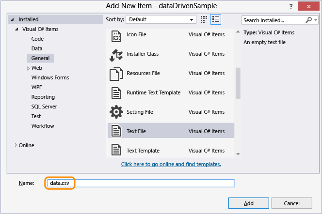
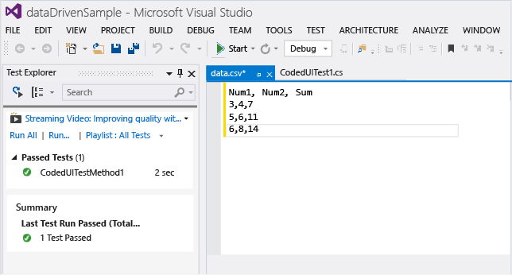
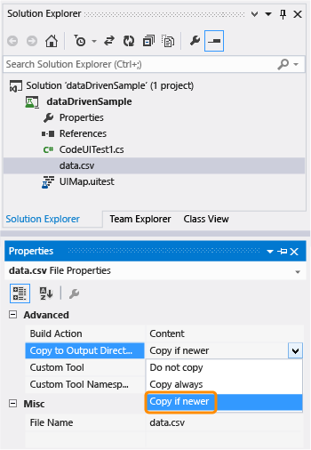
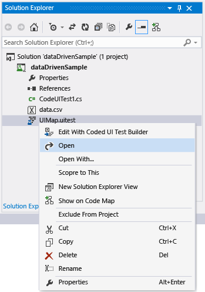
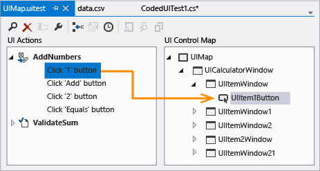
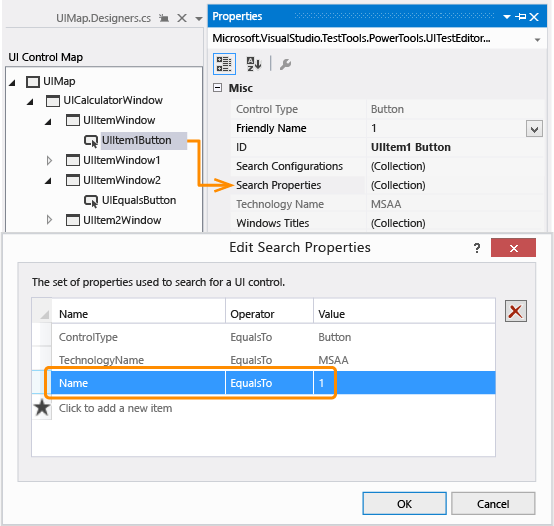

# <a name="creating-a-data-driven-coded-ui-test"></a>Criando um teste de interface do usuário codificado controlado por dados
Para testar diferentes condições, você pode executar os testes várias vezes com valores de parâmetros diferentes. Os testes de interface do usuário codificados controlados por dados são uma forma conveniente de fazer isso. Definir valores de parâmetro em uma fonte de dados e cada linha da fonte de dados é uma interação do teste de interface do usuário codificado. O resultado geral do teste será baseado no resultado para todas as iterações. Por exemplo, se uma interação de teste falhar, o resultado geral do teste terá falhas.  
  
 **Requisitos**  
  
-   Visual Studio Enterprise  
  
## <a name="create-a-data-driven-coded-ui-test"></a>Criar um teste de interface do usuário codificado controlado por dados  
 Este exemplo cria um teste de interface do usuário codificado que é executado no aplicativo Calculadora Windows. Ele adiciona dois números juntos e usa uma declaração para validar se a soma está correta. Em seguida, os valores de parâmetro e de declaração para os dois números são codificados para se tornarem controlados por dados e armazenados em um arquivo (.csv) de valores separados por vírgula.  
  
#### <a name="step-1---create-a-coded-ui-test"></a>Etapa 1 - Criar um teste de interface do usuário codificado  
  
1.  Criar um projeto.  
  
       
  
2.  Escolha registrar as ações.  
  
       
  
3.  Abra o aplicativo Calculadora e inicie a gravação do teste.  
  
       
  
4.  Adicione 1 mais 2, pause o gravador e gere o método de teste. Posteriormente, vamos substituir os valores dessa entrada do usuário por valores de um arquivo de dados.  
  
       
  
     Feche o construtor de teste. O método é adicionado ao teste:  
  
    ```c#  
    [TestMethod]  
    public void CodedUITestMethod1()  
    {  
        // To generate code for this test, select "Generate Code for Coded UI Test" from the shortcut menu and select one of the menu items.  
        this.UIMap.AddNumbers();  
  
    }  
    ```  
  
5.  Use o método `AddNumbers()` para verificar se o teste é executado. Coloque o cursor no método de teste mostrado acima, abra o menu de contexto e escolha **Executar Testes**. (Atalho de teclado: Ctrl + R, T).  
  
     O resultado do teste que mostra se o teste passou ou falhou é exibido na janela do Gerenciador de Testes. Para abrir a janela do Gerenciador de Testes, no menu **TESTE**, escolha **Windows** e, em seguida, escolha **Gerenciador de Testes**.  
  
6.  Como uma fonte de dados também pode ser usada para valores de parâmetro de declaração, que são usados pelo teste para verificar os valores esperados, vamos adicionar uma declaração para validar se a soma de dois números está correta. Coloque o cursor no método de teste mostrado acima, abra o menu de contexto e escolha **Gerar Código para Teste de IU Codificado** e, em seguida, **Usar Construtor de Teste de IU Codificado**.  
  
     Mapeie o controle de texto na Calculadora que exibe a soma.  
  
       
  
7.  Adicione uma declaração que valida que o valor da soma está correto. Escolha a propriedade **DisplayText** que tem o valor **3** e, em seguida, escolha **Adicionar Declaração**. Use o comparador **AreEqual** e verifique se o valor de comparação é **3**.  
  
       
  
8.  Após configurar a declaração, gere o código do construtor de novamente. Isso cria um novo método para a validação.  
  
       
  
     Como o método `ValidateSum` valida os resultados do método `AddNumbers`, mova-o para a parte inferior do bloco de códigos.  
  
    ```c#  
    public void CodedUITestMethod1()  
    {  
  
        // To generate code for this test, select "Generate Code for Coded UI Test" from the shortcut menu and select one of the menu items.  
        this.UIMap.AddNumbers();  
        this.UIMap.ValidateSum();  
  
    }  
    ```  
  
9. Verifique se o teste é executado usando o método `ValidateSum()`. Coloque o cursor no método de teste mostrado acima, abra o menu de contexto e escolha **Executar Testes**. (Atalho de teclado: Ctrl + R, T).  
  
     Neste ponto, todos os valores de parâmetro são definidos em seus métodos como constantes. Em seguida, vamos criar um conjunto de dados para fazer com que nosso teste seja controlado por dados.  
  
#### <a name="step-2---create-a-data-set"></a>Etapa 2 - Criar um conjunto de dados  
  
1.  Adicione um arquivo de texto ao projeto dataDrivenSample chamado `data.csv`.  
  
       
  
2.  Preencha o arquivo. csv com os seguintes dados:  
  
    |Núm1|Núm2|Sum|  
    |----------|----------|---------|  
    |3|4|7|  
    |5|6|11|  
    |6|8|14|  
  
     Depois de adicionar os dados, o arquivo deve aparecer como o seguinte:  
  
       
  
3.  É importante salvar o arquivo. csv usando a codificação correta. No menu **ARQUIVO**, escolha **Opções Avançadas para Salvar** e **Unicode (UTF-8 sem assinatura) – Página de código 65001** como a codificação.  
  
4.  O arquivo .csv deverá ser copiado para o diretório de saída ou não será possível executar o teste. Use a janela Propriedades para copiá-lo.  
  
       
  
     Agora que criamos o conjunto de dados, vamos associar os dados ao teste.  
  
#### <a name="step-3---add-data-source-binding"></a>Etapa 3 – Adicionar associação de fonte de dados  
  
1.  Para associar a fonte de dados, adicione um atributo `DataSource` dentro do atributo `[TestMethod]` existente que está imediatamente acima do método de teste.  
  
    ```  
    [DataSource("Microsoft.VisualStudio.TestTools.DataSource.CSV", "|DataDirectory|\\data.csv", "data#csv", DataAccessMethod.Sequential), DeploymentItem("data.csv"), TestMethod]  
    public void CodedUITestMethod1()  
    {  
  
        // To generate code for this test, select "Generate Code for Coded UI Test" from the shortcut menu and select one of the menu items.  
        this.UIMap.AddNumbers();  
        this.UIMap.ValidateSum();  
  
    }  
  
    ```  
  
     A fonte de dados agora está disponível para ser usada nesse método de teste.  
  
    > [!TIP]
    >  Consulte [amostras de atributos de fonte de dados](#CreateDataDrivenCUIT_QA_DataSourceAttributes) na seção de P e R para obter amostras sobre como usar outros tipos de fonte de dados como XML, SQL Express e Excel.  
  
2.  Execute o teste.  
  
     Observe que o teste é executado por meio de três iterações. Isso ocorre porque a fonte de dados que foi associada continha três linhas de dados. No entanto, você observará também que o teste ainda está usando os valores de parâmetro constante e está adicionando 1 + 2 com uma soma de 3 a cada vez.  
  
     Em seguida, vamos configurar o teste para usar os valores no arquivo de fonte de dados.  
  
#### <a name="step-4---use-the-data-in-the-coded-ui-test"></a>Etapa 4 – Usar os dados no teste de IU codificado  
  
1.  Adicione `using Microsoft.VisualStudio.TestTools.UITesting.WinControls` à parte superior do arquivo CodedUITest.cs:  
  
    ```  
    using System;  
    using System.Collections.Generic;  
    using System.Text.RegularExpressions;  
    using System.Windows.Input;  
    using System.Windows.Forms;  
    using System.Drawing;  
    using Microsoft.VisualStudio.TestTools.UITesting;  
    using Microsoft.VisualStudio.TestTools.UnitTesting;  
    using Microsoft.VisualStudio.TestTools.UITest.Extension;  
    using Keyboard = Microsoft.VisualStudio.TestTools.UITesting.Keyboard;  
    using Microsoft.VisualStudio.TestTools.UITesting.WinControls;  
    ```  
  
2.  Adicione `TestContext.DataRow[]` no método `CodedUITestMethod1()` que aplicará valores da fonte de dados. Os valores de fonte de dados substituem as constantes atribuídas aos controles UIMap usando os controles `SearchProperties`:  
  
    ```  
    public void CodedUITestMethod1()  
    {  
  
        // To generate code for this test, select "Generate Code for Coded UI Test" from the shortcut menu and select one of the menu items.  
        this.UIMap.UICalculatorWindow.UIItemWindow.UIItem1Button.SearchProperties[WinButton.PropertyNames.Name] = TestContext.DataRow["Num1"].ToString();this.UIMap.UICalculatorWindow.UIItemWindow21.UIItem2Button.SearchProperties[WinButton.PropertyNames.Name] = TestContext.DataRow["Num2"].ToString();  
        this.UIMap.AddNumbers();  
        this.UIMap.ValidateSumExpectedValues.UIItem2TextDisplayText = TestContext.DataRow["Sum"].ToString();  
        this.UIMap.ValidateSum();  
  
    }  
    ```  
  
     Para descobrir quais propriedades de pesquisa nas quais codificar os dados, use o Editor de Teste de Interface do Usuário Codificados.  
  
    -   Abra o arquivo UIMap.uitest.  
  
           
  
    -   Escolha a ação da interface do usuário e observe o mapeamento de controle da interface do usuário correspondente. Observe como o mapeamento corresponde ao código, por exemplo, `this.UIMap.UICalculatorWindow.UIItemWindow.UIItem1Button`.  
  
           
  
    -   Na Janela Propriedades, abra **Propriedades de Pesquisa**. O valor de **Name** das propriedades de pesquisa é o que está sendo manipulado no código usando a fonte de dados. Por exemplo, o `SearchProperties` está sendo atribuído aos valores na primeira coluna de cada linha de dados: `UIItem1Button.SearchProperties[WinButton.PropertyNames.Name] = TestContext.DataRow["Num1"].ToString();`. Para as três iterações, esse teste alterará o valor de **Name** da propriedade de pesquisa para 3, depois 5 e finalmente 6.  
  
           
  
3.  Salve a solução.  
  
#### <a name="step-5---run-the-data-driven-test"></a>Etapa 5 – Executar o teste controlado por dados  
  
1.  Execute o teste novamente para verificar se o teste agora é controlado por dados.  
  
     Você deve ver o teste ser executado por meio das três iterações usando os valores no arquivo .csv. A validação deve funcionar bem e o teste deve ser exibido conforme passado no Gerenciador de Testes.  
  
 **Diretrizes**  
  
 Para obter mais informações, consulte [Testing for Continuous Delivery with Visual Studio 2012 – Chapter 2: Unit Testing: Testing the Inside](http://go.microsoft.com/fwlink/?LinkID=255188) (Testando para entrega contínua com o Visual Studio 2012 – Capítulo 2: Teste de unidade: testando o interior) e [Testing for Continuous Delivery with Visual Studio 2012 – Chapter 5: Automating System Tests](http://go.microsoft.com/fwlink/?LinkID=255196) (Testando para entrega contínua com o Visual Studio 2012 – Capítulo 5: Automatizando os testes do sistema)  
  
## <a name="q--a"></a>Perguntas e respostas  
  
###  <a name="CreateDataDrivenCUIT_QA_DataSourceAttributes"></a> Quais são os atributos de fonte de dados para outros tipos de fonte de dados, como SQL Express ou XML?  
 Você pode usar as cadeias de caracteres de fonte de dados de amostra na tabela abaixo ao copiá-los em seu código e fazendo as personalizações necessárias.  
  
 **Tipos e atributos de fonte de dados**  
  
-   CSV  
  
     `[DataSource("Microsoft.VisualStudio.TestTools.DataSource.CSV", "|DataDirectory|\\data.csv", "data#csv", DataAccessMethod.Sequential), DeploymentItem("data.csv"), TestMethod]`  
  
-   Excel  
  
     `DataSource("System.Data.Odbc", "Dsn=ExcelFiles;Driver={Microsoft Excel Driver (*.xls)};dbq=|DataDirectory|\\Data.xls;defaultdir=.;driverid=790;maxbuffersize=2048;pagetimeout=5;readonly=true", "Sheet1$", DataAccessMethod.Sequential), DeploymentItem("Sheet1.xls"), TestMethod]`  
  
-   Caso de teste no Team Foundation Server  
  
     `[DataSource("Microsoft.VisualStudio.TestTools.DataSource.TestCase", "http://vlm13261329:8080/tfs/DefaultCollection;Agile", "30", DataAccessMethod.Sequential), TestMethod]`  
  
-   XML  
  
     `[DataSource("Microsoft.VisualStudio.TestTools.DataSource.XML", "|DataDirectory|\\data.xml", "Iterations", DataAccessMethod.Sequential), DeploymentItem("data.xml"), TestMethod]`  
  
-   SQL Express  
  
     `[DataSource("System.Data.SqlClient", "Data Source=.\\sqlexpress;Initial Catalog=tempdb;Integrated Security=True", "Data", DataAccessMethod.Sequential), TestMethod]`  
  
### <a name="q-can-i-use-data-driven-tests-on-my-windows-phone-app"></a>P: Posso usar testes controlados por dados em meu aplicativo Windows Phone?  
 **R:** Sim. Os testes de IU codificados e orientados a dados para Windows Phone são definidos com o uso do atributo DataRow em um método de teste. No exemplo a seguir, x e y usam os valores de 1 e 2 na primeira iteração e de -1 e -2 na segunda iteração do teste.  
  
```  
[DataRow(1, 2, DisplayName = "Add positive numbers")]  
[DataRow(-1, -2, DisplayName = "Add negative numbers")]  
[TestMethod]  
public void DataDrivingDemo_MyTestMethod(int x, int y)  
  
```  
  
 Para obter mais informações, consulte [Usar testes de IU codificados e controlados por dados em aplicativos Windows Phone](../test/test-windows-phone-8-1-apps-with-coded-ui-tests.md#TestingPhoneAppsCodedUI_DataDriven).  
  
### <a name="q-why-cant-i-modify-the-code-in-the-uimapdesigner-file"></a>P: Por que não posso modificar o código no arquivo UIMap.Designer?  
 **R:** Todas as alterações de código feitas no arquivo UIMapDesigner.cs serão substituídas sempre que você gerenciar o código usando o UIMap – Construtor de Teste de IU Codificado. Neste exemplo e na maioria dos casos, as alterações de código necessárias para habilitar um teste para usar uma fonte de dados podem ser feitas no arquivo de código-fonte do teste (ou seja, CodedUITest1.cs).  
  
 Se você tiver de modificar um método gravado, copie-o para o arquivo UIMap.cs e renomeie-o. O arquivo UIMap.cs pode ser usado para substituir métodos e propriedades no arquivo UIMapDesigner.cs. Você deve remover a referência para o método original no arquivo Coded UITest.cs e substituí-la pelo nome do método renomeado.  
  
## <a name="see-also"></a>Consulte também  
 <xref:Microsoft.VisualStudio.TestTools.UITest.Common.UIMap.UIMap>   
 <xref:Microsoft.VisualStudio.TestTools.UnitTesting.Assert>   
 [Usar a automação de interface do usuário para testar o código](../test/use-ui-automation-to-test-your-code.md)   
 [Criando testes de IU codificados](../test/use-ui-automation-to-test-your-code.md#VerifyingCodeUsingCUITCreate)   
 [Práticas recomendadas para testes de IU codificados](../test/best-practices-for-coded-ui-tests.md)   
 [Configurações e plataformas com suporte para testes de IU codificados e gravações das ações](../test/supported-configurations-and-platforms-for-coded-ui-tests-and-action-recordings.md)

