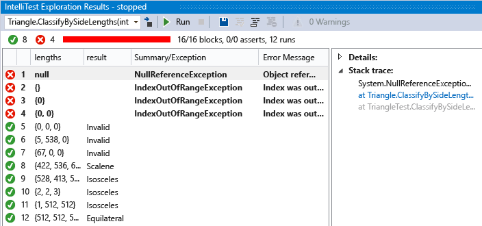
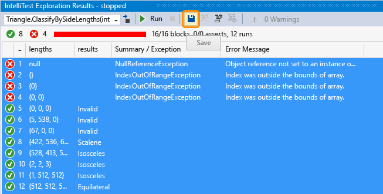

# Gerar testes de unidade para seu código com o IntelliTest
O IntelliTest explora seu código .NET para gerar dados de teste e um pacote de testes de unidade. Para cada instrução no código, é gerada uma entrada de teste para executar essa instrução. Uma análise de caso é realizada para cada branch condicional do código. Por exemplo, instruções `if`, declarações e todas as operações que podem gerar exceções são analisadas. Essa análise é usada para gerar dados de teste para um teste de unidade parametrizado de todos os métodos, criando testes de unidade com alta cobertura de código.

 Quando executa o IntelliTest, você pode ver facilmente quais testes estão falhando e adicionar o código que for necessário para corrigi-los. É possível selecionar quais dos testes gerados serão salvos em um projeto de teste para oferecer um pacote de regressão. Conforme você alterar seu código, execute novamente o IntelliTest para manter os testes gerados em sincronia com as alterações do código.

## Disponibilidade e extensões

Os comandos de menu **Criar IntelliTest** e **Executar IntelliTest**:

* Estão disponíveis apenas na Enterprise Edition do Visual Studio 2015 e em versões posteriores.

* Dão suporte apenas para código C# destinado ao .NET Framework.

* São [extensíveis](#extend-framework) e dão suporte a testes de emissão nos formatos MSTest, MSTest V2, NUnit e xUnit.

* Não dão suporte à configuração x64.

## Explorar: use o IntelliTest para explorar seu código e gerar testes de unidade
 Para gerar testes de unidade, seus tipos devem ser públicos. Caso contrário, [crie os testes de unidade](#NoRun) primeiro, antes de gerá-los.

1.  Abra a solução no Visual Studio. Em seguida, abra o arquivo de classe que tem métodos que você deseja testar.

2.  Clique com o botão direito do mouse em um método no código e escolha **Executar IntelliTest** para gerar testes de unidade para o código em seu método.

     

     O IntelliTest executa o código várias vezes com entradas diferentes. Cada execução é representada na tabela, mostrando os dados de teste de entrada e a saída ou exceção resultante.

     

     Para gerar testes de unidade para todos os métodos públicos de uma classe, basta clicar com o botão direito do mouse na classe, em vez de clicar em um método específico. Em seguida, escolha **Executar IntelliTest**. Use a lista suspensa na janela Resultados da Exploração para exibir os testes de unidade e os dados de entrada para cada método da classe.

     

     Para testes que forem aprovados, verifique se os resultados relatados na coluna de resultados correspondem às suas expectativas com relação ao código. Para testes que falharem, corrija o código conforme necessário. Depois, execute novamente o IntelliTest para validar as correções.

## Persistir: salve os testes de unidade como um pacote de regressão

1.  Selecione as linhas de dados que deseja salvar com o teste de unidade parametrizado em um projeto de teste.

     

     É possível exibir o projeto de teste e o teste de unidade parametrizado que foi criado – os testes de unidade individuais, correspondentes a cada uma das linhas, são salvos no arquivo .g.cs no projeto de teste e um teste de unidade parametrizado é salvo em seu arquivo .cs correspondente. É possível executar os testes de unidade e exibir os resultados do Gerenciador de Testes, como você faria com qualquer teste de unidade criado manualmente.

     

     As referências necessárias também são adicionadas ao projeto de teste.

     Se o código do método for alterado, execute novamente o IntelliTest para manter os testes de unidade em sincronia com as alterações.

## Assistência: use o IntelliTest para focar a exploração de código

1.  Se você tiver um código mais complexo, o IntelliTest lhe auxilia a ficar a exploração do código. Por exemplo, se você tiver um método que tem uma interface como parâmetro e houver mais de uma classe que implementa essa interface, o IntelliTest detectará essas classes e gerará um aviso.

     Exiba os avisos para decidir o que deseja fazer.

     

2.  Após examinar o código e entender o que deseja testar, você pode corrigir o aviso e escolher quais classes devem ser usadas para testar a interface.

     

     Essa opção é adicionada ao arquivo PexAssemblyInfo.cs.

     `[assembly: PexUseType(typeof(Camera))]`

3.  Agora, você pode executar o IntelliTest novamente para gerar um teste de unidade parametrizado e testar dados usando apenas a classe que você fixou.

     

## Especificar: use o IntelliTest para validar as propriedades de correção especificadas no código

Especifique a relação geral entre as entradas e saídas que você deseja que os testes de unidade gerados validem. Essa especificação é encapsulada em um método que se parece com um método de teste, mas é quantificada universalmente. Esse é o método de teste de unidade parametrizado e qualquer asserção que você fizer deve conter todos os valores de entrada possíveis que o IntelliTest pode gerar.

##   Perguntas e respostas

### P: É possível usar o IntelliTest para código não gerenciado?

**R:** Não, o IntelliTest funciona somente com código gerenciado.

### P: Quando um teste gerado é aprovado ou falha?

**A:** Ele é aprovado como qualquer outro teste de unidade se não ocorrer nenhuma exceção. Ele falhará se qualquer asserção falhar ou se o código que está sendo testado gerar uma exceção sem tratamento.

 Se tiver um teste que pode ser aprovado se determinadas exceções forem geradas, você pode definir um dos atributos a seguir com base em suas necessidades, no nível do método de teste, da classe de teste ou do assembly:

-   **PexAllowedExceptionAttribute**

-   **PexAllowedExceptionFromTypeAttribute**

-   **PexAllowedExceptionFromTypeUnderTestAttribute**

-   **PexAllowedExceptionFromAssemblyAttribute**

### P: Posso adicionar pressuposições ao teste de unidade parametrizado?

**R:** Sim, use pressuposições para especificar quais dados de teste não são necessários para o teste de unidade para um método específico. Use a classe <xref:Microsoft.Pex.Framework.PexAssume> para adicionar suposições. Por exemplo, você pode adicionar uma pressuposição de que a variável de tamanho não é nula.

 `PexAssume.IsNotNull(lengths);`

 Se você adicionar uma pressuposição e executar novamente o IntelliTest, os dados de teste que não forem mais relevantes serão removidos.

### P: Posso adicionar asserções ao teste de unidade parametrizado?

**R:** Sim, o IntelliTest verificará se o que você está declarando na instrução de fato está correto ao executar os testes de unidade. Use a classe <xref:Microsoft.Pex.Framework.PexAssert> ou a API de asserção que vem com a estrutura de teste para adicionar asserções. Por exemplo, é possível adicionar uma asserção de que duas variáveis são iguais.

 `PexAssert.AreEqual(a, b);`

 Se você adicionar uma asserção e executar o IntelliTest novamente, ele verificará se a asserção é válida e o teste falhará se ela não for.

###   P: Posso gerar testes de unidade parametrizados sem executar IntelliTest primeiro?

**R:** Sim, clique com o botão direito do mouse na classe ou no método e escolha **Criar IntelliTest**.

 

 Aceite o formato padrão para gerar os testes ou altere o nome de seu projeto e testes. É possível criar um novo projeto de teste ou salvar seus testes em um projeto existente.

 

### P: Posso usar outras estruturas de teste de unidade com o IntelliTest?

**R:** Sim, siga estas etapas para [encontrar e instalar outras estruturas](../test/install-third-party-unit-test-frameworks.md).
As extensões da estrutura de teste também estão disponíveis no Marketplace do Visual Studio:

* [Extensão do NUnit para geradores de teste](https://marketplace.visualstudio.com/items?itemName=NUnitDevelopers.TestGeneratorNUnitextension)
* [Extensão do xUnit.net para geradores de teste](https://marketplace.visualstudio.com/items?itemName=BradWilson.xUnitnetTestExtensions)

Depois de reiniciar o Visual Studio e reabrir a solução, clique com o botão direito do mouse na classe ou no método e escolha **Criar IntelliTest**. Selecione a estrutura instalada aqui:

Em seguida, execute novamente o IntelliTest para gerar testes de unidade individuais em seus respectivos arquivos .g.cs.

### P: Posso saber mais sobre como os testes são gerados?

**R:** Sim, para obter uma visão geral, leia esta [postagem de blog](http://blogs.msdn.com/b/visualstudioalm/archive/2015/07/05/intellitest-one-test-to-rule-them-all.aspx).
