# <a name="test-windows-uwp-and-81-phone-apps-with-coded-ui-tests"></a>Testar aplicativos Windows UWP e 8.1 do Windows Phone com testes de UI codificados

Use este passo a passo para criar testes de interface do usuário para aplicativos UWP que são executados em dispositivos móveis ou emuladores e aplicativos do Windows Phone 8.1 com base em XAML.  

## <a name="create-a-simple-windows-phone-app"></a>Criar um aplicativo simples do Windows Phone  
  
1.  Crie um novo projeto para um aplicativo do Windows Phone em branco usando um modelo Visual C# ou Visual Basic.  
  
     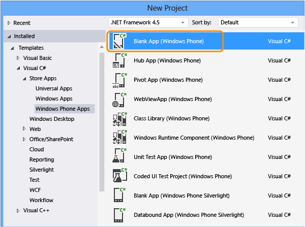  
  
2.  No Gerenciador de Soluções, abra MainPage.xaml. Na Caixa de Ferramentas, arraste um controle de botão e um controle de caixa de texto para a superfície do design.  
  
       
  
3.  Na janela Propriedades, atribua um nome ao controle de botão.  
  
     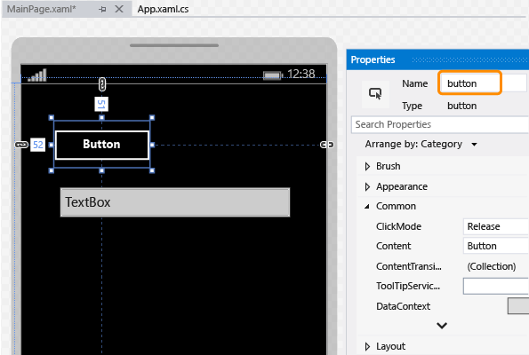  
  
4.  Atribua um nome ao controle de caixa de texto.  
  
     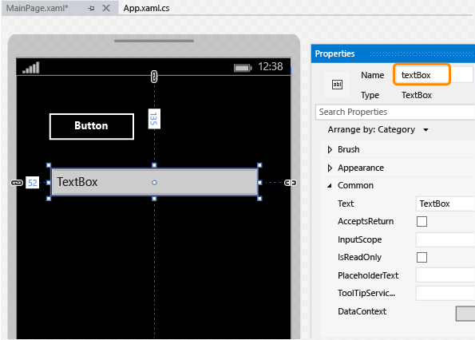  
  
5.  Na superfície de design, clique duas vezes no controle de botão e acrescente este código:  
  
    ```csharp  
    private void button_Click_1(object sender, RoutedEventArgs e)  
    {  
        this.textBox.Text = this.button.Name;  
    }  
  
    ```  
  
    ```vb  
    Public NotInheritable Class MainPage  
        Inherits Page  
  
        Private Sub button_Click(sender As Object, e As RoutedEventArgs) Handles Button.Click  
            Me.textBox.Text = Me.button.Name  
        End Sub  
    End Class  
    ```  
  
6.  Pressione F5 para executar seu aplicativo do Windows Phone no emulador e verificar se ele está funcionando.  
  
     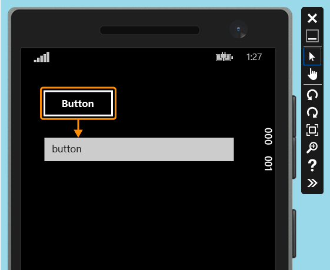  
  
7.  Saia do emulador.  
  
## <a name="deploy-the-windows-phone-app"></a>Implantar o aplicativo do Windows Phone  
  
1.  Para que um teste de IU codificado possa mapear os controles de um aplicativo, você deve implantar o aplicativo.  
  
     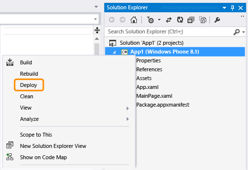  
  
     O emulador é iniciado. Agora, o aplicativo está disponível para testes.  
  
     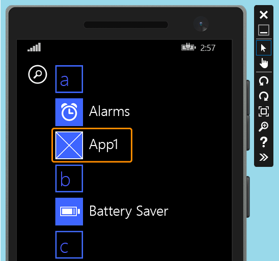  
  
     Mantenha o emulador em execução enquanto cria seu teste de IU codificado.  
  
## <a name="create-a-coded-ui-test-for-the-windows-phone-app"></a>Criar um teste de IU codificado para o aplicativo do Windows Phone  

[Como criar testes de IU codificados para aplicativos UWP (Plataforma Universal do Windows)?](#uwpapps)
  
1.  Acrescente o novo projeto de teste de IU codificado à solução no aplicativo do Windows Phone.  
  
     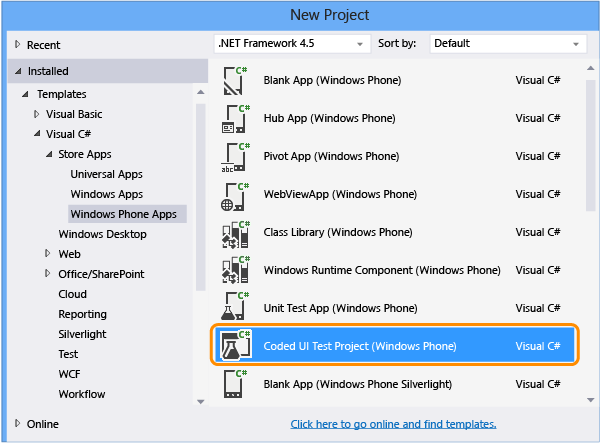  
  
2.  Escolha editar o mapa de interface do usuário usando a ferramenta de fios.  
  
     ![Gerar um teste de IU codificado usando a ferramenta de fios.] (../test/media/cuit_phone_howgencodedialog.png "CUIT_Phone_HowGenCodeDialog")  
  
3.  Use a ferramenta de fios para selecionar o aplicativo. Em seguida, copie o valor da propriedade **AutomationId** do aplicativo, que será usado posteriormente para iniciar o aplicativo no teste.  
  
     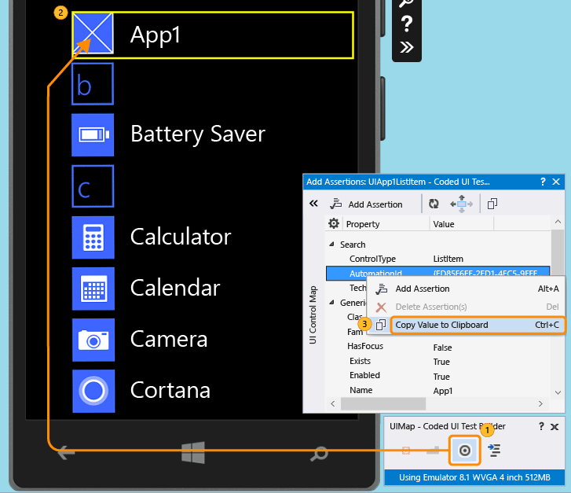  
  
4.  No emulador, inicie o aplicativo e use a ferramenta de fios para selecionar o controle de botão. Em seguida, acrescente o controle de botão ao mapa de controle da interface de usuário.  
  
     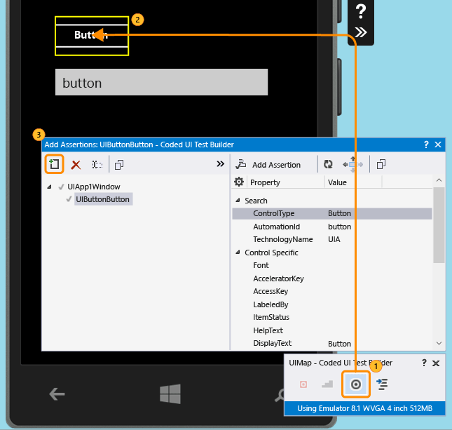  
  
5.  Para acrescentar o controle de caixa de texto ao mapa de controle da interface de usuário, repita a etapa anterior.  
  
     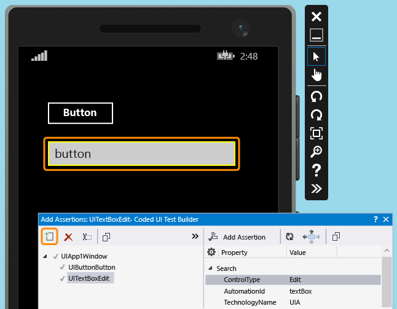  
  
6.  Gere um código para criar código de alterações no mapa de controle da interface de usuário.  
  
     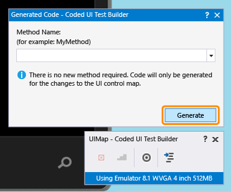  
  
7.  Use a ferramenta de fios para selecionar o controle de caixa de texto e, em seguida, selecione a propriedade **Text**.  
  
     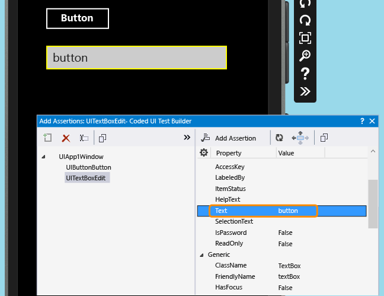  
  
8.  Adicione uma asserção. Ela será usada no teste para verificar se o valor está correto.  
  
     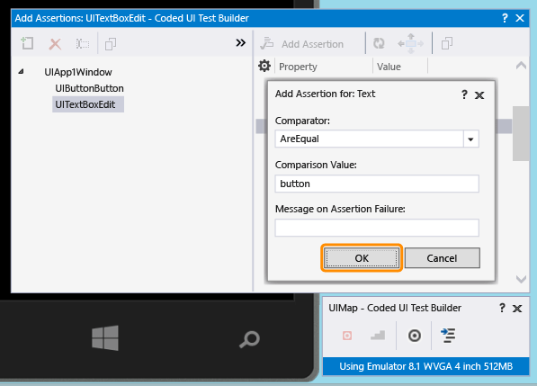  
  
9. Acrescente e gere um código para o método de asserção.  
  
     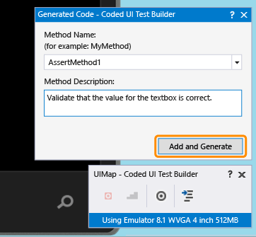  
  
10. **Visual C#**  
  
     No Gerenciador de Soluções, abra o arquivo UIMap.Designer.cs para exibir o código acrescentado ao método de asserção e aos controles.  
  
     **Visual Basic**  
  
     No Gerenciador de Soluções, abra o arquivo CodedUITest1.vb. No código do método de teste CodedUITestMethod1(), clique com o botão direito do mouse na chamada ao método de declaração que foi adicionada automaticamente, `Me.UIMap.AssertMethod1()`, e escolha **Ir Para Definição**. Essa ação abre o arquivo UIMap.Designer.vb no editor de códigos para que você possa exibir o código acrescentado ao método de asserção e aos controles.  
  
    > [!WARNING]
    >  Não modifique o arquivo UIMap.designer.cs ou UIMap.Designer.vb diretamente. Se fizer isso, as alterações no arquivo serão substituídas sempre que o teste for gerado.  
  
     **Método assert**  
  
    ```csharp  
    public void AssertMethod1()  
    {  
        #region Variable Declarations  
        XamlEdit uITextBoxEdit = this.UIApp1Window.UITextBoxEdit;  
        #endregion  
  
        // Verify that the 'Text' property of 'textBox' text box equals 'button'  
        Assert.AreEqual(this.AssertMethod1ExpectedValues.UITextBoxEditText, uITextBoxEdit.Text);  
    }  
    ```  
  
    ```vb  
    Public Sub AssertMethod1()  
        Dim uITextBoxEdit As XamlEdit = Me.UIApp1Window.UITextBoxEdit  
  
        'Verify that the 'Text' property of 'textBox' text box equals 'button'  
        Assert.AreEqual(Me.AssertMethod1ExpectedValues.UITextBoxEditText, uITextBoxEdit.Text)  
    End Sub  
    ```  
  
     **Controles**  
  
    ```csharp  
    #region Properties  
    public virtual AssertMethod1ExpectedValues AssertMethod1ExpectedValues  
    {  
        get  
        {  
            if ((this.mAssertMethod1ExpectedValues == null))  
            {  
                this.mAssertMethod1ExpectedValues = new AssertMethod1ExpectedValues();  
            }  
            return this.mAssertMethod1ExpectedValues;  
        }  
    }  
  
    public UIApp1Window UIApp1Window  
    {  
        get  
        {  
            if ((this.mUIApp1Window == null))  
            {  
                this.mUIApp1Window = new UIApp1Window();  
            }  
            return this.mUIApp1Window;  
        }  
    }  
    #endregion  
  
    #region Fields  
    private AssertMethod1ExpectedValues mAssertMethod1ExpectedValues;  
  
    private UIApp1Window mUIApp1Window;  
    #endregion  
    ```  
  
    ```vb  
    #Region "Properties"  
    Public ReadOnly Property UIButtonButton() As XamlButton  
        Get  
            If (Me.mUIButtonButton Is Nothing) Then  
                Me.mUIButtonButton = New XamlButton(Me)  
                Me.mUIButtonButton.SearchProperties(XamlButton.PropertyNames.AutomationId) = "button"  
            End If  
            Return Me.mUIButtonButton  
        End Get  
    End Property  
  
    Public ReadOnly Property UITextBoxEdit() As XamlEdit  
        Get  
            If (Me.mUITextBoxEdit Is Nothing) Then  
                Me.mUITextBoxEdit = New XamlEdit(Me)  
                Me.mUITextBoxEdit.SearchProperties(XamlEdit.PropertyNames.AutomationId) = "textBox"  
            End If  
            Return Me.mUITextBoxEdit  
        End Get  
    End Property  
    #End Region  
  
    #Region "Fields"  
    Private mUIButtonButton As XamlButton  
  
    Private mUITextBoxEdit As XamlEdit  
    #End Region  
    ```  
  
11. No Gerenciador de Soluções, abra o arquivo CodedUITest1.cs ou CodedUITest1.vb. Agora você pode acrescentar o código ao método CodedUTTestMethod1 para as ações necessárias para execução do teste. Use os controles que foram adicionados ao mapa de interface do usuário para acrescentar código:  
  
    1.  Inicie o aplicativo do Windows Phone usando a propriedade de ID de automação copiada anteriormente na área de transferência:  
  
        ```csharp  
        XamlWindow myAppWindow = XamlWindow.Launch("ed85f6ff-2fd1-4ec5-9eef-696026c3fa7b_cyrqexqw8cc7c!App");  
        ```  
  
        ```vb  
        XamlWindow.Launch("ed85f6ff-2fd1-4ec5-9eef-696026c3fa7b_cyrqexqw8cc7c!App");  
        ```  
  
    2.  Adicione um gesto para tocar no controle de botão:  
  
        ```csharp  
        Gesture.Tap(this.UIMap.UIApp1Window.UIButtonButton);  
        ```  
  
        ```vb  
        Gesture.Tap(Me.UIMap.UIApp1Window.UIButtonButton)  
        ```  
  
    3.  Verifique se a chamada ao método de asserção gerada automaticamente vem depois da inicialização do aplicativo e do gesto de toque no botão:  
  
        ```csharp  
        this.UIMap.AssertMethod1();  
        ```  
  
        ```vb  
        Me.UIMap.AssertMethod1()  
        ```  
  
     Depois que você acrescenta o código, o método de teste CodedUITestMethod1 deve aparecer desta forma:  
  
    ```csharp  
    [TestMethod]  
    public void CodedUITestMethod1()  
    {  
        // To generate code for this test, select "Generate Code for Coded UI Test" from the shortcut menu and select one of the menu items.  
  
        // Launch the app.  
        XamlWindow myAppWindow = XamlWindow.Launch("ed85f6ff-2fd1-4ec5-9eef-696026c3fa7b_cyrqexqw8cc7c!App");  
  
        // Tap the button.  
        Gesture.Tap(this.UIMap.UIApp1Window.UIButtonButton);  
  
        this.UIMap.AssertMethod1();  
    }  
    ```  
  
    ```vb  
    <CodedUITest>  
    Public Class CodedUITest1  
  
        <TestMethod()>  
        Public Sub CodedUITestMethod1()  
            '              
            ' To generate code for this test, select "Generate Code for Coded UI Test" from the shortcut menu and select one of the menu items.  
            '  
            ' Launch the app.  
            XamlWindow.Launch("ed85f6ff-2fd1-4ec5-9eef-696026c3fa7b_cyrqexqw8cc7c!App")  
  
            '// Tap the button.  
            Gesture.Tap(Me.UIMap.UIApp1Window.UIButtonButton)  
  
            Me.UIMap.AssertMethod1()  
        End Sub  
    ```  
  
## <a name="run-the-coded-ui-test"></a>Executar o teste de IU codificado  
  
1.  Compile seu teste e execute-o usando o gerenciador de testes.  
  
     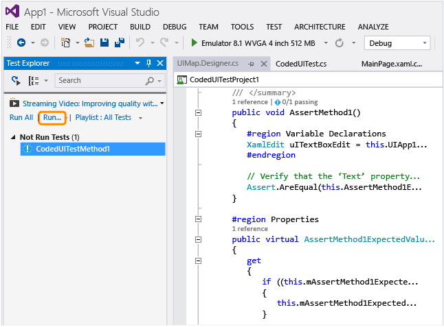  
  
     O aplicativo do Windows Phone é iniciado, a ação de toque no botão é concluída e a propriedade Texto da caixa de texto é populada e validada com o método de asserção.  
  
     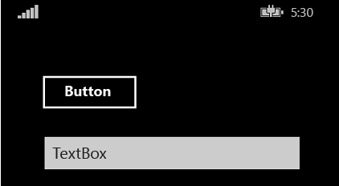  
  
     Após a conclusão do teste, o Gerenciador de Testes confirma que o teste foi aprovado.  
  
     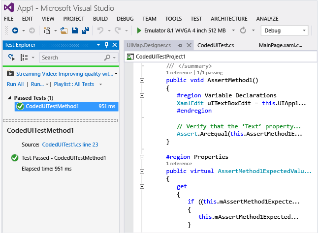  
  
##  <a name="TestingPhoneAppsCodedUI_DataDriven"></a> Usar testes de IU codificados e controlados por dados em aplicativos Windows Phone  
 Para testar diferentes condições, é possível executar um teste de IU codificado diversas vezes com diferentes conjuntos de dados.  
  
 Os testes de IU codificados e orientados a dados para Windows Phone são definidos com o uso do atributo DataRow em um método de teste. No exemplo a seguir, x e y usam os valores de 1 e 2 na primeira iteração e de -1 e -2 na segunda iteração do teste.  
  
```  
[DataRow(1, 2, DisplayName = "Add positive numbers")]  
[DataRow(-1, -2, DisplayName = "Add negative numbers")]  
[TestMethod]  
public void DataDrivingDemo_MyTestMethod(int x, int y)  
  
```  
  
## <a name="q--a"></a>Perguntas e respostas  
  
### <a name="q-do-i-have-to-deploy-the-windows-phone-app-in-the-emulator-in-order-to-map-ui-controls"></a>P: Preciso implantar o aplicativo para Windows Phone no emulador para mapear os controles de interface do usuário?  
 **R**: Sim. O compilador de teste de IU codificado exige que um emulador esteja em execução e que o aplicativo esteja implantado nele. Caso contrário, ele lança uma mensagem de texto informando que não foi possível localizar nenhum emulador em execução.  
  
###  <a name="TestingPhoneAppsCodedUI_EmulatorDevice"></a> P: Os testes só podem ser executados no emulador ou também posso usar um dispositivo físico?  
 **R**: Há suporte para as duas opções. Para selecionar o destino da execução de teste, altere o tipo de emulador ou selecione o dispositivo na barra de tarefa do dispositivo. Se Dispositivo estiver selecionado, será necessário conectar o dispositivo Phone Blue a uma das portas USB do computador.  
  
 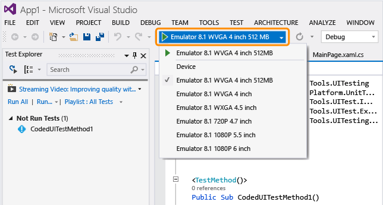  
  
### <a name="q-why-dont-i-see-the-option-to-record-my-coded-ui-test-in-the-generate-code-for-a-coded-ui-test-dialog"></a>P: Por que não vejo a opção de registrar meu teste de IU codificado no diálogo Gerar Código para Teste de IU Codificado?  
 **R**: A opção de registro não tem suporte para aplicativos Windows Phone.  
  
### <a name="q-can-i-create-a-coded-ui-test-for-my-windows-phone-apps-based-on-winjs-silverlight-or-html5"></a>P: Posso criar um teste de IU codificado para meus aplicativos do Windows Phone baseados em WinJS, Silverlight ou HTML5?  
 **R**: Não. Há suporte apenas para aplicativos baseados em XAML.  
  
### <a name="q-can-i-create-coded-ui-tests-for-my-windows-phone-apps-on-a-system-that-is-not-running-windows-81-or-windows-10"></a>P: Posso criar testes de IU codificados para meus aplicativos Windows Phone em um sistema que não executa o Windows 8.1 nem o Windows 10?  
 **R**: Não, os modelos de Projeto de Teste de IU Codificado estão disponíveis somente no Windows 8.1 e Windows 10. Para criar a automação para aplicativos UWP (Plataforma Universal do Windows), você precisará do Windows 10.  

<a name="uwpapps"></a>  
### <a name="q-how-do-i-create-coded-ui-tests-for-universal-windows-platform-uwp-apps"></a>P: Como fazer para criar testes de IU codificados para aplicativos UWP (Plataforma Universal do Windows)?  
 **R**: Dependendo da plataforma em que você está testando o aplicativo UWP, crie o projeto de teste de IU codificado de uma destas maneiras:  
  
-   Um aplicativo UWP em execução no computador local será executado como um aplicativo UWP. Para testar isso, é necessário usar o modelo **Projeto de Teste de IU Codificado (Windows)**. Para encontrar esse modelo ao criar um novo projeto, acesse o nó **Windows**, **Universal**. Se preferir, acesse o nó **Windows**, **Windows 8**, **Windows**.  
  
-   Um aplicativo UWP em execução em um emulador ou dispositivo móvel será executado como um aplicativo do Windows Phone. Para testar isso, é necessário usar o modelo **Projeto de Teste de IU Codificado (Windows Phone)**. Para encontrar esse modelo ao criar um novo projeto, acesse o nó **Windows**, **Universal**. Se preferir, acesse o nó **Windows**, **Windows 8**, **Windows Phone**.  
  
 Depois de criar o projeto, a criação de um teste permanece a mesma que antes.  
  
### <a name="q-can-i-select-controls-that-are-outside-the-emulator"></a>P: Posso selecionar controles externos ao emulador?  
 **R**: Não. O compilador não os detectará.  
  
### <a name="q-can-i-use-the-coded-ui-test-builder-to-map-controls-using-a-physical-phone-device"></a>P: Posso usar o compilador de teste de IU codificado para mapear controles usando um dispositivo telefônico físico?  
 **R**: Não. O compilador poderá mapear elementos de interface do usuário apenas se o aplicativo tiver sido implantado no emulador.  
  
### <a name="q-why-cant-i-modify-the-code-in-the-uimapdesigner-file"></a>P: Por que não posso modificar o código no arquivo UIMap.Designer?  
 **R**: Todas as alterações de código feitas no arquivo UIMapDesigner.cs serão substituídas sempre que você gerenciar o código usando o UIMap – Construtor de Teste de IU Codificado. Se você tiver de modificar um método gravado, copie-o para o arquivo UIMap.cs e renomeie-o. O arquivo UIMap.cs pode ser usado para substituir métodos e propriedades no arquivo UIMapDesigner.cs. Você deve remover a referência para o método original no arquivo Coded UITest.cs e substituí-la pelo nome do método renomeado.  
  
### <a name="q-can-i-run-a-coded-ui-test-on-my-windows-phone-app-from-the-command-line"></a>P: Posso executar um teste de IU codificado no meu aplicativo do Windows Phone da linha de comando?  
 **R**: Sim. É possível usar um arquivo runsettings para especificar o dispositivo de destino da execução do teste. Por exemplo:  
  
 **vstest.console.exe "pathToYourCodedUITestDll" /settings:devicetarget.runsettings**  
  
 Exemplo de arquivo runsettings:  
  
```  
<?xml version="1.0" encoding="utf-8"?>  
<RunSettings>  
<MSPhoneTest>  
<!--to specify test execution on device, use a TargetDevice option as follows-->  
<TargetDevice>Device</TargetDevice>  
<!--to specify an emulator instead, use a TargetDevice option like below-->  
<!--<TargetDevice>Emulator 8.1 WVGA 4 inch 512MB</TargetDevice>-->  
</MSPhoneTest>  
</RunSettings>  
```  
  
### <a name="q-what-are-the-differences-between-coded-ui-tests-for-xaml-based-uwp-apps-and-windows-phone-apps"></a>P: Quais são as diferenças entre os testes de interface do usuário codificados para aplicativos UWP baseados em XAML e para aplicativos do Windows Phone?  
 **R**: Estas são algumas das principais diferenças:  
  
|Recurso|Aplicativos UWP|Aplicativos do Windows Phone|  
|-------------|------------------------|------------------------|  
|Destino da execução de testes|Computador local ou remoto. Você pode especificar os computadores remotos ao usar um caso de teste automatizado para executar os testes. Consulte [Automatizar um caso de teste no Microsoft Test Manager](/devops-test-docs/test/automate-a-test-case-in-microsoft-test-manager).|Emulador ou dispositivo. Consulte [P: Os testes só podem ser executados no emulador ou também posso usar um dispositivo físico?](#TestingPhoneAppsCodedUI_EmulatorDevice) neste tópico.|  
|Executar da linha de comando|Não é necessário usar o arquivo de configurações para especificar o destino.|O arquivo runsettings necessário para especificar o destino.|  
|Classes especializadas para controles do shell|<xref:Microsoft.VisualStudio.TestTools.UITesting.DirectUIControls.DirectUIControl>|<xref:Microsoft.VisualStudio.TestTools.UITesting.UITestControl>|  
|Controle WebView em um aplicativo XAML|Compatível se você usa classes Html* especializadas para interagir com elementos HTML. Consulte <xref:Microsoft.VisualStudio.TestTools.UITesting.HtmlControls>.|Sem suporte.|  
|Executar testes automatizados do MTM|Com suporte.|Sem suporte.|  
|Testes direcionados a dados|Consulte [Testes controlados por dados](../test/creating-a-data-driven-coded-ui-test.md) para obter informações sobre como usar fontes de dados externas e o atributo DataSource em um método de teste.|Os dados são especificados e embutidos com o uso do atributo DataRow em um método de teste. Consulte [Usar testes de IU codificados e controlados por dados em aplicativos Windows Phone](#TestingPhoneAppsCodedUI_DataDriven) neste tópico.|  
  
 Para obter informações sobre testes de interface do usuário codificados para aplicativos UWP, consulte [Testar aplicativos Windows UWP com testes de interface do usuário codificados](../test/test-windows-store-8-1-apps-with-coded-ui-tests.md).  
  
## <a name="external-resources"></a>Recursos externos  
 Blog do Gerenciamento do Ciclo de Vida do Aplicativo do Microsoft Visual Studio: [Using Coded UI to test XAML-based Windows Phone apps](http://blogs.msdn.com/b/visualstudioalm/archive/2014/04/05/using-coded-ui-to-test-xaml-based-windows-phone-apps.aspx?PageIndex=2#comments) (Usando a IU codificada para testar aplicativos Windows Phone baseados em XAML)  
  
## <a name="see-also"></a>Consulte também  
 [Usar automação de interface do usuário para testar código](../test/use-ui-automation-to-test-your-code.md)
