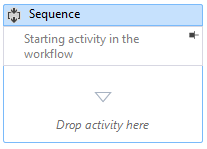

# Como: Adicionar comentários a um fluxo de trabalho em Designer de Fluxo de Trabalho

Para facilitar a criação de fluxos de trabalho maiores e mais complicados, o .NET Framework 4.5 permite que o desenvolvedor adicionar anotações para os seguintes tipos de item no designer:

-   <xref:System.Activities.Activity>

-   <xref:System.Activities.Statements.State>

-   <xref:System.Activities.Statements.Transition>

-   Classes derivadas de <xref:System.Activities.Statements.FlowNode>

-   <xref:System.Activities.Variable>

-   <xref:System.Activities.Argument>

> [!IMPORTANT]
> O conteúdo de uma anotação são salvos como texto sem formatação ao arquivo XAML associado com o fluxo de trabalho, e podem potencialmente ser lidas por outro. Seja cuidadoso ao inserir informações sigilosas em uma anotação.

## Adicionando uma anotação a uma atividade no designer

1. No designer de fluxo de trabalho, clique em um item do fluxo de trabalho no designer e selecione **anotações**, **Adicionar anotação**.

1. Adicione o texto de anotação no espaço fornecido.

   O item mostra um ícone de anotação. Ao passar o mouse sobre o ícone de anotação exibe o texto da anotação.

## Exibindo uma anotação no designer de uma atividade

1.  Com o designer de atividade que tem uma anotação exibindo fora da atividade, clique o **Pin** ícone no adorno de anotação.

   A anotação é exibida no designer da atividade. Em captura de tela abaixo, a anotação “que inicia a atividade no fluxo de trabalho” é exibida no designer de atividade.

   

1. Para exibir a anotação fora do designer da atividade, passe o mouse sobre a área de anotação no designer da atividade e clique no **Desafixar** ícone

   

## Mostrar ou ocultar todas as anotações

1. Clique com o botão direito do mouse uma atividade que tenha uma anotação. Selecione **anotações**, **Mostrar todas as anotações**.

   Todas as anotações são exibidas nos designers da atividade.

1. Para exibir todas as anotações fora designers da atividade, clique na atividade e selecione **anotações**, **ocultar todas as anotações**.

## Editando ou excluindo uma anotação para uma atividade

1. Clique com o botão direito do mouse em uma atividade que tenha uma anotação.

1. Selecione **anotações**, **editar anotação** ou **exclusão de anotação**.

   A anotação é aberta para edição ou excluída.

1. Para excluir todas as anotações de uma só vez, clique com botão direito do fluxo de trabalho no designer e selecione **anotação**, **excluir todas as anotações**.

## Adicionando, editar, e excluir uma anotação para uma variável ou um argumento

1. Clique com o botão direito do mouse em uma variável ou o argumento e selecione adicionar a anotação.

1. Digite o texto de anotação. A variável ou argumento exibe um ícone de anotação.

1. Clique com o botão direito do mouse em uma variável ou em um argumento que tenha uma anotação. Selecione a anotação de edição.

   A anotação é aberta para edição.

1. Clique com o botão direito do mouse em uma variável ou em um argumento que tenha uma anotação. Selecione a anotação excluir.

   A anotação é excluída.