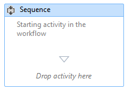

# How to: Add comments to a workflow in the Workflow Designer
Para facilitar a criação maior, os fluxos de trabalho mais complicados, [!INCLUDE[net_v45](../ide/includes/net_v45_md.md)] permitem que o desenvolvedor adiciona anotações aos seguintes tipos de item sobre o designer:  
  
-   <xref:System.Activities.Activity>  
  
-   <xref:System.Activities.Statements.State>  
  
-   <xref:System.Activities.Statements.Transition>  
  
-   Classes derivadas de <xref:System.Activities.Statements.FlowNode>  
  
-   <xref:System.Activities.Variable>  
  
-   <xref:System.Activities.Argument>  
  
> [!IMPORTANT]
>  O conteúdo de uma anotação são salvos como texto sem formatação ao arquivo XAML associado com o fluxo de trabalho, e podem potencialmente ser lidas por outro.  Seja cuidadoso ao inserir informações sigilosas em uma anotação.  
  
### Adicionando uma anotação a uma atividade no designer  
  
1.  No designer de fluxo de trabalho, clique com o botão direito do mouse em um item no designer de fluxo de trabalho e selecione **Anotações**, **Adicionar Anotação**.  
  
2.  Adicione o texto de anotação no espaço fornecido.  
  
3.  O item mostrará um ícone de anotação.  Passa sobre o ícone de anotação exibirá o texto de anotação.  
  
       
  
### Exibindo uma anotação no designer de uma atividade  
  
1.  Com um designer de atividade que tenha uma anotação que exibe fora da atividade, clique no ícone de **Fixar** no adorno de anotação.  
  
2.  A anotação será exibida no designer de atividade.  Em captura de tela abaixo, a anotação “que inicia a atividade no fluxo de trabalho” é exibida no designer de atividade.  
  
       
  
3.  Para exibir a anotação fora do designer de atividade, passa sobre a área de anotação no designer de atividade e clique no ícone de **Desafixar**  
  
       
  
### Mostrar ou ocultar todas as anotações  
  
1.  Clique com o botão direito do mouse uma atividade que tenha uma anotação.  Selecione **Anotações**, **Mostrar Todas as Anotações**.  
  
2.  Todas as anotações serão exibidas no designer de atividade.  
  
3.  Para exibir as anotações fora do designer de atividade, clique com o botão direito do mouse na atividade e selecione **Anotações**, **Ocultar Todas as Anotações**.  
  
### Editando ou excluindo uma anotação para uma atividade  
  
1.  Clique com o botão direito do mouse em uma atividade que tenha uma anotação.  
  
2.  **Anotações**, Selecione **Editar Anotação** ou **Excluir Anotação**.  
  
3.  A anotação será aberta editando ou excluída.  
  
4.  Para excluir imediatamente todas as anotações, clique com o botão direito do mouse no designer de fluxo de trabalho e selecione **Anotação**, **Excluir Todas as Anotações**.  
  
### Adicionando, editar, e excluir uma anotação para uma variável ou um argumento  
  
1.  Clique com o botão direito do mouse em uma variável ou o argumento e selecione adicionar a anotação.  
  
2.  Digite o texto de anotação.  A variável ou o argumento exibirá um ícone de anotação.  
  
3.  Clique com o botão direito do mouse em uma variável ou em um argumento que tenha uma anotação.  Selecione a anotação de edição.  
  
4.  A anotação será aberta editando.  
  
5.  Clique com o botão direito do mouse em uma variável ou em um argumento que tenha uma anotação.  Selecione a anotação excluir.  
  
6.  A anotação será excluída.