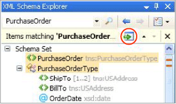

# How to: Add Schema Set Search Result Nodes to the Workspace
[!INCLUDE[vs2017banner](../code-quality/includes/vs2017banner.md)]

Este tópico explica como adicionar os nós que são realçadas em XML Schema Explorer como resultado de uma pesquisa de palavra\-chave no espaço de trabalho.  
  
> [!NOTE]
>  Somente os nós globais podem ser adicionados a [o espaço de trabalho](../xml-tools/xml-schema-designer-workspace.md).  
  
 Este exemplo usa o exemplo [Esquema de ordem de compra](../Topic/Sample%20XSD%20File:%20Purchase%20Order%20Schema.md).  
  
### Para adicionar nós definidos do resultado de esquema  
  
1.  Siga as etapas em [How to: Create and Edit an XSD Schema File](../xml-tools/how-to-create-and-edit-an-xsd-schema-file.md).  
  
2.  O tipo “purchaseOrder” na caixa de texto de pesquisa de barra de ferramentas de [XML Explorer](../xml-tools/xml-schema-explorer.md) e clique no botão de pesquisa.  
  
       
  
     Os resultados de pesquisa são realçadas em XML Schema Explorer e marcados por escalas na barra de rolagem vertical.  
  
3.  Adicione os resultados de pesquisa para o espaço de trabalho clicando no botão de **Adicionar nós realçados ao Espaço de Trabalho** no painel de resultados de resumo.  
  
       
  
     O nó de `purchaseOrder` e o nó de `PurchaseOrderType` aparecem próximos uns dos outros na superfície de design de [Representa graficamente a exibição](../xml-tools/graph-view.md).  Porque os dois nós são relacionados \(o elemento de `purchaseOrder` é do tipo de `PurchaseOrderType` \), uma seta é desenhada entre eles.