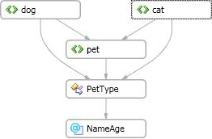

# How to: Get an Overview of a Schema Set Using the Graph View
[!INCLUDE[vs2017banner](../code-quality/includes/vs2017banner.md)]

Este tópico descreve como usar [O modo de gráfico](../xml-tools/graph-view.md) para ver uma exibição de alto nível de nós em um conjunto de esquema e as relações entre os nós.  
  
### Para criar um novo arquivo XSD e exibir o elemento raiz no modo do modelo de conteúdo  
  
1.  Crie um novo arquivo de esquema XML e salve o arquivo como Relationships.xsd.  
  
2.  Clique no link **Use o Editor de XML para exibir e editar o arquivo de esquema XML subjacente** na Exibição Inicial.  
  
3.  Copie o código de exemplo de esquema XML [Esquema XML de exemplo: Relações](../Topic/Sample%20XSD%20File:%20Relationships.md) e cole\-o para substituir o código que foi adicionado ao novo arquivo XSD por padrão.  
  
4.  Clique com o botão direito do mouse em qualquer lugar no editor XML e selecione **Exibir Designer**.  
  
5.  Selecione o modo de gráfico da barra de ferramentas XSD.  
  
6.  Selecione o nó de **Conjunto de Esquemas** em XML Schema Explorer e arraste o nó para criar o suface do modo de gráfico.  Você deve ver todos os nós globais, e as setas que conectam os nós que possuem relações.  
  
       
  
7.  Clique em qualquer nó na superfície de design e examine a barra de rastreamento para ver onde o nó selecionado é localizado no conjunto de esquema.  
  
8.  Rick\- clique em qualquer nó de elemento na superfície desing e em **Gerencia o exemplo XML** selecione para ver o documento de instância XML.